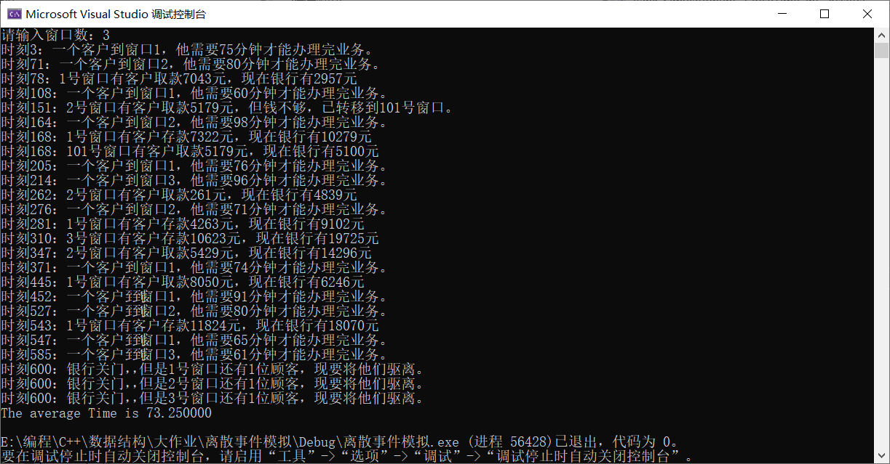
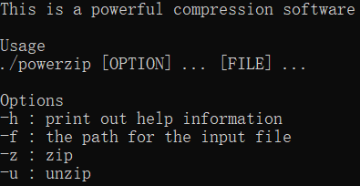
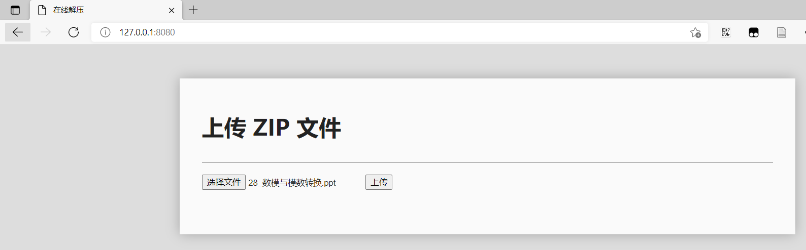
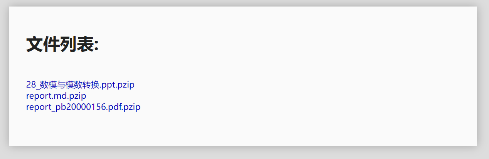

# 数据结构实验报告
徐亦昶  
PB20000156
## 离散时间模拟
### 项目特点
* 文件结构安排合理，模块区分明确。
* 代码通用性强，易于修改（改变一个数组大小即可进行窗口数量的转变）。
* 可显示详细过程，方便结果检验及调试。
### 文件结构
* list.h/cpp 链表模块
* queue.h/cpp 队列模块
* simulator.cpp 模拟器主程序
### 链表模块
链表模块中对元素类型及链表结构体的定义如下：  
```c++
typedef struct
{
	int Occurtime; //时间发生时间
	int NType; //0表示存款，1表示取款
}Event,ElemType;

typedef struct LNode
{
	ElemType data;
	struct LNode *next;
}*Link,*Position;

typedef struct
{
	Link head,tail;
	int len;
}LinkList;
```
在list.cpp中，实现了课本中定义的所有链表操作函数，包括：  
```c++
Status MakeNode(Link &p,ElemType e);
void FreeNode(Link &p);
Status InitList (LinkList &L);
Status DestroyList(LinkList &L);
Status ClearList(LinkList &L);
Status InsFirst(Link h,Link s);
Status DelFirst(Link h,Link &q);
Status Append(LinkList &L,Link s);
Status Remove(LinkList &L,Link &q);
Status InsBefore(LinkList &L,Link &p,Link s);
Status InsAfter(LinkList &L,Link &p,Link s);
Status SetCurElem(Link &p,ElemType e);
ElemType GetCurElem(Link p);
Status ListEmpty(LinkList L);
int ListLength(LinkList L);
Position GetHead(LinkList L);
Position GetLast(LinkList L);
Position PriorPos(LinkList L,Link p);
Position NextPos(LinkList L,Link p);
Status LocatePos(LinkList L,int i,Link &p);
Position LocateElem(LinkList L,ElemType e,Status (*compare)(ElemType,ElemType));
Status ListTraverse(LinkList L,Status (*visit)(Link));
Status OrderInsert(LinkList &L,ElemType e,int (*cmp)(ElemType,ElemType));
```
其中OrderInsert为有序链表插入函数，它的实现如下：  
```c++
Status OrderInsert(LinkList &L,ElemType e,int (*cmp)(ElemType,ElemType))
{
	Link p;
	MakeNode(p,e);
	if(ListEmpty(L)||cmp(e,L.tail->data)>=0) return InsAfter(L,L.tail,p);
	if(cmp(e,L.head->next->data)<=0) return InsAfter(L,L.head,p);
	for(Link pointer=GetHead(L)->next;pointer!=L.tail;pointer=pointer->next)
	{
		if(cmp(pointer->next->data,e)<0) continue;
		return InsAfter(L,pointer,p);
		break;
	}
}
```
经逐个检验，这些函数均能正确运行。
### 队列模块
相关数据类型定义如下：  
```c++
typedef struct
{
	int ArrivalTime; //到达时间
	int Duration; //该人办理业务需要多久
	int Type; //0表示存款，1表示取钱
	int Amount; //数额
}QElemType; //表示排队等候的每一个人

typedef struct QNode
{
	QElemType data;
	struct QNode *next;
}QNode,*QueuePtr;

typedef struct
{
	QueuePtr front;
	QueuePtr rear;
}LinkQueue;
```
queue.cpp中实现了如下几个基本函数：  
```c++
Status InitQueue(LinkQueue &Q);
Status DestroyQueue(LinkQueue &Q);
Status ClearQueue(LinkQueue &Q);
Status QueueEmpty(LinkQueue Q);
int QueueLength(LinkQueue Q);
Status GetHead(LinkQueue Q,QElemType &e);
Status EnQueue(LinkQueue &Q,QElemType e);
Status DeQueue(LinkQueue &Q,QElemType &e);
Status QueueTraverse(LinkQueue Q,void (*visit)(QNode *node));
```
其中最后一个函数仅为调试用。最重要的函数EnQueue和DeQueue实现如下：  
```c++
Status EnQueue(LinkQueue &Q,QElemType e) //入队
{
	QueuePtr p=(QueuePtr)malloc(sizeof(QNode));
	if(!p) exit(OVERFLOW);
	p->data=e;
	p->next=NULL;
	Q.rear->next=p;
	Q.rear=p;
	return OK;
}

Status DeQueue(LinkQueue &Q,QElemType &e) //出队
{
	if(Q.front==Q.rear) return ERROR;
	QueuePtr p=Q.front->next;
	e=p->data;
	Q.front->next=p->next;
	if(Q.rear==p) Q.rear=Q.front;
	free(p);
	return OK;
}
```
### 主要模块
该模块负责整个模拟的过程，主要有以下一个函数构成（部分函数省略）：  
```c++
void OpenForDay();
void CustomerArrived();
void CustomerDeparture();
void Bank_Simulation(int ClostTime, int _Assets);
int main();
```
全局变量定义如下：  
```c++
typedef LinkList EventList;

EventList ev; //事件表
Event en; //事件
LinkQueue q[102]; //100个客户队列和1个检查队列（q[101]）
QElemType customer; //客户记录
int TotalTime, CustomerNum, CloseTime, NumPorts; //累计客户逗留时间，客户数，停止营业时间，窗口数
int Assets; //银行总资产
int Check = 1; //是否值得检查101号窗口
```
OpenForDay()：初始化，并向事件链表中加入第一个客户在第3秒进入银行的事件。具体实现如下：  
```c++
void OpenForDay()
{
	TotalTime = 0;
	CustomerNum = 0;
	InitList(ev);
	en.Occurtime = 3;
	en.NType = 0;
	OrderInsert(ev, en, cmp);
	for (int i = 1; i <= 101; i++) InitQueue(q[i]);
}
```
CustomerArrived()：处理客户到达事件。将随机生成该客户办理业务所需时间以及下一个客户在几秒后到达，并将该客户插入到队列。如果排在队列最前列，需要向事件链表插入该客户离开这一事件。这是因为客户离开队列这一事件在上一个客户办理完业务才会被添加到事件链表，如果队列本来为空，则无法触发。在函数开头，还需插入下一个客户到达这一事件。具体实现：  
```c++
void CustomerArrived()
{
	int durtime, intertime;
	CustomerNum++;
	Random(durtime, intertime);
	int t = en.Occurtime + intertime;
	if (t < CloseTime) OrderInsert(ev, { t,0 }, cmp); //下一个客户到达
	int min = QueueLength(q[1]);
	int index = 1;
	for (int i = 2; i <= NumPorts; i++)
	{
		if (min > QueueLength(q[i]))
		{
			min = QueueLength(q[i]);
			index = i;
		}
	}
	EnQueue(q[index], { en.Occurtime,durtime,rand()%2,rand()%20000+1 }); //当前客户入队
	printf("时刻%d：一个客户到窗口%d，他需要%d分钟才能办理完业务。\n",en.Occurtime, index, durtime);
	if (QueueLength(q[index]) == 1) OrderInsert(ev, { en.Occurtime + durtime,index }, cmp); //队列原本为空进行处理
}
```
CustomerDeparture()：处理客户离开事件。如果当前客户存款，则办理业务，并将check赋为1，以便后续检查101号窗口是否有人可以办理贷款业务。如果贷款，先检查银行总资产，如果满足条件则进行办理，否则将该客户移至101号窗口，置check为0，因为无论何种情况资金都不会增加，不会有101号窗口的客户刚好在此轮满足需求。然后检查101号窗口。处理完毕后，如果当前队列不为空，生成队列下一人办理业务的事件。具体实现：  
```c++
void CustomerDeparture()
{
	int NType = en.NType,len=QueueLength(q[101]);
	DeQueue(q[NType], customer);
	if (customer.Type == 0)
	{
		Assets += customer.Amount;
		Check = 1;
		TotalTime += en.Occurtime - customer.ArrivalTime;
		printf("时刻%d：%d号窗口有客户存款%d元，现在银行有%d元\n", en.Occurtime, NType, customer.Amount, Assets);
	}
	else
	{
		if (customer.Amount <= Assets)
		{
			Assets -= customer.Amount;
			TotalTime += en.Occurtime - customer.ArrivalTime;
			printf("时刻%d：%d号窗口有客户取款%d元，现在银行有%d元\n", en.Occurtime, NType, customer.Amount, Assets);
		}
		else
		{
			EnQueue(q[101], customer);
			printf("时刻%d：%d号窗口有客户取款%d元，但钱不够，已转移到101号窗口。\n", en.Occurtime, NType, customer.Amount);
		}
		Check = 0;
	}
	if (Check)
	{
		for (int i = 0; i < len; i++)
		{
			QElemType tmp;
			DeQueue(q[101], tmp);
			if (tmp.Amount <= Assets)
			{
				Assets -= tmp.Amount;
				TotalTime += en.Occurtime - tmp.ArrivalTime;
				printf("时刻%d：101号窗口有客户取款%d元，现在银行有%d元\n", en.Occurtime, tmp.Amount, Assets);
			}
			else
			{
				EnQueue(q[101], tmp);
			}
		}
	}
	if (!QueueEmpty(q[NType]))
	{
		GetHead(q[NType], customer);
		OrderInsert(ev, { en.Occurtime + customer.Duration,NType }, cmp);
	}
}
```
Bank_Simulation(int _CloseTime, int _Assets)：参数为银行关门时间和初始资产数。这是模拟的主程序，先输入正式业务窗口数（1到100，然后初始化。接下来是一个循环，每次从事件链表里按时间顺序逐个取出元素，如果该事件发生时银行关门就退出循环并清理剩余顾客，否则根据事件类型（取款还是存款）执行相应函数。具体实现：  
```c++
void Bank_Simulation(int _CloseTime, int _Assets)
{
	CloseTime = _CloseTime;
	Assets = _Assets;
	while (1)
	{
		printf("请输入窗口数：");
		scanf("%d", &NumPorts);
		if (NumPorts <= 0 || NumPorts > 100) MessageBox(NULL, "窗口数必须在1到100之间！", "错误", MB_OK);
		else break;
		system("cls");
	}
	OpenForDay();
	Link p;
	while (!ListEmpty(ev))
	{
		DelFirst(GetHead(ev), p);
		ev.tail = GetLast(ev);
		ev.len--;
		en = GetCurElem(p);
		if (en.Occurtime > CloseTime)
		{
			break;
		}
		if (en.NType == 0) CustomerArrived();
		else CustomerDeparture();
	}
	for (int i = 1; i <= 101; i++)
	{
		if (!QueueEmpty(q[i])) printf("时刻%d：银行关门，但是%d号窗口还有%d位顾客，现要将他们驱离。\n", CloseTime, i, QueueLength(q[i]));
		while (!QueueEmpty(q[i]))
		{
			QElemType left;
			DeQueue(q[i], left);
			TotalTime += CloseTime - left.ArrivalTime;
		}
	}
	printf("The average Time is %f\n", (float)TotalTime / CustomerNum);
}
```
### 主函数
设置随机数种子，并调用Bank_Simulation函数。  
```c++
int main()
{
	srand((unsigned)time(NULL));
	Bank_Simulation(600, 10000);
	return 0;
}
```
### 运行效果

## 基于Huffman树的压缩软件powerzip
### 项目特点
* 设置了命令行参数，方便在命令行调用。
* 压缩有效，可以压缩任意类型的文件，通常压缩后文件会小很多。
* 代码设置灵活，重要的地方接口化、参数化，方便进行多叉树及编码粒度的改写，在数据结构的设计上充分考虑了多叉树及编码粒度不是1字节的情况。事实上，本程序可以很容易改为多叉树及编码粒度自选的模式，但时间不充裕。
* 使用Flask制作了一个在线网盘，文件上传后使用压缩程序进行压缩，需要解压时再在服务器上解压并下载至本地。其中压缩和解压均由服务器完成，这样的网盘可以有效节约服务器的存储资源。
### 文件结构（c++部分）
* bitstream.h/cpp：定义了一个类bitstream，用于处理二进制数据流，其中使用了运算符重载，方便向使用字符串一样对其操作。
* huffman.h/cpp：Huffman树编码以及基于Huffman树的压缩、解压操作。
* powerzip.cpp：主程序，实现命令行参数的解析即函数的调用。
### 文件结构（Python部分）
* online.py Python主程序，在里面写了一个web。
* templates index.html是网站主页，template.html是一个模板，这个网页用于显示文件目录。
* media 存放上传文件的文件夹。
* powerzip.exe 压缩程序。
### bitstream模块
bitstream.h中类的定义如下：  
```c++
class bitstream
{
public:
	char* bits;
	int length; //unit:bits
	bitstream();
	bitstream(const char* bitstring);
	void Free();
	bitstream slice(int left, int right, int unit_len = 8);
	int write(const char* filename);
	void append(bitstream b);
	long read(const char* filename, int offset = 0, int bytes = -1);
	bitstream operator+(const bitstream& b);
	char getbit(int i)const;
	friend ostream &operator<<(ostream &output, const bitstream& b);
	bool operator<(const bitstream& b);
	void setbit(int i,int n);
	void operator=(const bitstream& b);
	void operator=(const char* b);
	bool operator==(const bitstream& b);
	bool operator==(const char* b);
};
```
其中slice为切片函数，write为写入文件（追加模式），read为从文件中读取。offset是相对于文件初始位置的偏移，bytes是要读取的字节数。bytes=-1意味着读到文件尾。getbit可以获取单个位，setbit将第i位设置成n，其中i从0开始。  
cpp文件如下：  
```c++
#include "bitstream.h"

bitstream::bitstream()
{
	bits = NULL;
	length = 0;
}

bitstream::bitstream(const char* bitstring)
{
	this->length = strlen(bitstring);
	int bytes = ceil((float)this->length / 8);
	bits = (char*)malloc(bytes);
	for (int i = 0; i < bytes; i++)
	{
		bits[i] = 0;
	}
	for (int i = 0; i < bytes; i++)
	{
		for (int j = 0; j < 8; j++)
		{
			if (i * 8 + j < strlen(bitstring) && bitstring[i * 8 + j] == '1') this->bits[i] |= (1 << (7 - j));
		}
	}
}

void bitstream::Free()
{
	length = 0;
	free(bits);
}

bitstream bitstream::slice(int left, int right, int unit_len)
{
	bitstream ret;
	ret.length = (right - left) * unit_len;
	ret.bits = (char*)malloc(ret.length / 8+1);
	for (int i = 0; i < ret.length / 8; i++)
	{
		ret.bits[i] = bits[(i + left) * unit_len / 8];
	}
	return ret;
}

int bitstream::write(const char* filename)
{
	int bytes = ceil((float)length / 8);
	FILE* outfile;
	outfile = fopen(filename, "ab");
	if (outfile == NULL) return 0;
	fwrite(bits, bytes, 1, outfile);
	fclose(outfile);
	return 1;
}

void bitstream::append(bitstream b)
{
	int bytes = ceil((float)b.length / 8 + (float)length / 8);
	if (length == 0) bits = (char*)malloc(bytes);
	else
		bits = (char*)realloc(bits, bytes);
	for (int i = 0; i < b.length; i++) setbit(length + i, b.getbit(i));
	length += b.length;
}

long bitstream::read(const char* filename, int offset, int bytes)
{
	FILE* infile;
	long _offset;
	infile = fopen(filename, "rb");
	if (infile == NULL) return -1;
	fseek(infile, offset, SEEK_SET);
	int size;
	if (bytes == -1)
	{
		size = _filelength(_fileno(infile)) - offset;
	}
	else
	{
		size = bytes;
	}
	bits = (char*)malloc(size);
	fread(bits, size, 1, infile);
	_offset = ftell(infile);
	fclose(infile);
	length = size * 8;
	return _offset;
}

char bitstream::getbit(int i) const
{
	return (bits[i / 8] >> (7 - i % 8)) & 0x1;
}

void bitstream::setbit(int i, int n)
{
	if (n == 0) bits[i / 8] &= 255 - (1 << (7 - i % 8));
	else bits[i / 8] |= 1 << (7 - i % 8);
}

void bitstream::operator=(const bitstream& b)
{
	if (this->length == 0) this->Free();
	this->length = b.length;
	int bytes = ceil((float)this->length / 8);
	this->bits = (char*)malloc(bytes);
	for (int i = 0; i < bytes; i++)
	{
		bits[i] = 0;
	}
	for (int i = 0; i < bytes; i++) this->bits[i] = b.bits[i];
}
```
为简洁起见，仅列举了一个运算符重载函数作为示例。  
### Huffman编码和压缩/解压模块
huffman.h中数据结构和函数定义如下：  
```c++
typedef struct
{
	unsigned int weight;
	unsigned int parent, lchild, rchild;
}HTNode, *HuffmanTree;
typedef struct
{
	unsigned int weight;
	bitstream data;
}HTLeaf;
typedef bitstream* HuffmanCode;

void HuffmanCoding(HuffmanTree& HT, HuffmanCode& HC, HTLeaf* w, int n);
void CalcuFrequency(const char *filename, HTLeaf*& w, int& n); //统计文件中关键字出现频率
void PrintTree(HuffmanTree HT);
void Select(HuffmanTree HT, int n, int& s1, int& s2);
void Zip(const char* filename); //压缩
void UnZip(const char* filename); //解压
bitstream CodeUnit(HuffmanCode HC, HTLeaf* w, bitstream origin, int n); //将一个字节的二进制流进行编码

struct ListNode
{
	HTLeaf data;
	ListNode* next;
};
class LeafList
{
public:
	LeafList();
	ListNode* head;
	int length;
	void OrderInsert(HTLeaf Node);
	void traverse(HTLeaf* w);
	HTLeaf& operator[](int i);
}; //叶子节点，按关键字排序，方便检索。
```
Huffman编码参考了课本的示例，由于对bitstream的赋值运算符进行了重载，这里将字符串向bit流的迁移尤为简单。  
CalculateFrequency进行词频统计。  
```c++
void CalcuFrequency(const char* filename, HTLeaf*& w, int& n)
{
	bitstream content;
	LeafList FreqList;
	content.read(filename);
	for (int i = 0; i < content.length / 8; i++)
	{
		bitstream fragment = content.slice(i, i + 1);
		HTLeaf Node = { 1,fragment };
		FreqList.OrderInsert(Node);
	}
	n = FreqList.length;
	w = (HTLeaf*)malloc((n + 1)*sizeof(HTLeaf));
	FreqList.traverse(w);
	content.Free();
}
```
LeafList的两个重要成员函数实现如下：  
```c++
void LeafList::traverse(HTLeaf* w) //遍历并赋给w
{
	int i = 0;
	for (ListNode* p=head->next;p;p=p->next)
	{
		w[i].weight = p->data.weight;
		w[i].data = p->data.data;
		i++;
	}
}

HTLeaf& LeafList::operator[](int i) //索引
{
	ListNode* p = head->next;
	for (int j = 0; j < i; j++)
	{
		if (!p) break;
		p = p->next;
	}
	return p->data;
}
```
CodeUnit对单字节进行编码。通过二分查找得到对应的编码序列并返回。事实上，这个函数不止可以编码单个字节。当力度不为1字节时，也可调用同样的函数进行编码。函数的具体实现：  
```c++
bitstream CodeUnit(HuffmanCode HC, HTLeaf* w, bitstream origin, int n)
{
	int low = 0, high = n - 1, mid = (low + high) / 2;
	while (low < high) //二分查找算法
	{
		if (w[mid].data < origin) //小于号被重载，这里可以直接像两个数一样去比较
		{
			low = mid + 1;
			mid = (low + high) / 2;
		}
		else if (origin < w[mid].data)
		{
			high = mid - 1;
			mid = (low + high) / 2;
		}
		else break;
	}
	return HC[mid + 1];
}
```
Zip函数统计词频、生成Huffman树后对文件进行编码，结果存入bitstream型变量result，并输出到文件。输出的压缩文件为pzip类型，命名规则为原始文件名+".pzip"。文件存储结构：  
* 四字节存储n，即叶子节点个数。
* 2n个HTNode大小的存储空间保存Huffman树HT。
* 4字节存储result的长度（目前为int型，将来需要修改只需要改bitstream.length的类型即可，存储时使用了sizeof）。
* n字节存储叶子节点的数据。叶子节点需要额外存储而不是默认256个是因为将来如果将编码粒度变大，可能导致存储的叶子节点过多，但大部分节点不会用到，从而浪费存储空间。
* 最后存储编码后的文件内容。
函数具体实现：  
```c++
void Zip(const char* filename)
{
	HTLeaf* w;
	int n;
	HuffmanCode HC;
	HuffmanTree HT;
	bitstream content, result;
	CalcuFrequency(filename, w, n); //统计关键字频率
	HuffmanCoding(HT, HC, w, n); //生成Huffman树
	content.read(filename);
	for (int i = 0; i < content.length / 8; i++)
	{
		result.append(CodeUnit(HC, w, content.slice(i, i + 1), n)); //编码并写入result
	}
	content.Free();
	FILE* outfile = fopen((string(filename) + ".pzip").c_str(), "wb");
	fwrite(&n, sizeof(n), 1, outfile);
	fwrite(HT, sizeof(HTNode), 2 * n, outfile); //写入Huffman树
	fwrite(&result.length, sizeof(result.length), 1, outfile);
	fclose(outfile);
	for (int i = 0; i < n; i++) w[i].data.write((string(filename) + ".pzip").c_str()); //写入叶子节点数据
	result.write((string(filename) + ".pzip").c_str()); //写入压缩后的编码
	result.Free();
}
```
注：为清晰起见删去了输出语句，并补充了注释。  
Unzip函数是一个逆向的过程，其中编码后的文件被存入crypt，再遍历二叉树进行搜索。追溯到叶子节点后，将对应的原始编码写入result。  
具体实现：  
```c++
void UnZip(const char* filename)
{
	HTLeaf* w;
	HuffmanTree HT;
	bitstream crypt, leaves, result;
	string tmp;
	int n, cur, len;
	FILE* infile = fopen(filename, "rb");
	fread(&n, sizeof(n), 1, infile);
	long deb2 = ftell(infile);
	HT = (HuffmanTree)malloc(2 * n * sizeof(HTNode));
	w = (HTLeaf*)malloc(n * sizeof(HTLeaf));
	fread(HT, sizeof(HTNode), 2 * n, infile);
	long deb = ftell(infile);
	fread(&len, sizeof(len), 1, infile);
	long offset = ftell(infile);
	offset = leaves.read(filename, offset, n);
	for (int i = 0; i < n; i++) w[i].data = leaves.slice(i, i + 1);
	leaves.Free();
	crypt.read(filename, offset);
	crypt.length = len;
	fclose(infile);
	cur = 2 * n - 1;
	for (int i = 0; i < crypt.length; i++) //解码
	{
		if (crypt.getbit(i) == 0) cur = HT[cur].lchild;
		else cur = HT[cur].rchild;
		if (cur >= 1 && cur <= n)
		{
			result.append(w[cur - 1].data);
			cur = 2 * n - 1;
		}
	}
	result.write(string(filename).substr(0, strlen(filename) - 5).c_str());
}
```
### 主函数
负责对命令行参数进行解析，合理调用Zip和Unzip函数。代码如下：
```c++  
#include"huffman.h"

// A simple arguments parser
std::pair<bool, string> getCmdOption(char** begin, char** end, const std::string& option) {
    char** itr = std::find(begin, end, option);
    if (itr != end && ++itr != end) {
        return std::make_pair(true, *itr);
    }
    return std::make_pair(false, "");
}
bool cmdOptionExists(char** begin, char** end, const std::string& option)
{
    return std::find(begin, end, option) != end;
}
int main(int argc, char** argv)
{
    if (cmdOptionExists(argv, argv + argc, "-h")) {
        std::cout << "This is a powerful compression software" << std::endl << std::endl;
        std::cout << "Usage" << std::endl;
        std::cout << "./powerzip [OPTION] ... [FILE] ..." << std::endl << std::endl;
        std::cout << "Options" << std::endl;
        std::cout << "-h : print out help information" << std::endl;
        std::cout << "-f : the path for the input file" << std::endl;
        std::cout << "-z : zip" << std::endl;
        std::cout << "-u : unzip" << std::endl;
        return 0;
    }
    auto input_info = getCmdOption(argv, argv + argc, "-f");
    string input_filename = input_info.second;
    if (cmdOptionExists(argv, argv + argc, "-z")) {
        Zip(input_filename.c_str());
    }
    else if (cmdOptionExists(argv, argv + argc, "-u")) {
        UnZip(input_filename.c_str());
    }
	return 0;
}
```
帮助界面截图：  
  
从这里可以看到完整的使用方法。
### online.py
上传文件：收到文件后先保存，然后执行`powerzip -z -f <filename>`来压缩，等待压缩程序完全退出后删去原来的文件。  
下载文件：执行`powerzip -u -f <filename>`解压，解压后以二进制流（application/octet-stream）的形式发给客户端浏览器，随后在服务器本地将解压后的文件删除。  
代码如下，重要的部分已添加注释。
```python
import os
import json
from shutil import copyfile
from flask import Flask,request,render_template,url_for,send_from_directory,make_response,redirect
from werkzeug.middleware.proxy_fix import ProxyFix
from flask import jsonify
from hashlib import md5
import signal
import time
from http.server import HTTPServer, SimpleHTTPRequestHandler

base=os.getcwd() #工作目录
os.environ['TEMP']=os.getcwd()

app = Flask("access")
app.wsgi_app = ProxyFix(app.wsgi_app, x_for=1 ,x_proto=1)


@app.route('/',methods=['POST', 'GET'])
def index(): #文件解压网站主页
    if request.method == 'POST': #收到用户上传的文件进行处理
        f=request.files['file']
        f.save(base+'\\media\\'+f.filename)
        os.system('powerzip -z -f .\\media\\'+f.filename)
        time.sleep(0.1)
        os.system('del .\\media\\'+f.filename)
        return redirect('/media/')
    response = render_template('index.html')
    return response

@app.route('/media/',methods=['GET'])
@app.route('/media',methods=['GET'])
@app.route('/media/<path>',methods=['GET'])
def media(path=""):
    if not os.path.exists(base+'\\media\\'+path):
        return make_response("404",404)
    if path!="": #用户想获取文件，进行解压并传送
        os.system('powerzip -u -f .\\media\\'+path)
        path=path[:-5]
        f=open(base+'\\media\\'+path,'rb')
        response = make_response(send_from_directory(base+'\\media\\',path,as_attachment=True))
        response.headers['Content-Type'] = 'application/octet-stream'
        time.sleep(0.1)
        os.system('del .\\media\\'+path)
        return response
    else: #展示文件列表
        fn=os.listdir(base+'.\\media\\')
        f=open(".\\templates\\template.html")
        x=f.read()
        f.close()
        ret="<h1>文件列表:</h1><br><hr>"
        for i in fn:
            print(i)
            ret+="<a href='"+'/media/'+i+"'>"+i+"</a><br>"
        x=x.replace("HTMLTEXT",ret)
        return x

app.run(host="0.0.0.0",port=8080,debug=False,threaded=True) #运行Web服务
```
index.html主要使用了一个表单。  
```html
<!DOCTYPE html>
<html lang="en">

<head>
    <meta charset="UTF-8">
    <title>在线解压</title>
    <style type="text/css">
        html {
            background-color: #dddddd;
            font-size: 1.1em;
            color: #222;
        }

        body {
            background-color: #fafafa;
            background-clip: padding-box;
            max-width: 900px;
            margin: auto;
            padding: 2em 2em 4em 2em;
            margin-top: 3em;
            font-family: 'Microsoft YaHei', 'Segoe UI', sans-serif;
            box-shadow: 0 0 20px rgba(0, 0, 0, .25);
        }

        a {
            color: #00b;
            text-decoration: none;
            cursor: pointer;
        }

        a:hover {
            border-bottom: 1px solid #00b;
            margin-bottom: -1px;
        }

        button {
            min-width: 5em;
        }

        h1 {
            margin: .5em 0 0 0;
        }

        hr {
            border: none;
            height: 1px;
            background-color: #555;
            padding-bottom: .5em;
            background-clip: content-box;
        }
    </style>
</head>

<body>
    <h1>上传 ZIP 文件</h1><br>
    <hr>
    <form action="" enctype='multipart/form-data' method='POST'>
        <input type="file" name="file">
        <input type="submit" value="上传">
    </form>
</body>

</html>
```
template.html主体部分是空的，有待脚本填写。
```html
<!DOCTYPE html>
<html lang="en">

<head>
    <meta charset="UTF-8">
    <title>在线解压</title>
    <style type="text/css">
        <!--和上面相同，此处省略-->
    </style>
</head>

<body>
HTMLTEXT
</body>

</html>
```
### 在线网盘运行截图
主页  
  
文件列表
  
解压后下载  

media文件夹  

## 遇到的问题及解决方法
* 链表出现访问越界。通过单步调试，得到原因在于p=p->next写成了p++。
* Huffman程序出现堆破坏。堆破坏时报错位置通常不是代码有问题的位置，无法通过单步调试来寻找错误。我的方法是每次尝试删除程序的某些部分，逐步删除，直到程序可以正常运行，然后再把删的重新加回来，这样反复修改即可最终锁定问题的出处。最后发现，原因是对w进行malloc时没有乘以sizeof，参数仅为元素的个数。
* Huffman程序突然不能正常运行，一次一个样。在单步调试的时候有时可以正常运行，有时会在malloc时报错。但malloc确认无误。更奇怪的是，加入命令行参数处理模块前调试时都能正常运行。于是想到是不是仅在Release模式下不行。调回Debug后，发现果然可以了。但是Debug速度不够快，仍想调回Release。上网查发现这是VS经典的bug，解决方法在项目属性中设置多进程调试。再改回Release模式，程序正常运行。
* 处理的文件大致1M后，解码后的文件和编码后的不一致。输出Huffman编码后发现是因为无穷设置得太小，使得某些词词频过高时出错。将其进行修改后运行正常。
## 其他的优化
* 为bitstream设置Free成员函数，将不用的变量及时释放掉。  
* 为bitstream设置Append方法，并尽量使用realloc而不是重新malloc，防止加运算每次进行拷贝时浪费存储空间。
