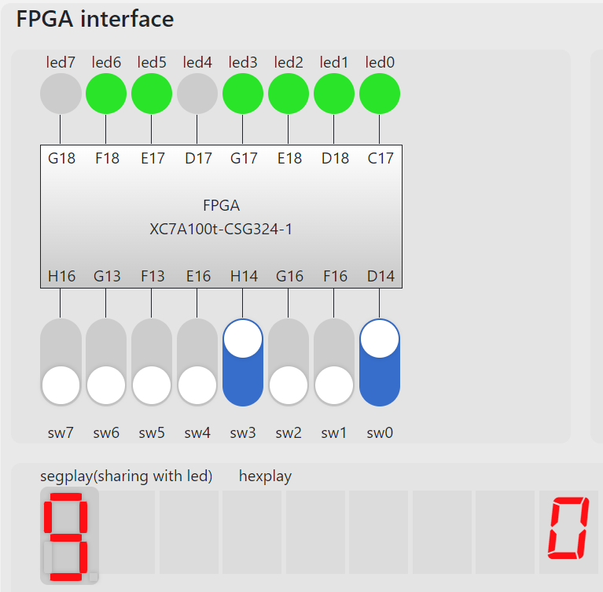
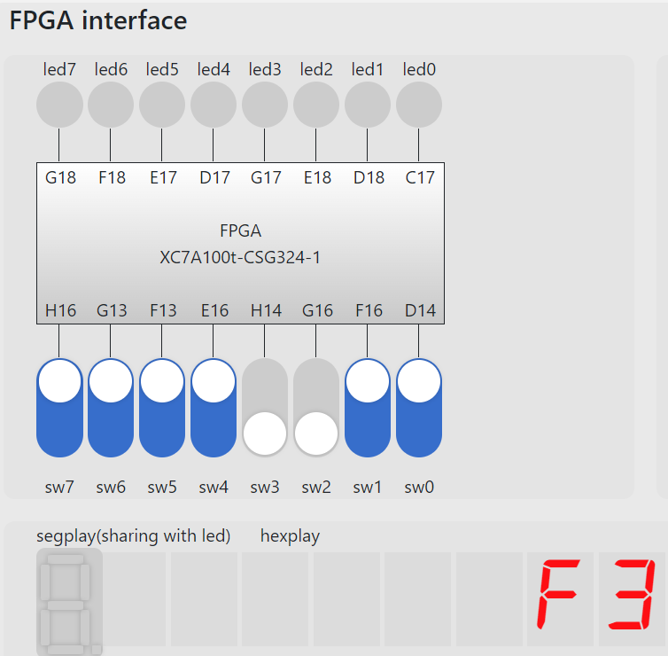
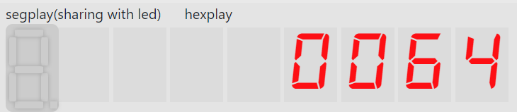

# 实验 07 FPGA 实验平台及 IP 核使用
徐亦昶  
PB20000156
## 实验练习
### 题目1
直接调用IP核即可。  
```verilog
`timescale 1ns / 1ps

module p1(
input [3:0]sw,input clk,
output [7:0]led);
dist_mem_gen_0 dist_mem_gen_0(.a(4'b0),.d(8'b0),.we(1'b0),.clk(clk),.dpra(sw),.dpo(led));
endmodule
```
仿真文件：  
```verilog
`timescale 1ns / 1ps

module test_bench();
reg [3:0]sw;
wire [7:0]led;
reg clk;
integer i;
initial
begin
    clk=0;
    forever
    #5 clk=~clk;
end
initial
begin
    sw=4'b0000;
    for(i=0;i<16;i=i+1)
    begin
        sw=sw+4'b0001;
        #5;
    end
end
p1 p1(.sw(sw),.clk(clk),.led(led));
endmodule
```
管脚约束文件：  
```
## Clock signal
set_property -dict { PACKAGE_PIN E3    IOSTANDARD LVCMOS33 } [get_ports { clk }]; #IO_L12P_T1_MRCC_35 Sch=clk100mhz
#create_clock -add -name sys_clk_pin -period 10.00 -waveform {0 5} [get_ports {CLK100MHZ}];

## FPGAOL SWITCH

set_property -dict { PACKAGE_PIN D14   IOSTANDARD LVCMOS33 } [get_ports { sw[0] }];
set_property -dict { PACKAGE_PIN F16   IOSTANDARD LVCMOS33 } [get_ports { sw[1] }];
set_property -dict { PACKAGE_PIN G16   IOSTANDARD LVCMOS33 } [get_ports { sw[2] }];
set_property -dict { PACKAGE_PIN H14   IOSTANDARD LVCMOS33 } [get_ports { sw[3] }];
set_property -dict { PACKAGE_PIN E16   IOSTANDARD LVCMOS33 } [get_ports { sw[4] }];
set_property -dict { PACKAGE_PIN F13   IOSTANDARD LVCMOS33 } [get_ports { sw[5] }];
set_property -dict { PACKAGE_PIN G13   IOSTANDARD LVCMOS33 } [get_ports { sw[6] }];
set_property -dict { PACKAGE_PIN H16   IOSTANDARD LVCMOS33 } [get_ports { sw[7] }];


## FPGAOL HEXPLAY

set_property -dict { PACKAGE_PIN A14   IOSTANDARD LVCMOS33 } [get_ports { hexplay_data[0] }];
set_property -dict { PACKAGE_PIN A13   IOSTANDARD LVCMOS33 } [get_ports { hexplay_data[1] }];
set_property -dict { PACKAGE_PIN A16   IOSTANDARD LVCMOS33 } [get_ports { hexplay_data[2] }];
set_property -dict { PACKAGE_PIN A15   IOSTANDARD LVCMOS33 } [get_ports { hexplay_data[3] }];
set_property -dict { PACKAGE_PIN B17   IOSTANDARD LVCMOS33 } [get_ports { an[0] }];
set_property -dict { PACKAGE_PIN B16   IOSTANDARD LVCMOS33 } [get_ports { an[1] }];
set_property -dict { PACKAGE_PIN A18   IOSTANDARD LVCMOS33 } [get_ports { an[2] }];
```
运行示意图：  

### 题目2
本题中，将数码管多个位同时显示的方式为对hexplay_an以较快的频率进行扫描，每次显示数码管对应位，这样在人眼看来数码管所有位是同时显示的。  
Verilog代码：  
```verilog
`timescale 1ns / 1ps

module p2(
input [7:0]sw,
input clk,
output reg [2:0]an,
output reg [3:0]hexplay_data);
reg [32:0] hexplay_cnt;
always@(posedge clk) begin
	if (hexplay_cnt >= (2000000 / 8))
		hexplay_cnt <= 0;
	else
		hexplay_cnt <= hexplay_cnt + 1;
end
always@(posedge clk)
begin
    if(hexplay_cnt==0)
    begin
        if(an==3'b000)
            an<=3'b001;
        else
            an<=3'b000;
    end
end
always@(posedge clk)
begin
    if(an==3'b000)
        hexplay_data<=sw[3:0];
    else
        hexplay_data<=sw[7:4];
end 
endmodule
```
仿真文件：  
```verilog
`timescale 1ns / 1ps

module test_banch();
reg clk;
reg [7:0]sw;
wire [2:0]an;
wire [3:0]hexplay_data;
integer i;
initial
begin
    sw=0;
    for(i=8'b0;i<=8'b11111111;i=i+1)
    begin
        sw=sw+1;
        #10;
    end
end
initial
begin
    clk=0;
    forever
    #1 clk=~clk;
end
p2 p2(.sw(sw),.clk(clk),.an(an),.hexplay_data(hexplay_data));
endmodule
```
管脚约束文件：  
```verilog
## Clock signal
set_property -dict { PACKAGE_PIN E3    IOSTANDARD LVCMOS33 } [get_ports { clk }]; #IO_L12P_T1_MRCC_35 Sch=clk100mhz
#create_clock -add -name sys_clk_pin -period 10.00 -waveform {0 5} [get_ports {CLK100MHZ}];

## FPGAOL SWITCH

set_property -dict { PACKAGE_PIN D14   IOSTANDARD LVCMOS33 } [get_ports { sw[0] }];
set_property -dict { PACKAGE_PIN F16   IOSTANDARD LVCMOS33 } [get_ports { sw[1] }];
set_property -dict { PACKAGE_PIN G16   IOSTANDARD LVCMOS33 } [get_ports { sw[2] }];
set_property -dict { PACKAGE_PIN H14   IOSTANDARD LVCMOS33 } [get_ports { sw[3] }];
set_property -dict { PACKAGE_PIN E16   IOSTANDARD LVCMOS33 } [get_ports { sw[4] }];
set_property -dict { PACKAGE_PIN F13   IOSTANDARD LVCMOS33 } [get_ports { sw[5] }];
set_property -dict { PACKAGE_PIN G13   IOSTANDARD LVCMOS33 } [get_ports { sw[6] }];
set_property -dict { PACKAGE_PIN H16   IOSTANDARD LVCMOS33 } [get_ports { sw[7] }];


## FPGAOL HEXPLAY

set_property -dict { PACKAGE_PIN A14   IOSTANDARD LVCMOS33 } [get_ports { hexplay_data[0] }];
set_property -dict { PACKAGE_PIN A13   IOSTANDARD LVCMOS33 } [get_ports { hexplay_data[1] }];
set_property -dict { PACKAGE_PIN A16   IOSTANDARD LVCMOS33 } [get_ports { hexplay_data[2] }];
set_property -dict { PACKAGE_PIN A15   IOSTANDARD LVCMOS33 } [get_ports { hexplay_data[3] }];
set_property -dict { PACKAGE_PIN B17   IOSTANDARD LVCMOS33 } [get_ports { an[0] }];
set_property -dict { PACKAGE_PIN B16   IOSTANDARD LVCMOS33 } [get_ports { an[1] }];
set_property -dict { PACKAGE_PIN A18   IOSTANDARD LVCMOS33 } [get_ports { an[2] }];
```
运行示意图：  

### 题目3
由于平台的Vivado的时钟IP核有一些bug，这里手写分频模块。  
Verilog代码：  
```verilog
`timescale 1ns / 1ps

module p3(
input clk,rst,
output reg [2:0]hexplay_an,
output reg [3:0]hexplay_data);
wire locked;
reg [23:0]timer_cnt;
reg [15:0]data;
reg [32:0]hexplay_cnt;

always@(posedge clk)
begin
    if(hexplay_cnt>=(20000000/8))
        hexplay_cnt<=0;
    else
        hexplay_cnt<=hexplay_cnt+1;
    if(rst==1)
    begin
        timer_cnt<=0;
        hexplay_cnt<=0;
        hexplay_an<=0;
        data<=0;
        hexplay_data<=16'b0001001000110100;
    end
    if(hexplay_cnt==0)
    begin
        if(hexplay_an==3'b011)
            hexplay_an<=0;
        else
            hexplay_an<=hexplay_an+1;
    end
    case(hexplay_an)
        0:hexplay_data<=data[3:0];
        1:hexplay_data<=data[7:4];
        2:hexplay_data<=data[11:8];
        3:hexplay_data<=data[15:12];
        default:hexplay_data=0;
    endcase
    if(timer_cnt==0)
    begin
        data<=data+1;
        if(data[3:0]==10)
        begin
            data[3:0]<=4'b0000;
            data[7:4]<=data[7:4]+1;
        end
        if(data[7:4]==10)
        begin
            data[7:4]<=4'b0000;
            data[11:8]<=data[11:8]+1;
        end
        if(data[11:8]==6)
        begin
            data[11:8]<=4'b0000;
            data[15:12]<=data[15:12]+1;
        end
        if(data[15:12]==10)
            data[15:12]<=4'b0000;
    end
    if(timer_cnt>=10000000)
        timer_cnt<=0;
    else
        timer_cnt<=timer_cnt+1;
end
endmodule
```
在本题目程序的编写中，出现了多驱动问题。这是因为在多个always语句中对同一个变量进行赋值，而导致竞争-冒险。它的表现是仿真时可以正常运行，而实际在板子上不可以。  
仿真文件：
```verilog
`timescale 1ns / 1ps

module test_bench();
reg clk;
reg rst;
wire [2:0]hexplay_an;
wire [3:0]hexplay_data;
initial
forever
    #1 clk=~clk;
initial
begin
    clk=0;
    rst=1;
    #5 rst=0;
    
end

p3 p3(.clk(clk),.rst(rst),.hexplay_an(hexplay_an),.hexplay_data(hexplay_data));
endmodule
```
运行示意图：  

## 总结与思考
* 通过本次实验，掌握了IP核的使用方法，同时在编写代码中也遇到了一些问题（如多驱动），锻炼了调试和解决问题的能力。  
* 实验较难。
* 任务量适中。  
* 希望修复在线平台中Vivado的一些bug，如点击generate bitstream时闪退、无故报no constraints selected导致route design总是失败（确信是平台的问题，因为经过多次重启或在本地编译vivado都不会遇到同样的问题）。