# 实验 03_简单时序逻辑电路
徐亦昶  
PB20000156
## 实验目的
* 掌握时序逻辑相关器件的原理及底层结构
* 能够用基本逻辑门搭建各类时序逻辑器件
* 能够使用 Verilog HDL 设计简单逻辑电路
## 实验环境
* vlab.ustc.edu.cn
* Logisim
* verilogoj.ustc.edu.cn
## 实验过程
### Step1：搭建双稳态电路
* 拼接电路
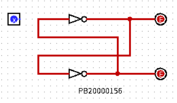  
* 将两条交叉耦合线断开一条并接通信号
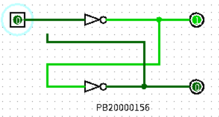  
* 连上耦合线并断开信号，发现信号保持
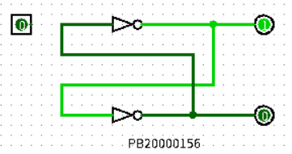
### Step2：搭建SR锁存器
搭好的锁存器如图：  
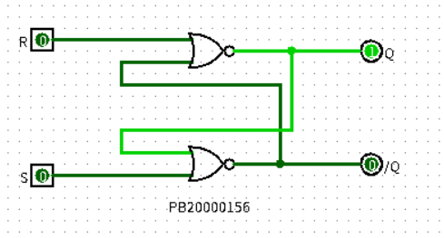
### Step3：搭建D锁存器
时钟信号为 1 时，将 SR 锁存器的 S 和 R 输入用一个输入和它的反向表示，这样可以保证它们不同时为 1；时钟信号为 0 时，经过 AND 操作使得锁存器的 S 和 R 均为 0，锁存器保持。  
直接参考文档搭建电路：  
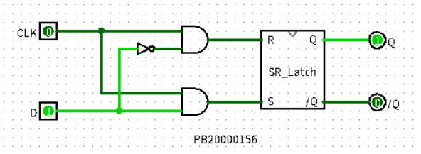
### Step4：搭建D触发器
两个 D 锁存器可以构成 D 触发器，它们的时钟信号相反，起到了信号延迟的作用。  
* 搭建 D 触发器电路
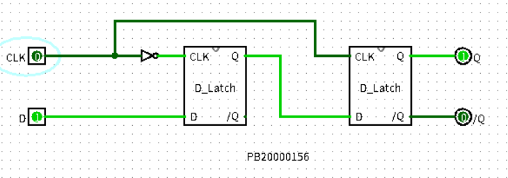  
* 更换为时钟信号
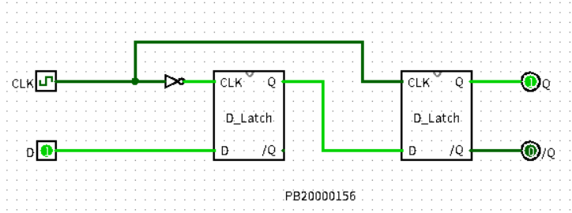  
* 增加复位信号
  
### Step5：搭建寄存器
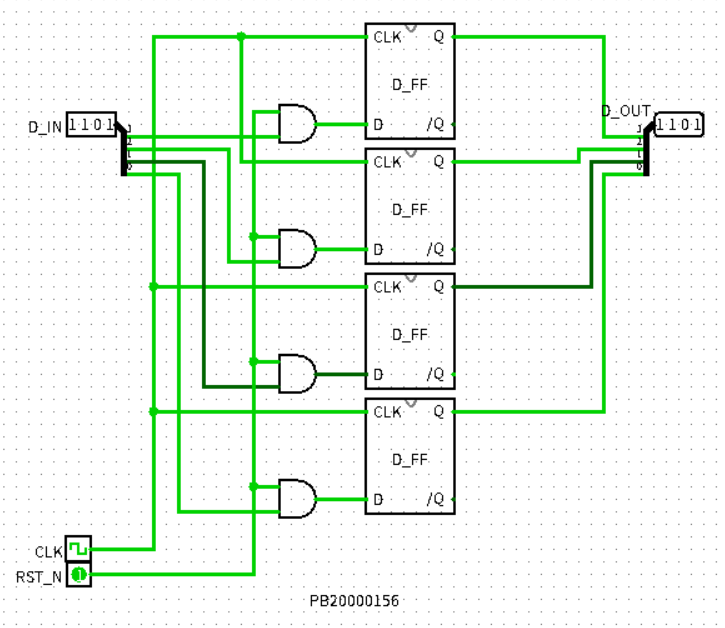  
### Step6：搭建简单时序逻辑电路
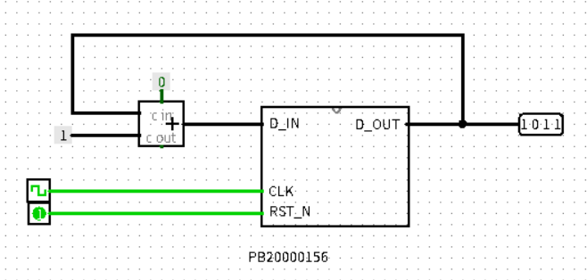  
## 实验练习
### Problem1
电路如图所示：S 和 R 都为 1 时保持，仅 S 为 0 时输出 Q 设为 1，仅R 为 0 时输出 Q 设为 0，S 和 R 都为 0 时状态未定义。  
电路图如下：  
  
### Problem2
电路图如下：  
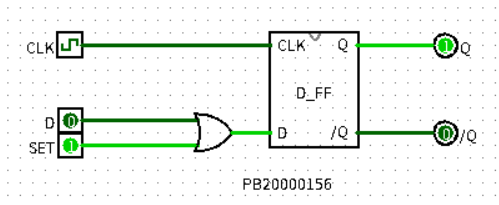  
当SET为1时，D端输入为1，进行同步复位。  
Verilog 思路：在时钟上升沿根据 set 的值给 q 赋值。
```verilog
module d_ff_s(
	input clk,set,d,
	output reg q);
always@(posedge clk)
begin
	if(set==1)
		q<=1'b1
	else
		q<=d
end
endmodule
```
### Problem3
* 搭建有异步复位功能的D触发器。
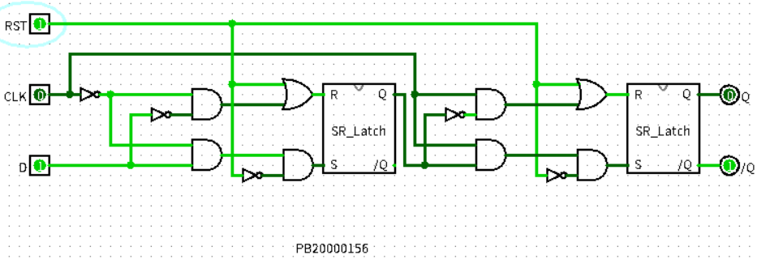  
* 使用该触发器搭建4位寄存器。
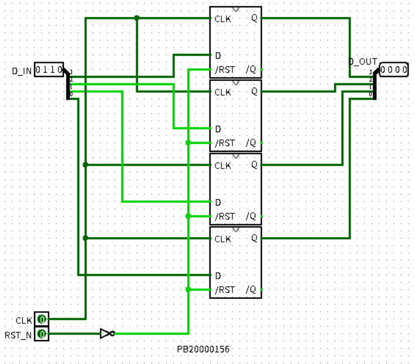  
* 将寄存器每次的输出用加法器加一作为下一次的输入，随着时钟信号更新，即可作为计数器。
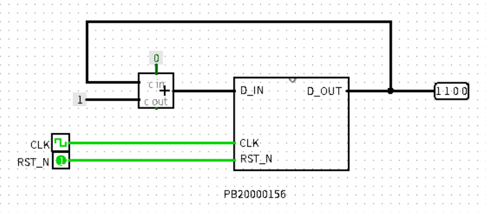  
Verilog代码：  
```verilog
module d_ff_r(
	input clk,rst_n,d,
	output reg g);
always@(posedge clk or negedge rst_n)
begin
	if(rst_n==1'b0)
		q<=1'b0;
	else
		q<=d;
end
endmodule

module reg4(
	input clk,[3:0]d_in,rst_n,
	output[3:0] d_out);
d_ff_r ff3(clk,d[3:3],rst_n,d_out[3:3]);
d_ff_r ff2(clk,d[2:2],rst_n,d_out[2:2]);
d_ff_r ff1(clk,d[1:1],rst_n,d_out[1:1]);
d_ff_r ff0(clk,d[0:0],rst_n,d_out[0:0]);
endmodule

module counter(
	input clk,rst_n,
	output[3:0] g);
wire [3:0]din;
add add(d_out,4'b1,1'b0,din);
reg4 reg4(clk,din,rst_n,g);
endmodule
```
### Problem4
计数器部分类似，但使用数据选择器控制复位信息。同时检测到结果降为0后进行复位。  
电路图：  
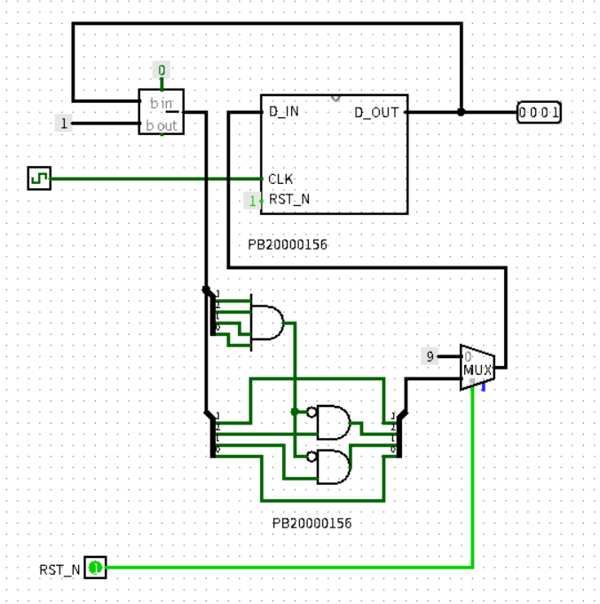  
Verilog:  
```verilog
module counter(
	input clk,
	input rst_n,
	output reg[3:0] g);
always@(posedge clk)
begin
    if(rst_n==1'b0)
        g<=4'b1001;
    else
    begin
        if(g==4'b0000)
            g<=4'b1001;
        else
            g<=g-1;
    end
end
endmodule
```
本题Verilog直接对计数器采用了时序逻辑的写法。
### Problem5
直接取反即可。  
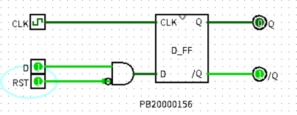  
Verilog：
```verilog
module d_ff_s(
	input clk,rst,d,
	output reg q);
always@(posedge clk)
begin
	if(rst==1'b1)
		q<=1'b0
	else
		q<=d
end
endmodule
```
## 总结与思考
* 通过本次实验掌握了使用 Logisim 搭建时序逻辑电路的方法，同时也知道了如何写对应的 Verilog 代码。初次设计电路时也遇到了不少问题，如异步复位不能直接给输出赋值，这些都为将来进一步实验提供了经验。
* 本次实验难易度中等。
* 任务量较大，主要是因为非简单题目比较多，触发器的设计较费时间。
* 无改进建议。
