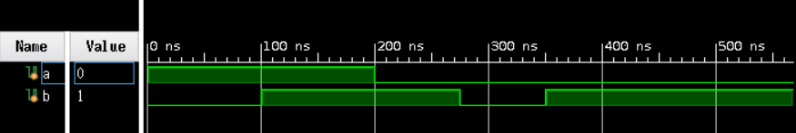
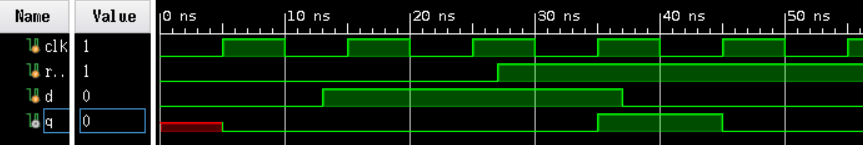
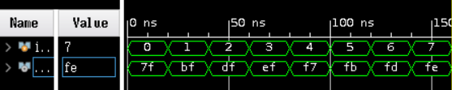

# 第六次实验
徐亦昶 PB20000156
## 实验题目
使用 Vivado 进行仿真
## 实验练习
### Problem 1
使用#号来控制产生下一个信号的时间，用initial语句实现并行控制两个输出。
```verilog
`timescale 1ns / 1ps
module test_bench();
reg a,b;
initial
begin
    a=1;
    b=0;
end
initial
begin
    #200;
    a=0;
end
initial
begin
    #100;
    b=1;
    #175;
    b=0;
    #75;
    b=1;
end
endmodule
```
产生的波形信号如下：  

### Problem 2
使用always来实现时钟信号的周期性变化，使用initial来实现变量值的同步、一次性更新。
```verilog
`timescale 1ns / 1ps
module test_bench();
reg clk,rst_n,d;
wire q;
initial clk=0;
always #5 clk=~clk;
initial
begin
    rst_n=0;
    d=0;
end
initial
begin
    #27;
    rst_n=1;
end
initial
begin
    #13;
    d=1;
    #24;
    d=0;
end
endmodule
```
在Vivado中仿真，产生如下波形：

### Problem 3
在上一条代码中，调用模块d_ff_r:
```verilog
d_ff_r d_ff_r(.clk(clk),.rst_n(rst_n),.d(d),.q(q));
```
调用语句在wire声明后面。  
在Vivado中进行仿真，波形如下：  

对不同的输入，使用case语句得到相应的输出。注意赋值符号<=是作用于时序逻辑，不是组合逻辑。即使是在always语句下，也不一定要用<=来赋值。（做本题目时，一开始使用了<=来对输出变量进行赋值，导致仿真的波形图无法正常显示，输出变量一直都是XX）  
译码器代码：
```verilog
`timescale 1ns / 1ps
module decoder(
input [2:0] in,
output reg [7:0] out);
always@(*)
begin
case(in)
    3'b000:out=8'b0111_1111;
    3'b001:out=8'b1011_1111;
    3'b010:out=8'b1101_1111;
    3'b011:out=8'b1110_1111;
    3'b100:out=8'b1111_0111;
    3'b101:out=8'b1111_1011;
    3'b110:out=8'b1111_1101;
    3'b111:out=8'b1111_1110;
    default:out=8'b1111_1111;
endcase
end
endmodule
```
仿真文件将调用该模块，依次产生可能的输入信号对模块进行检查：
```verilog
`timescale 1ns / 1ps
module test_bench();
reg [2:0] in;
wire [7:0] out;
decoder decoder(.in(in),.out(out));
initial
begin
    in=3'b000; #20;
    in=3'b001; #20;
    in=3'b010; #20;
    in=3'b011; #20;
    in=3'b100; #20;
    in=3'b101; #20;
    in=3'b110; #20;
    in=3'b111; #20;
    $finish;
end
endmodule
```
波形图：  
  
输出波形正常。
## 总结与思考
1、通过本次实验，学会了在Vivado上进行Verilog的设计与验证，同时掌握了使用Vivado写Verilog仿真文件的语法。  
2、难易度中等。  
3、任务量适中。  
4、建议提升vivado的速度，特别是在后面实验的bit文件生成部分，速度奇慢。