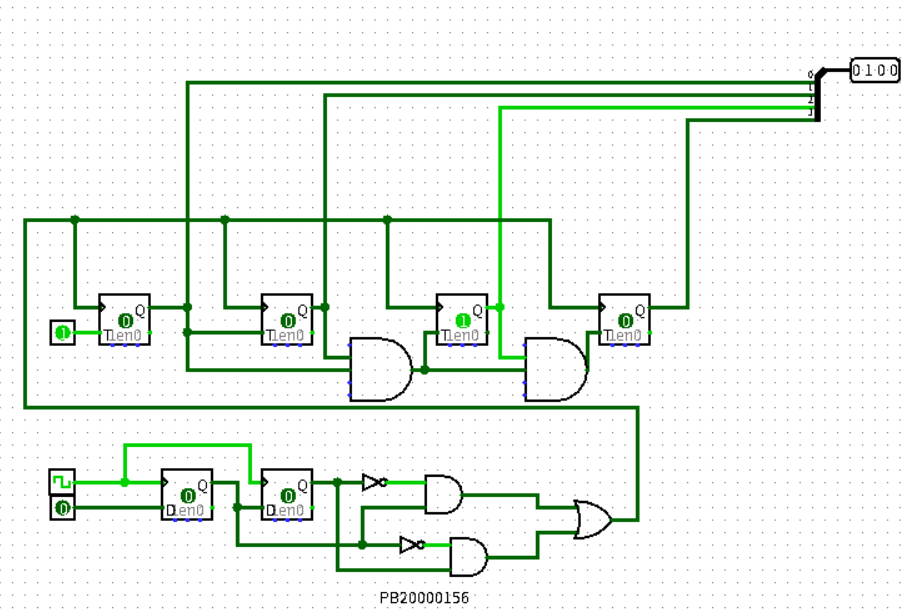
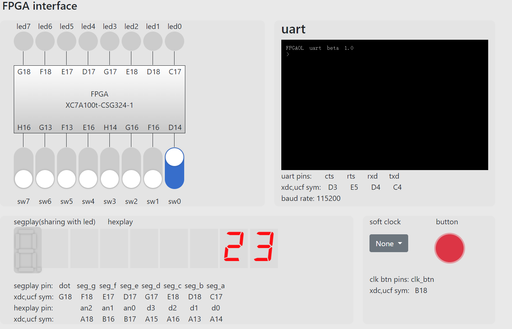

# 实验 08 信号处理及有限状态机
徐亦昶  
PB20000156  
注：后两题有奇怪的bug，没有调试出来，暂时只贴代码。  
## 实验题目
### 第一题
```verilog
module test(
input clk,rst,timer_pulse
output led);
reg [1:0]curr_state;
reg [1:0]next_state;
always@(*)
begin
	if(timer_pulse)
	begin
		case(curr_state)
			2'b00:next_state=2'b01;
			2'b01:next_state=2'b10;
			2'b10:next_state=2'b11;
			2'b11:next_state=2'b00;
		endcase
	else
		next_state=curr_state;
end
always@(posedge clk or posedge rst)
begin
	if(rst)
		curr_state<=2'b00;
	else
		curr_state<=next_state
end
assign led=(curr_state==2'b11)?2'b1:1'b0;
endmodule
```
### 第二题  
使用前文提到的边沿检测方式检测sw的改变。  

下面的pin是sw。
### 第三题
Verilog:  
```verilog
//p3.v
`timescale 1ns / 1ps

module signal_edge(
input clk,rst,button,
output button_edge);
reg button_r1,button_r2;
always@(posedge clk)
    button_r1 <= button;
always@(posedge clk)
    button_r2 <= button_r1;
assign button_edge = button_r1 & (~button_r2);
endmodule
```
```verilog
//top.v
module top(
input sw,clk,btn,rst,
output reg [2:0]hexplay_an,
output reg [3:0]hexplay_data);
reg [7:0] data;
reg [32:0] hexplay_cnt;
wire button_edge;

always@(posedge clk or posedge rst) begin
    if (hexplay_cnt >= (20000000 / 8))
		hexplay_cnt <= 0;
	else
		hexplay_cnt <= hexplay_cnt + 1;
    if(rst)
        hexplay_cnt<=0;
end
always@(posedge clk) begin
	if (hexplay_cnt == 0)begin
		if (hexplay_an == 3'b1)
			hexplay_an <= 3'b0;
		else
			hexplay_an <= 3'b1;
	end
end
always@(posedge clk) begin
	if(hexplay_an==0)
        hexplay_data<=data[3:0];
    else
        hexplay_data<=data[7:4];
end
always@(posedge clk or posedge rst)
begin
if(button_edge)
        data<=sw?data+1:data-1;
if(rst)
        data<=8'h1f;
end

signal_edge signal_edge(clk,rst,btn,button_edge);
endmodule
```
管脚限制文件：  
```
## Clock signal
set_property -dict { PACKAGE_PIN E3    IOSTANDARD LVCMOS33 } [get_ports { clk }]; #IO_L12P_T1_MRCC_35 Sch=clk100mhz
#create_clock -add -name sys_clk_pin -period 10.00 -waveform {0 5} [get_ports {CLK100MHZ}];

## FPGAOL SWITCH

set_property -dict { PACKAGE_PIN D14   IOSTANDARD LVCMOS33 } [get_ports { sw }];
set_property -dict { PACKAGE_PIN F16   IOSTANDARD LVCMOS33 } [get_ports { rst }];

## FPGAOL HEXPLAY

set_property -dict { PACKAGE_PIN A14   IOSTANDARD LVCMOS33 } [get_ports { hexplay_data[0] }];
set_property -dict { PACKAGE_PIN A13   IOSTANDARD LVCMOS33 } [get_ports { hexplay_data[1] }];
set_property -dict { PACKAGE_PIN A16   IOSTANDARD LVCMOS33 } [get_ports { hexplay_data[2] }];
set_property -dict { PACKAGE_PIN A15   IOSTANDARD LVCMOS33 } [get_ports { hexplay_data[3] }];
set_property -dict { PACKAGE_PIN B17   IOSTANDARD LVCMOS33 } [get_ports { hexplay_an[0] }];
set_property -dict { PACKAGE_PIN B16   IOSTANDARD LVCMOS33 } [get_ports { hexplay_an[1] }];
set_property -dict { PACKAGE_PIN A18   IOSTANDARD LVCMOS33 } [get_ports { hexplay_an[2] }];

## FPGAOL BUTTON & SOFT_CLOCK

set_property -dict { PACKAGE_PIN B18   IOSTANDARD LVCMOS33 } [get_ports { btn }];
```
运行效果如图：  
  
### 第四题
本题在数码管的显示上有奇怪的bug，没有解决。但代码给两个助教检查都没问题。此处仅放Verilog代码。
Verilog:  
```verilog
//state.v
module StateMachine(
input clk, btn,sw,
output reg[2:0] hexplay_an,
output reg[3:0] hexplay_data
);

reg[1:0] current_state;
reg[1:0] next_state;
reg[3:0] num_series;
wire [23:0]data;
wire button_edge;
reg[15:0] prev;
reg[32:0] hexplay_cnt;

parameter STATE0 = 2'b00;
parameter STATE1 = 2'b01;
parameter STATE2 = 2'b10;
parameter STATE3 = 2'b11;

/*initial
begin
hexplay_an=0;
hexplay_data=0;
hexplay_cnt=0;
current_state=STATE0;
next_state=STATE0;
num_series=0;
prev=0;
hexplay_cnt=0;
end*/

signal_edge signal_edge(.clk(clk),.button(btn),.button_edge(button_edge));
always@(posedge clk) begin
	if (hexplay_cnt >= (100000 ))
	   begin
		hexplay_cnt <= 0;
		if (hexplay_an == 5)
			hexplay_an <= 0;
		else
			hexplay_an <= hexplay_an + 1;
		end
		
	else
		hexplay_cnt <= hexplay_cnt + 1;
end


always@(*) begin
	case(hexplay_an)
		0: hexplay_data = data[3:0];
		1: hexplay_data = data[7:4];
		2: hexplay_data = data[11:8];
		3: hexplay_data = data[15:12];
		4: hexplay_data = data[19:16];
		5: hexplay_data = data[23:20];
		default:hexplay_data=4'b0000;
	endcase
end

always@(posedge clk)
	begin
		current_state <= next_state;				
	end

always@(posedge clk or posedge button_edge)
	begin
	if(button_edge==1)
	begin
	   if(~sw&current_state[0]&current_state[1])
	       num_series<=num_series+1;
		case(current_state)
			STATE0: if(sw== 0)
							next_state <= STATE0;
					else 
							next_state <= STATE1;
			STATE1: if(sw== 0)
							next_state <= STATE0;
					else 
							next_state <= STATE2;
			STATE2: if(sw == 0)
							next_state <= STATE3;
					else 
							next_state <= STATE2;
			STATE3: if(sw == 0)
							next_state <= STATE0;
					else 
							next_state <= STATE1;	
			default: next_state <= STATE0;
		endcase
        prev[11:8]<=prev[15:12];
        prev[7:4]<=prev[11:8];
        prev[3:0]<=prev[7:4];
        prev[15:12]<={1'b0,1'b0,1'b0,sw};
        end
	end
	
assign data[23:20]={1'b0,1'b0,current_state};
assign data[19:16]=num_series[3:0];
assign data[15:0]=prev[15:0];
 
endmodule
```
```verilog
//edge.v
module signal_edge(
input clk,
input button,
output button_edge);
reg button_r1,button_r2;
always@(posedge clk)
button_r1 <= button;
always@(posedge clk)
button_r2 <= button_r1;
assign button_edge = button_r1 & (~button_r2);
endmodule
```
## 收获
* 学会了去毛刺、取边沿等基本的信号处理操作，也明白了有限自动机在Verilog里的实现框架。
* 本次实验的Verilog代码编写遇到了很多问题，在解决过程中提高了静态查错能力。除此之外，也养成了代码分模块编写、每个always语句中处理一个变量的习惯。