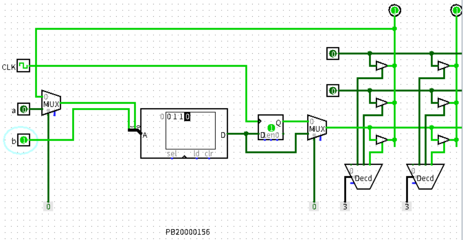
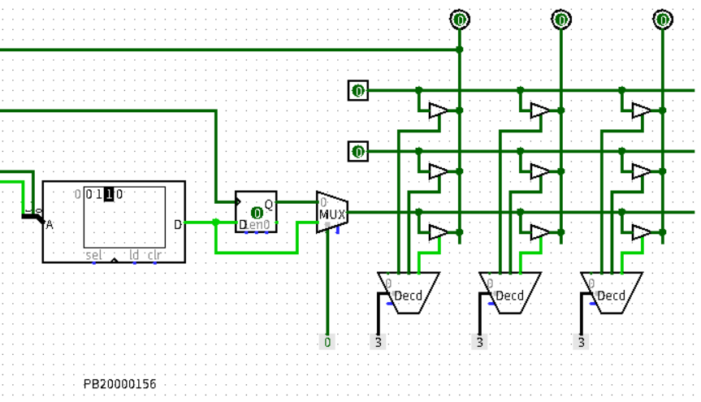
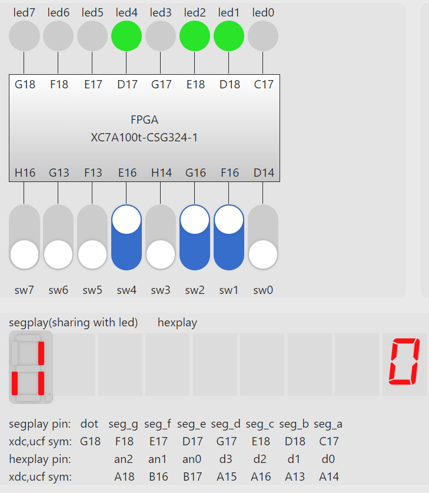
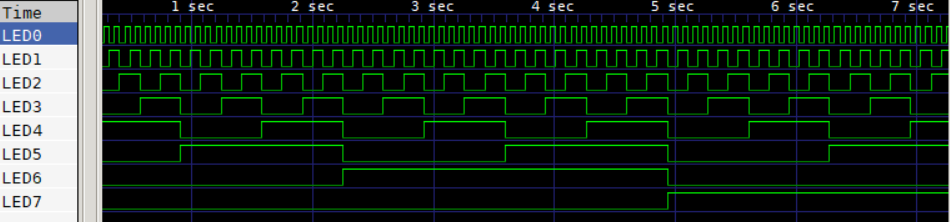
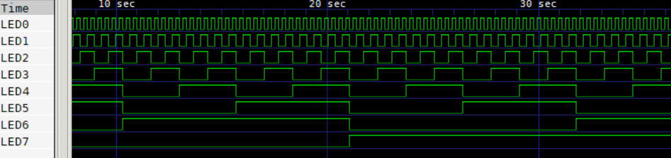

# 实验 06 FPGA 原理及 Vivado 综合
徐亦昶  
PB20000156
## 实验练习
### 第一题
由于后一个状态和当前状态有关，故第一个选择器选择反馈输入，又由于电路为时序的，所以第二个选择器要选择触发器输出，同时在RAM内赋予合适的值，使得查找到的值刚好为地址每一位的异或。  
电路图如下：  
  
  
管脚文件：  
```
set_property -dict { PACKAGE_PIN E3 IOSANDARD LVCMOS33} [get_ports {clk}];
set_property -dict { PACKAGE_PIN B1 IOSANDARD LVCMOS33} [get_ports {a}];
```
### 第二题
只需要在前面实验文档中代码的基础上，把sw的索引顺序反过来即可。  
修改又的管脚约束文件：  
```
set_property -dict { PACKAGE_PIN E3    IOSTANDARD LVCMOS33 } [get_ports { clk }]; #IO_L12P_T1_MRCC_35 Sch=clk100mhz

## FPGAOL LED (signle-digit-SEGPLAY)

set_property -dict { PACKAGE_PIN C17   IOSTANDARD LVCMOS33 } [get_ports { led[0] }];
set_property -dict { PACKAGE_PIN D18   IOSTANDARD LVCMOS33 } [get_ports { led[1] }];
set_property -dict { PACKAGE_PIN E18   IOSTANDARD LVCMOS33 } [get_ports { led[2] }];
set_property -dict { PACKAGE_PIN G17   IOSTANDARD LVCMOS33 } [get_ports { led[3] }];
set_property -dict { PACKAGE_PIN D17   IOSTANDARD LVCMOS33 } [get_ports { led[4] }];
set_property -dict { PACKAGE_PIN E17   IOSTANDARD LVCMOS33 } [get_ports { led[5] }];
set_property -dict { PACKAGE_PIN F18   IOSTANDARD LVCMOS33 } [get_ports { led[6] }];
set_property -dict { PACKAGE_PIN G18   IOSTANDARD LVCMOS33 } [get_ports { led[7] }];


## FPGAOL SWITCH

set_property -dict { PACKAGE_PIN D14   IOSTANDARD LVCMOS33 } [get_ports { sw[7] }];
set_property -dict { PACKAGE_PIN F16   IOSTANDARD LVCMOS33 } [get_ports { sw[6] }];
set_property -dict { PACKAGE_PIN G16   IOSTANDARD LVCMOS33 } [get_ports { sw[5] }];
set_property -dict { PACKAGE_PIN H14   IOSTANDARD LVCMOS33 } [get_ports { sw[4] }];
set_property -dict { PACKAGE_PIN E16   IOSTANDARD LVCMOS33 } [get_ports { sw[3] }];
set_property -dict { PACKAGE_PIN F13   IOSTANDARD LVCMOS33 } [get_ports { sw[2] }];
set_property -dict { PACKAGE_PIN G13   IOSTANDARD LVCMOS33 } [get_ports { sw[1] }];
set_property -dict { PACKAGE_PIN H16   IOSTANDARD LVCMOS33 } [get_ports { sw[0] }];

set_property -dict { PACKAGE_PIN B18   IOSTANDARD LVCMOS33 } [get_ports { rst }];

```
在vivado中进行编译，然后在FPGAOL上加载.bit文件，最终效果如下：  
  
### 第三题
这里展示的代码仅以32位的为例，30位的完全类似。将number的高8位整体赋给led。  
Verilog代码：  
```verilog
`timescale 1ns / 1ps
module counter(
input clk,
output reg [7:0]led);
reg [31:0] number;
always@(posedge clk)
begin
    led<=number[31:24];
    number<=number+1;
end
endmodule
```
管脚约束文件：  
```
set_property -dict { PACKAGE_PIN E3    IOSTANDARD LVCMOS33 } [get_ports { clk }]; #IO_L12P_T1_MRCC_35 Sch=clk100mhz

set_property -dict { PACKAGE_PIN C17   IOSTANDARD LVCMOS33 } [get_ports { led[0] }];
set_property -dict { PACKAGE_PIN D18   IOSTANDARD LVCMOS33 } [get_ports { led[1] }];
set_property -dict { PACKAGE_PIN E18   IOSTANDARD LVCMOS33 } [get_ports { led[2] }];
set_property -dict { PACKAGE_PIN G17   IOSTANDARD LVCMOS33 } [get_ports { led[3] }];
set_property -dict { PACKAGE_PIN D17   IOSTANDARD LVCMOS33 } [get_ports { led[4] }];
set_property -dict { PACKAGE_PIN E17   IOSTANDARD LVCMOS33 } [get_ports { led[5] }];
set_property -dict { PACKAGE_PIN F18   IOSTANDARD LVCMOS33 } [get_ports { led[6] }];
set_property -dict { PACKAGE_PIN G18   IOSTANDARD LVCMOS33 } [get_ports { led[7] }];
```
运行时生成了波形文件，用GTKWave打开得到下图：  
30位：  
  
32位：  
  
可以看出结果均正确，32位比30位慢，放到fpga平台也是如此。这里仅展示运行截图：  
  
## 总结与思考
* 通过本次实验，掌握了写管脚约束文件、并把verilog代码编译成bit录入fpga的过程。  
* 本次实验较简单，任务量适中。    
* 无改进建议。  