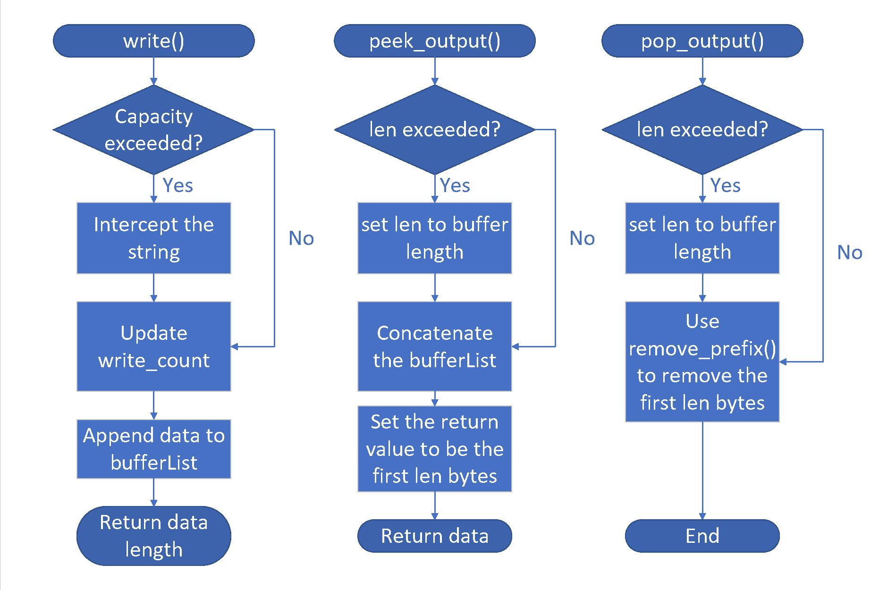

Lab 0 Writeup
=============

My name: Yichang Xu

My SUNet ID: PB20000156

This lab took me about 3 hours to do.

# Priciples of Class BufferList
BufferList consists of a queue of class Buffer called _buffer and some member functions:
* `append`: push the buffer at the rear of the queue.
* `concatenate`: iterate over the queue and then add the content of each of the buffer to a string.
* `size`: iterate over the queue and accumulate the size of encounted buffers.
* `remove_prefix`: suppose the parameter is n, then iterate over the queue, remove corresponding element and reduce n until n is reduced to 0.
# Convinience of Using Monolithic Class ByteStream
* If we want to write a stream to the buffer, we only need to call write(), no need to take care about the capacity, etc.
* If we want to read things out, only call peek_output. We don't need to concatenate strings in the buffer by hand.
* We can focus better on real scenarios: the buffer is just one black box, a tool for us to use.
# Procedure of write(), peek_output() and pop_output()

# Difficulty and Bugs
This is a simple lab, so I only encountered some bugs.

* Get a 400 bad request on my webget. This is because I didn't use a user-agent. Some websites also requires Host to be in the header.
* Result abnormal on calling remaining_capacity(). This is because I didn't complete the construction function of ByteStream. _capacity should be initialized here.
* _write_count didn't change after calling write(). On the last second line of write(), I wrote `_buffer.append(BufferList(move(_data)))`, which means the string stored in `_data` is already **moved** after implementing this instruction. I mistakenly called _data.length() after this statement, so it certainly returns 0. To fix the problem, I just moved `int ret=_data.length()` **before** the append statement.

All these problems were figured out after a quick scan of the corresponding function, so there's no need to use gdb to debug them in this lab.
# Things to Improve
Maybe we can try different methods besides GET in the webget program? Like POST.