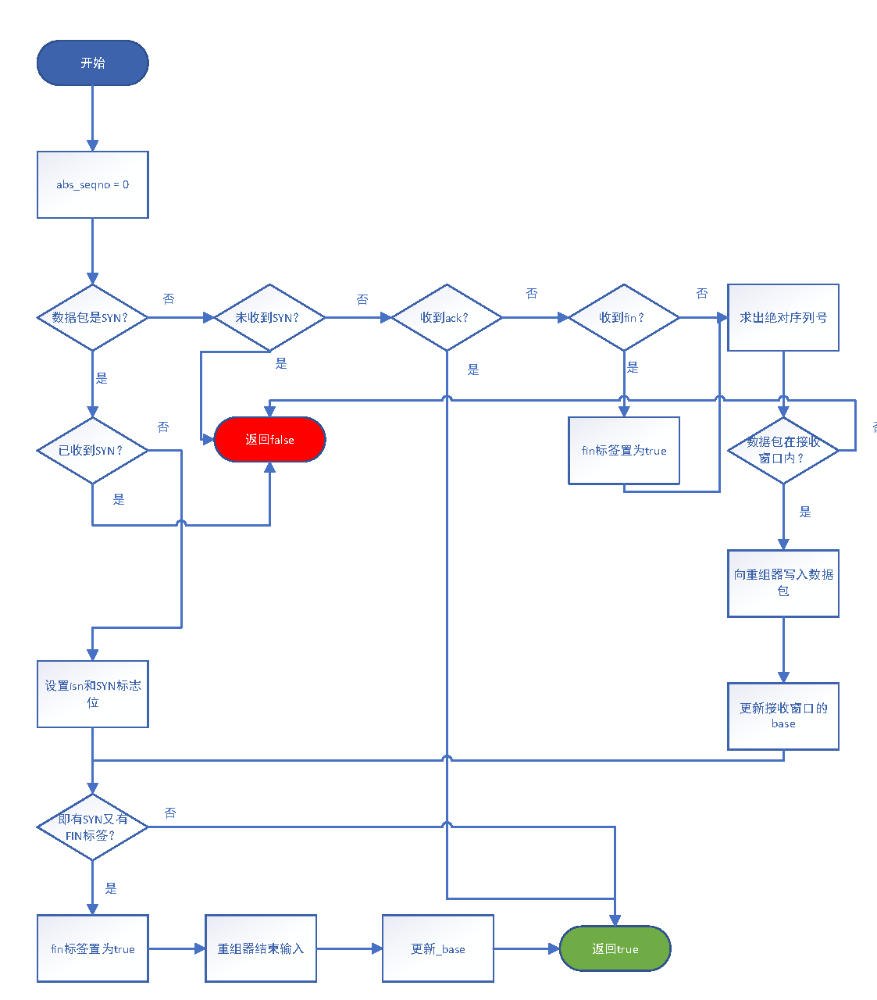

Lab 2 Writeup  
徐亦昶  
PB20000156

1. 在unwrap函数中，如果参数n溢出，则回到0，这时比起offset64，offset64 + (1ull << 32)会更接近checkpoint，即上次的索引。维护绝对索引值的完整步骤：
* 计算n-isn，得到32位偏移量。
* 将偏移量扩展到64位得到offset64，高32位和checkpoint相同。
* 计算三个候选值：offset64 - (1ull << 32)、offset64 - (1ull << 32)、offset64。如果offset64 < (1ull << 32)，则不考虑第一个候选值。
* 求候选值到checkpoint的距离，返回距离最近的候选值。

2. ISN即为SYN包seg的seg.header().seqno.raw_value()。

3. 数据包内容（字符串）、位置索引、eof。内容决定向重组器写入了什么，位置索引决定写到重组器的哪里，eof决定是否设置重组器结束输入。

4. 难点在于对三次握手协议的理解。有一些地方需要注意：
* _base并不等于_isn，而是_isn+1。SYN包传入isn后，下一次期待传入的序号应该是isn+1。
* 如果数据包的起始位置低于_base，但结尾超过_base，也应该写入。
* 注意考虑数据包其实位置超出重组器容量的情况，应该返回false。
* 写入重组器的索引号应该为绝对序列号**减一**。
* 如果包的SYN和FIN位都是1，应该当作两个包处理。
* FIN包虽然可能没有负载，但是返回的ackno应该为原来的值+1（假设数据包按序接收）。

这些问题都可以通过`make check_lab2`的报错信息检查出，没有进行单步调试。

5. 建议对握手协议说得更具体一点，以及代码中_base的具体含义应在文档中给出。官方文档的序列号、绝对序列号、索引值关系举例也应该在文档中给出，以便于理解。

6.

