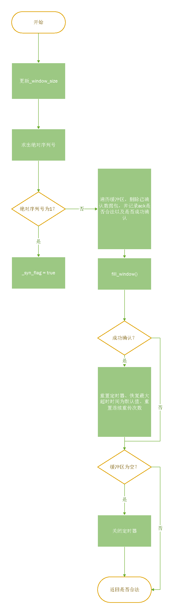

Lab 3 Writeup
徐亦昶  
PB20000156

1. 如果窗口大小为0，则不发送报文。否则先得到待发送报文长度，将其以最大报文段长度为上限进行截断，再把截断后的长度和窗口长度进行比较。如果截断后长度大于窗口大小，则将其减到窗口长度，并记录当前窗口大小为0。否则发送报文，相应减小窗口大小记录值。

2. 先遍历一遍缓冲区，把序列号小于ackno对应序列号的全部删除，并标志成功接收。如果成功接收，则重启定时器，将最大超时时间设置回默认，连续重传数置零。当缓冲区为空时，关闭定时器。对于函数返回值：遍历缓冲区的时候记录ackno对应序列号在合法范围内（即它对应序列号-1必须不大于某个数据包的最大字节位置的序列号），如果ackno合法则返回true，否则返回false。

3. 重新发送序列号最小的数据包，如果窗口大小大于0，说明最大超时时长过短，此时增加连续重传数并设置最大超时时长为原来的两倍，在两种情况下，最后都要重启计时器。TCP协议规范中，当一个TCP报文重传的次数达到系统设置的最大值时，有些系统会直接reset重置该TCP连接，但有些要求很高的业务应用系统，则会不断的重传被丢弃的报文，以尽最大可能保证业务数据的正常交互。

4. 记录下一个待发送数据包的序列号，这是数据包报头的必要信息。

5. 

6. 本实验的难点主要在于理解。
* 收到ack后要检测是否合法，**如果不合法返回false**。
* _syn_flag不能在刚发送时就设置，应该在收到相应的ack后再设。
* 关于eof的处理：实验文档代码有问题，应该通过_stream.input_ended()判断。我发现这个问题是通过在进入fill_window时输出当前缓冲区和eof。
* 发送对于_window_size的考虑：一开始使用了一个变量统计发送出的字节数，发送前会先判断是否超出窗口限制。但后来发现这样做会导致第二次调用fill_window时误认为没有发送数据，后来采用了减少_window_size的方法。发现这个问题是通过在每次调用fill_window时进行输出，再在发送数据包前输出_window_size和已发送字节数，观察到有系统调用的fill_window出现，此时已发送字节数作为局部变量被重新初始化为0。

7. 建议补充超时重传过程的具体操作，这部分没有官方文档详细。以及去除syn和fin同时为true这种现实中不可能的数据包。还有就是对early ack results in bare ack这样的测试样例做一下解释，字面意思很难读懂要测什么。