# 第0次实验

主要内容：建立自己的git仓库，学会使用Markdown撰写实验报告。

## git

### git 的安装

#### Windows

在Windows下，个人推免一套软件安装模式。即使用 CHOCOLATEY 对软件进行安装和管理。

优点： 命令行安装，操作简单。

缺点： 需要以管理员模式启动命令行略微麻烦，默认安装目录是C盘，需要额外操作移动目录。

参照：https://chocolatey.org/install 安装chocolaty

之后执行：

```powershell
choco install git
```

即可完成安装。

如果不实用chocolaty也可以下载安装可执行文件进行安装，安装时如果不理解的选项保持默认即可。

#### Linux (Ubuntu为例)

```bash
sudo apt install git
```

即可安装，大部分发行版内置 git。

### 远程账号注册

本学期实验建议使用平台为：https://git.lug.ustc.edu.cn/

注册账号不做赘述。

### SSH 登录

简介：由一对文件用于身份校验的文件，公钥是可以公开随意发放，私钥是具有隐私性质的。如果公钥和私钥匹配，那么身份就得到了认证。

在命令行中使用: 

```bash
ssh-keygen
```

命令生成公私钥对，之后直接回车默认信息即可。

Tip: 为了更好的安全性，可以添加emphasis信息或者采用edcsa等其他签名验证算法。

**Tip：如果你已经有了自己的公私钥，请不要直接生成，请不要直接生成，请不要直接生成**

之后 Linux 默认在 `${HOME}/.ssh` 目录下

Windows 默认在 `%userprofile%\.ssh` 目录下

此时可以看到 id_rsa.pub 文件，将此文件内容复制。

之后在：https://git.lug.ustc.edu.cn/-/profile/preferences

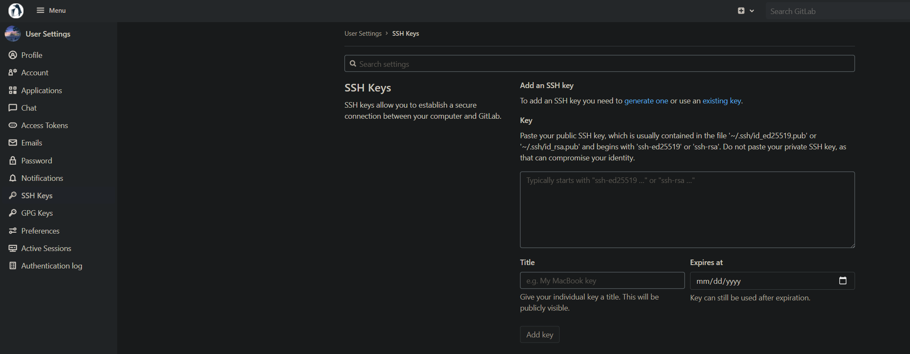

将刚刚的文件内容复制，点击Add Key即可。

从此以后，LUG gitlab上的内容如果通过 SSH 进行clone、push、pull将不再需要手动输入账号和密码。

### 仓库权限管理

在仓库管理页面可以找到 Member 页面

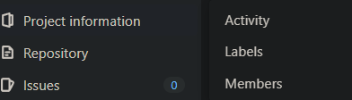

将助教作为 Maintainer 进行 Invite：

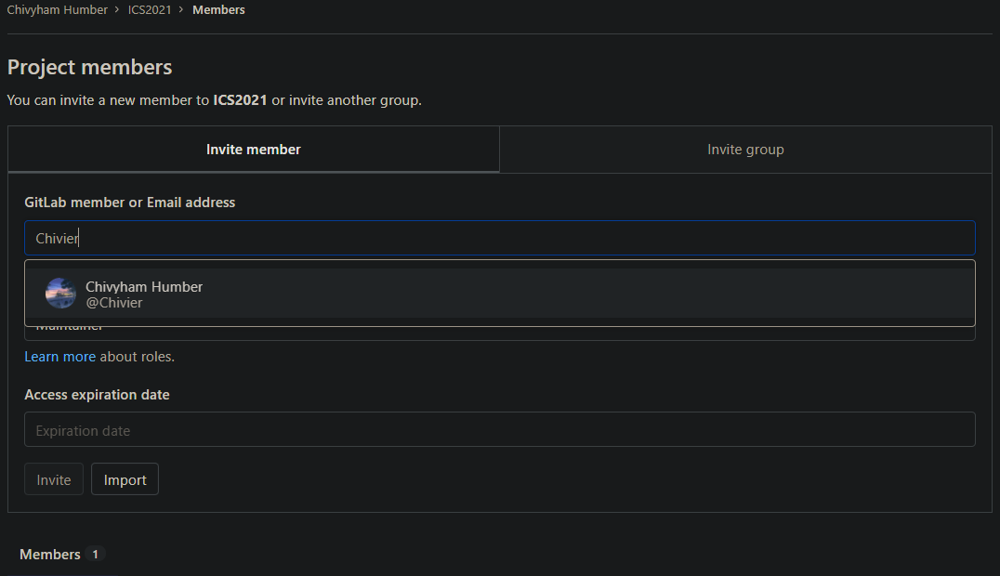


### git 新建仓库

在：https://git.lug.ustc.edu.cn/projects/new

可以新建自己的仓库，点击 `Create blank project`

进入图示页面：

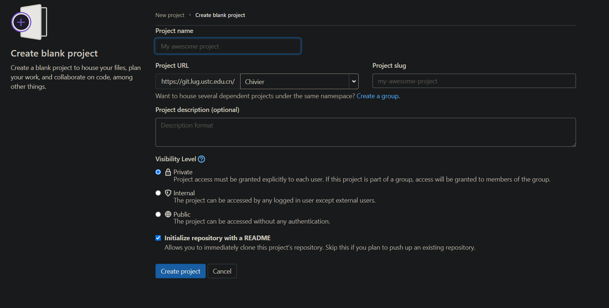

项目名称填写`学号_ICS`，例如：`PB17000144_ICS`

可见级别请**一定选为 Private**

成功创建后，可以看到如下图所示：


点击 Clone 按钮，可以看到项目地址，之后在命令行中使用 `git clone ...` 将项目下载到本地。

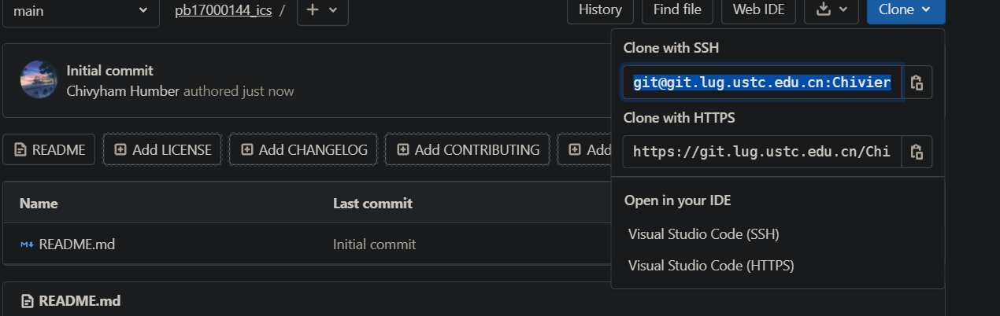

### 本地更新

之后的操作演示只给出 Linux 版本，Windows 可以使用 Cmder 或者 Powershell 进行相同的操作，具体命令实现不一定相同，大家自行处理。

Clone 仓库：


之后编辑次目录下的文件，此时目录应该像下图所示：

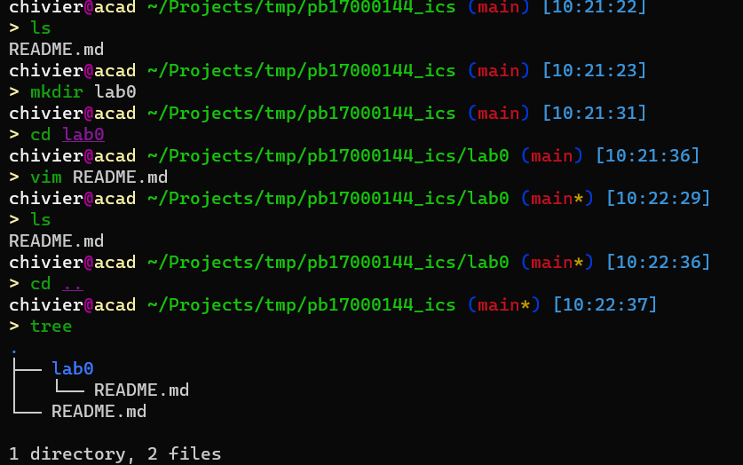

此时用命令查看本地仓库状态：
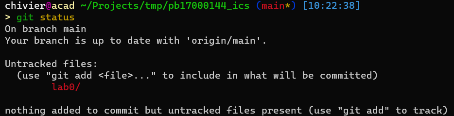

发现有一个文件夹未更新，所以使用git add命令添加：
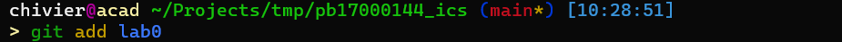

再去查看状态，确认已经添加：
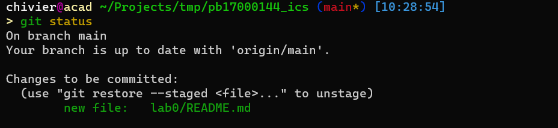

为本次添加行为记录commit信息，建议大家养成良好的习惯，尽量写“简介有效”的信息：


之后进行 push 操作：
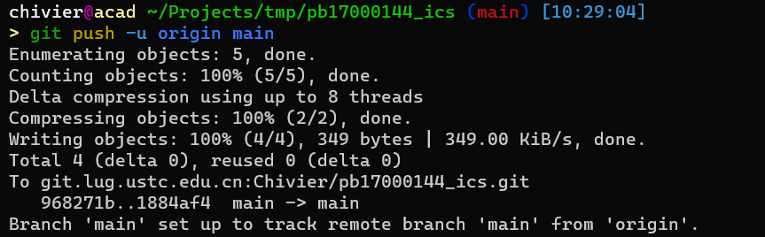

push 成功之后查看网页：
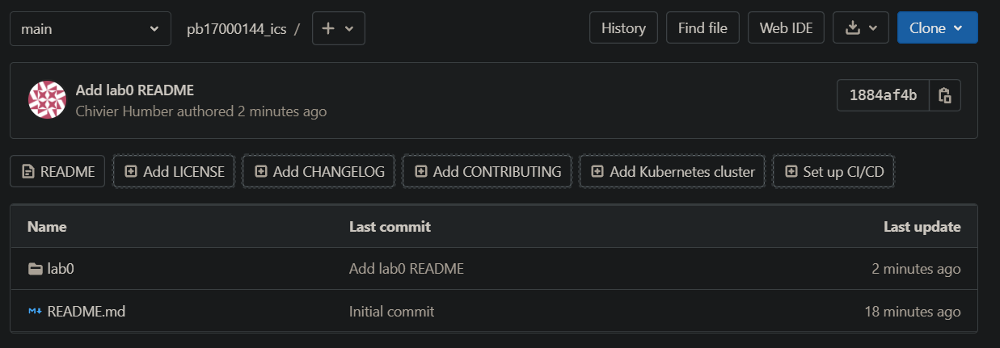

发现已经完成了提交。

## 实验内容

1. 完成仓库创建和公钥添加
2. 建立 lab0 目录
3. 在 lab0 目录中使用 Markdown 写一个简单的自我介绍，文件名为`README.md`，50个汉字以内（**别卷，之后会给你们卷的机会**），使用一级标题写学号，二级标题写姓名，普通文本写自己的一项爱好。
（关于实验报告插入图片的问题，本次实验文档可以作为参考）

## 评分标准

本次实验不计分，但是之后的实验都会使用git进行收取，如果本次实验未能成功提交，那么之后所有实验可能均无法得分，请同学自行承担风险。
