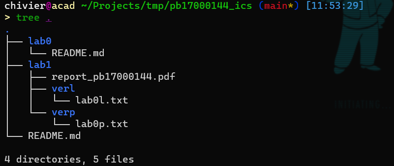

# 第一次实验 “温故知新”

在实验开始之前，有三句话送给大家：

- Stay Hungry, Stay Foolish. （不要满足现状）
- Do not set limit for yourself. （不要停止优化，任何程序都有重整优化的空间）
- Courage is going from failure to failure without losing enthusiasm. （不要害怕 debug）

## 实验内容

1. 众所周知，LC3 机器是没有可以直接使用的乘法指令的。<font color=red>本次实验任务是实现乘法，写出对应程序机器码</font>。两个运算数分别放置于 R0 和 R1，结果需要存储到 R7，其他寄存器状态我们不做限制（即不限结束状态）。初始状态：R0和R1存放待计算数，其余寄存器全部为0。
2. 请评估自己程序的<font color=red>代码行数</font>、完成实验功能所需要<font color=red>执行的指令数</font>，并将统计方法写在报告中。
3. 要求提交<font color=red>两个版本的代码</font>。L版本尽量编写更少的代码行数，P版本尽量让程序执行更少的指令。

## 评分标准

#### 1）程序正确性 （60%）

- <font color=red>！！！请严格按照实验要求将结果存储在R7！！！</font>
- L版本程序通过所有测试可得30%
- P版本程序通过所有测试可得30%
- 要求与c语言short型整数乘法结果相同

#### 2）实验报告（20%），要求图文并茂

- L程序和P程序是如何设计的？
- L版本程序最初用了多少行？最终版本用了多少行？
- P版本程序最初用了多少条指令？最终完成版本用了多少条指令？
- ... ....

#### 3）L版本的<font color=red>代码行数</font>小于14行（10%），否则分数按照下列公式计算：

- $Score_{vesion\,l} = 10 \times min(2 \times\frac{ \texttt{Lines of TA's program}}{\texttt{Lines of your program}}, 1)$
- 其中，**Lines of TA's program = 7**。

- 程序的指令行数（注意是行号代表的行数，而非程序执行的指令数）在TA's program的两倍以内即可得满分。

#### 4）P版本在所有测试用例上执行的<font color=red>平均指令条数</font>需要小于130条（10%），否则分数按照下列公式计算：

- $
  Score_{vesion\,p} = 10 \times min(2 \times \frac{\texttt{Average time of TA's program}}{\texttt{Average time of your program}}, 1)
  $
- 其中，Time of TA's program在**下方测试样例**上执行的平均指令数为70，在**全部测试样例上** (包括未给出的) 执行的平均指令数为65。

- 我们采用“执行过的指令数”作为时间衡量标准。程序执行的指令数在TA's program的两倍以内即可得满分。

## 测试样例

- 需要对下列case的测试：
  - 计算 1 * 1
  - 计算 5 * 4000
  - 计算 4000 * 5
  - 计算 -500 * 433 （刻意溢出）
  - 计算 -114 * -233

- 评估程序正确性、计算P时，会有其他的样例

## 注意事项

- 必须使用LC3 tool完成实验

- 自己使用LC3 tool时，程序的第一条指令需要指定在内存中的位置，比如0x3000，并以HALT指令结束。以下是一个例子，计算R7 = R0 + R1：

``` assem
; start the program at location x3000 
0011 0000 0000 0000

;your own program
0101 001 001 1 00000 ;R1 = 0, clear R1
0101 000 000 1 00000 ;R0 = 0, clear R0
0001 000 000 1 00001 ;R0 = 1
0001 001 001 1 00001 ;R1 = 1
0001 111 000 000 001 ;R7 = R0 + R1

; halt
1111 0000 00100101
```

- <font color=red>！！！提交的代码只需要保留your own program的部分，并去掉对寄存器初始化的过程！！！</font>比如上述程序，你提交的代码只需要：

``` assem
0001 111 000 000 001				
```

​		此时，统计的代码行数为1行。评分标准中提到Lines of TA's program = 7就是掐头去尾统计得到的。

## 提交说明

完成的程序应当在目录下呈现如图所示结构：



lab1目录为本次实验内容，其中 report_pbxxxxxxxx.pdf 为报告，<font color=red>限制pdf格式，其他格式默认不予接受。</font>

verl目录存放L版本代码，verp目录存放P版本代码。


## 提交方式

### 安老师班

Git提交

### 苗老师、张老师班

请将lab1文件夹打包，压缩包改为 <font color=red>姓名\_学号\_lab1</font>.zip/tar/rar/...

之后<font color=red>上传到坚果云</font>，链接会放在课程主页上。


**截止日期：2021.12.4 23:00 (UTC+8 China Standard Time)**

