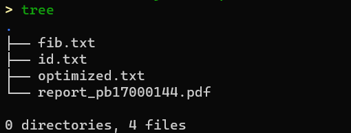

# Lab3 Better Angels

## Task

### task 1: read and understand

In lab 3, you will get a piece of assemble code in 'fib.txt'. Your first task is to read the code arefully.

### task 2: guess

This code is some other's program in lab2. Guess the owner of the program by the last 4 lines of the program.

Write down the owner's student id in 'id.txt'.

### task 3: optimize

The code in lab2 is a L-version program. Of course it's performance is not very well. In this part, you need to optimize other's program.

(Rewriting is also a legitimate optimization method)

Store the optimized code in 'optimized.txt'.

### task 4(optional): feedback

Contact the owner, say anything you like. (Don't swear. If the other party's program is too difficult to understand, please also keep polite.)

## Score

### read (20%）

After finishing part 1, you will get 20% score.

### Guess (20%)

Getting correct student id will earn 20% score.

### Optimizeing(40%)

In this section, a score of 40% can be achieved if optimization is completed.

Here we will test the following 10 data sets.

N = 24, 144, 456, 1088, 1092, 2096, 4200, 8192, 12000, 14000

The ratio of the average number of execution cycles before and after these 10 sets of optimizations will be used as a prize(the ratio has nothing to do with your score), and the student with the largest optimization will receive a surprise gift.

### Report（20%）

- Same as lab1

## Submission

The completed program should be structured in the directory as shown in the figure,

### Prof. An

Use git to submit your program.

### Prof. Miao & Zhang

Please pack the lab3 folder and zip it to Name\_ID\_lab3.zip/tar/rar/...

After that upload to the nut cloud and the link will be placed on the course homepage.

**2021.12.18 23:00 (UTC+8 China Standard Time)**