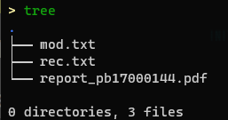

# Lab4 Reveal Yourself

## Task

Have you ever met such a situation that your disk is broken and data is lost?

OK, in this lab, your task is to find out the missing bit in a program.

### task 1

In the first part, 4 bits in the code are missing. You need to find out the missing bits. Before the program starts, values in the registers(except PC) are 0. At the end of the program, the register status is as follow.

```bash
R0 = 5, R1 = 0, R2 = 300f, R3 = 0
R4 = 0, R5 = 0, R6 = 0, R7 = 3003
```

The program is stored in task1.txt.

Store the fixed program in 'rec.txt'.

### task 2

The second part of the program is used to calculate the remainder. 15 bits int the code are missing. For 2,4,6,8 the remainder is easy to calculate, but for 7 the remainder needs some skills. Here is a quicker way to do the remainder for 7.

Hint: The program uses the term "divide by 8".

The program is stored in task2.txt.

Store the fixed program in 'mod.txt'.

## Score

### read (40%）

After finishing part 1, you will get 40% score.

### Guess (40%)

After finishing part 2, you will get 40% score.

### Report（20%）

- Same as lab1

## Submission

The completed program should be structured in the directory as shown in the figure,



### Prof. An

Use git to submit your program.

### Prof. Miao & Zhang

Please pack the lab4 folder and zip it to <font color=red>Name\_ID\_lab4</font>.zip/tar/rar/...

After that <font color=red>upload to the nut cloud</font> and the link will be placed on the course homepage.

**2021.12.24 23:00 (UTC+8 China Standard Time)**

**Merry Christma**
