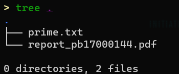

# Lab5 Riddle

## Task

For this experiment you need to functionally reproduce a c++ programs.

Program A:

```c++
int judge(int r0) {
    int i = 2;
    r1 = 1;
    while (i * i <= r0) {
        if (r0 % i == 0) {
            r1 = 0;
            break;
        }
        i++;
    }
    return r1;
}
```

Your program should follow a specific framework:

```assembly
.ORIG x3000
... ; TO BE DONE
HALT
JUDGE ... ; TO BE DONE
... ; TO BE DONE
RET
... ; TO BE DONE
.END

```

r0(an integer, $0 \le r0 \le 10000$) is given before program executes(just like lab1), and store the final result in r1. (no need to print out with TRAP)

## Score

### 1）Corectness (60%）

If your program passes all the test cases, you can get 60%

### 2）Report（40%）

Same as lab1

## Submission

The completed program should be structured in the directory as shown in the figure,



### Prof. An

Use git to submit your program.

### Prof. Miao & Zhang

Please pack the lab5 folder and zip it to <font color=red>Name\_ID\_lab5</font>.zip/tar/rar/...

After that <font color=red>upload to the nut cloud</font> and the link will be placed on the course homepage.

**2021.12.31 21:00 (UTC+8 China Standard Time)**

**Happy New Year**