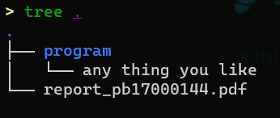

# Lab6 Learn from the past

The last lab might be the simplest one. Use a high-level programming language (e.g. C, Python, C++) to implement all the code that has been written before. The algorithm needs to be consistent with what was used before, e.g. a replication of the first experiment cannot be implemented with just one line of multiplication.

Program list:

- lab0l (lab1 L version)
- lab0p (lab1 P version)
- fib (lab2 fibonacci)
- fib-opt (lab3 fibonacci)
- rec (lab4 task1 rec)
- mod (lab4 task2 mod)
- prime (lab5 prime)

For this experiment, you should think about the following questions:

1. how to evaluate the performance of your own high-level language programs
2. why is a high-level language easier to write than LC3 assembly
3. what instructions do you think need to be added to LC3? (You can think about the previous experiments and what instructions could be added to greatly simplify the previous programming)
4. is there anything you need to learn from LC3 for the high-level language you use?

## Score

### 1）Corectness (50%）

Your program accounts for half the score.

### 2）Report（50%）

Your report accounts for another half the score.

**2022.1.7 23:00 (UTC+8 China Standard Time)**

**Thank you for taking this course**

