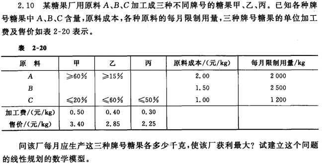

# 使用matlab解线性规划问题
PB20000156  
徐亦昶

## 问题描述

## 模型建立
设甲产品中ABC三种原料的含量分别是$x_1,x_2,x_3$(单位千克)，同理对乙、丙产品中原料设定为$x_4,x_5,...,x_9$，则约束方程可列为：
$$
\left\{
\begin{aligned}
x_1+x_2+x_3&\le2000 \\
x_4+x_5+x_6&\le2500 \\
x_7+x_8+x_9&\le1200 \\
x_1-0.6(x_1+x_4+x_7)&\ge0 \\
x_2-0.15(x_2+x_5+x_8)&\ge0 \\
x_7-0.2(x_1+x_4+x_7)&\le0 \\
x_8-0.6(x_2+x_5+x_8)&\le0 \\
x_9-0.5(x_3+x_6+x_9)&\le0 \\
x_1,...,x_{9}&\ge0
\end{aligned}
\right.
$$
$$
\max z=-2x_1-2x_2-2x_3-1.5x_4-1.5x_5-1.5x_6-x_7-x_8-x_9+2.9(x_1+x_4+x_7)+2.45(x_2+x_5+x_8)+1.95(x_3+x_6+x_9)
$$
化简后得：
$$
\left\{
\begin{aligned}
x_1+x_2+x_3&\le2000 \\
x_4+x_5+x_6&\le2500 \\
x_7+x_8+x_9&\le1200 \\
0.4x_1-0.6x_4-0.6x_7&\ge0 \\
0.85x_2-0.15x_5-0.15x_8&\ge0 \\
-0.2x_1-0.2x_4+0.8x_7&\le0 \\
-0.6x_2-0.6x_5+0.4x_8&\le0 \\
-0.5x_3-0.5x_6+0.5x_9&\le0 \\
x_1,...,x_{9}&\ge0
\end{aligned}
\right.
$$
$$
\max z=0.9x_1+0.45x_2-0.05x_3+1.4x_4+1.95x_5+0.45x_6+1.9x_7+1.45x_8+0.95x_9
$$
加入松弛变量变为标准型：
$$
\left\{
\begin{aligned}
x_1+x_2+x_3+x_{10}&=2000 \\
x_4+x_5+x_6+x_{11}&=2500 \\
x_7+x_8+x_9+x_{12}&=1200 \\
0.4x_1-0.6x_4-0.6x_7-x_{13}&=0 \\
0.85x_2-0.15x_5-0.15x_8-x_{14}&=0 \\
-0.2x_1-0.2x_4+0.8x_7+x_{15}&=0 \\
-0.6x_2-0.6x_5+0.4x_8+x_{16}&=0 \\
-0.5x_3-0.5x_6+0.5x_9+x_{17}&=0 \\
x_1,...,x_{17}&\ge0
\end{aligned}
\right.
$$
$$
\max z=0.9x_1+0.45x_2-0.05x_3+1.4x_4+1.95x_5+0.45x_6+1.9x_7+1.45x_8+0.95x_9
$$
可取$x_{13}$到$x_{20}$为基变量，约束方程变为
$$
\left\{
\begin{aligned}
x_1+x_2+x_3+x_{10}&=2000 \\
x_4+x_5+x_6+x_{11}&=2500 \\
x_7+x_8+x_9+x_{12}&=1200 \\
-0.4x_1+0.6x_4+0.6x_7+x_{13}&=0 \\
-0.85x_2+0.15x_5+0.15x_8+x_{14}&=0 \\
-0.2x_1-0.2x_4+0.8x_7+x_{15}&=0 \\
-0.6x_2-0.6x_5+0.4x_8+x_{16}&=0 \\
-0.5x_3-0.5x_6+0.5x_9+x_{17}&=0 \\
x_1,...,x_{17}&\ge0
\end{aligned}
\right.
$$
$$
\max z=0.9x_1+0.45x_2-0.05x_3+1.4x_4+1.95x_5+0.45x_6+1.9x_7+1.45x_8+0.95x_9
$$
初始系数矩阵：
$$
\begin{pmatrix}
1&1&1&0&0&0&0&0&0&1&0&0&0&0&0&0&0 \\
0&0&0&1&1&1&0&0&0&0&1&0&0&0&0&0&0 \\
0&0&0&0&0&0&1&1&1&0&0&1&0&0&0&0&0 \\
-0.4&0&0&0.6&0&0&0.6&0&0&0&0&0&1&0&0&0&0 \\
0&-0.85&0&0&0.15&0&0&0.15&0&0&0&0&0&1&0&0&0 \\
-0.2&0&0&-0.2&0&0&0.8&0&0&0&0&0&0&0&1&0&0 \\
0&-0.6&0&0&-0.6&0&0&0.4&0&0&0&0&0&0&0&1&0 \\
0&0&-0.5&0&0&-0.5&0&0&0.5&0&0&0&0&0&0&0&1
\end{pmatrix}
$$
在单纯形表中，
$$
c_j=[0.9,0.45,-0.05,1.4,1.95,0.45,1.9,1.45,0.95,0,0,0,0,0,0,0,0]
$$
$$
\boldsymbol{X}_B=[x_{10},x_{11},...,x_{17}]
$$
$$
\boldsymbol{b}=[2000,2500,1200,0,0,0,0,0]
$$
其余项会在后续的程序中自动算出。
## 程序编写
### 原理
使用Matlab编写一个solve函数，传入$c_j,\boldsymbol{X}_B,\boldsymbol{b}$和约束方程矩阵，输出每次迭代得到的单纯性表并返回最终的目标函数值。如果有无界解则返回Inf。  
这个函数会先计算单纯形表中没有给出的$\boldsymbol{C}_B$列和$c_j-z_j$行并确定换入变量。如果存在换入变量则计算$\theta_j$列并得到换出变量或无界解。如果存在换出变量，则对原单纯形表进行旋转操作，将新的单纯形表作为参数传入solve函数进行一次递归调用，完成接下来的迭代。不存在换入变量时，说明目标函数已经最大化，此时输出最终的单纯形表并计算目标函数值。  
另外还有一个Display函数，负责传入单纯形表相关参数并以尽可能规范的形式打印出单纯形表。  
### 源码展示
* solve.m
```matlab
function f=solve(cj,XB,b,mat,iter)
if nargin==4
    iter=1;
end
for i = 1:length(XB(:)) %Compute CB
    CB(i)=cj(XB(i));
end
for i = 1:length(cj(:)) %Compute cj-zj
    zj=0;
    for j = 1:length(CB(:))
        zj=zj+CB(j)*mat(j,i);
    end
    cjzj(i)=cj(i)-zj;
end
replace_in=find(cjzj==max(cjzj));
replace_in=replace_in(1);
if cjzj(replace_in)>0 %Not optimized
    for i = 1:length(CB(:)) %Compute theta_j
        if mat(i,replace_in)<=0
            theta(i)=inf;
        else
            theta(i)=b(i)/mat(i,replace_in);
        end
    end
    fprintf("Iteration %d:\n",iter);
    Display(cj,CB,XB,b,mat,cjzj,theta);
    if min(theta)==inf %Infinite solution
        f=inf;
        return;
    else
        replace_out=find(theta==min(theta));
        replace_out=replace_out(1);
        XB(replace_out)=replace_in;
        for i = 1:length(CB(:)) %Rotate the matrix
            if i==replace_out
                continue
            end
            ratio=mat(i,replace_in)/mat(replace_out,replace_in);
            b(i)=b(i)-b(replace_out)*ratio;
            mat(i,:)=mat(i,:)-mat(replace_out,:)*ratio;
        end
        b(replace_out)=b(replace_out)/mat(replace_out,replace_in);
        mat(replace_out,:)=mat(replace_out,:)/mat(replace_out,replace_in);
        f=solve(cj,XB,b,mat,iter+1); %Process the next table
    end
else %Optimized
    f=0;
    for i = 1:length(CB(:))
        theta(i)=inf;
        f=f+CB(i)*b(i);
    end
    fprintf("Iteration %d:\n",iter);
    Display(cj,CB,XB,b,mat,cjzj,theta);
end
return;
```
* Display.m
```matlab
function f=Display(cj,CB,XB,b,mat,cjzj,theta)
fprintf("\tcj\t\t");
for i = 1:length(cj(:))
    fprintf("%.2f\t",cj(i));
end
fprintf("theta\nCB\tXB\tb\t");
for i = 1:length(cj(:))
    fprintf("x%d\t",i);
end
fprintf("\n");
for i = 1:length(CB(:))
    fprintf("%.2f\tx%d\t%.2f\t",CB(i),XB(i),b(i));
    for j = 1:length(cj(:))
        fprintf("%.2f\t",mat(i,j));
    end
    if theta(i)==inf
        fprintf("-\n");
    else
        fprintf("%.2f\n",theta(i));
    end
end
fprintf("\tcj-zj\t\t");
for i = 1:length(cjzj(:))
    fprintf("%.2f\t",cjzj(i));
end
fprintf("\n\n");
return;
```
已经使用教材及作业中的多道题目验证了程序的正确性。
## 问题解决
### 变量建立
先在Matlab中建立调用solve函数需要的变量cj,XB,b,mat(约束方程矩阵)。
```matlab
%answer.m
clear;
cj=[0.9,0.45,-0.05,1.4,0.95,0.45,1.9,1.45,0.95,0,0,0,0,0,0,0,0];
XB=[10,11,12,13,14,15,16,17];
b=[2000,2500,1200,0,0,0,0,0];
mat(1,:)=[1,1,1,0,0,0,0,0,0,1,0,0,0,0,0,0,0];
mat(2,:)=[0,0,0,1,1,1,0,0,0,0,1,0,0,0,0,0,0];
mat(3,:)=[0,0,0,0,0,0,1,1,1,0,0,1,0,0,0,0,0];
mat(4,:)=[-0.4,0,0,0.6,0,0,0.6,0,0,0,0,0,1,0,0,0,0];
mat(5,:)=[0,-0.85,0,0,0.15,0,0,0.15,0,0,0,0,0,1,0,0,0];
mat(6,:)=[-0.2,0,0,-0.2,0,0,0.8,0,0,0,0,0,0,0,1,0,0];
mat(7,:)=[0,-0.6,0,0,-0.6,0,0,0.4,0,0,0,0,0,0,0,1,0];
mat(8,:)=[0,0,-0.5,0,0,-0.5,0,0,0.5,0,0,0,0,0,0,0,1];
solve(cj,XB,b,mat)
```
### 输出
```
Iteration 1:
	cj		0.90	0.45	-0.05	1.40	0.95	0.45	1.90	1.45	0.95	0.00	0.00	0.00	0.00	0.00	0.00	0.00	0.00	theta
CB	XB	b	x1	x2	x3	x4	x5	x6	x7	x8	x9	x10	x11	x12	x13	x14	x15	x16	x17	
0.00	x10	2000.00	1.00	1.00	1.00	0.00	0.00	0.00	0.00	0.00	0.00	1.00	0.00	0.00	0.00	0.00	0.00	0.00	0.00	-
0.00	x11	2500.00	0.00	0.00	0.00	1.00	1.00	1.00	0.00	0.00	0.00	0.00	1.00	0.00	0.00	0.00	0.00	0.00	0.00	-
0.00	x12	1200.00	0.00	0.00	0.00	0.00	0.00	0.00	1.00	1.00	1.00	0.00	0.00	1.00	0.00	0.00	0.00	0.00	0.00	1200.00
0.00	x13	0.00	-0.40	0.00	0.00	0.60	0.00	0.00	0.60	0.00	0.00	0.00	0.00	0.00	1.00	0.00	0.00	0.00	0.00	0.00
0.00	x14	0.00	0.00	-0.85	0.00	0.00	0.15	0.00	0.00	0.15	0.00	0.00	0.00	0.00	0.00	1.00	0.00	0.00	0.00	-
0.00	x15	0.00	-0.20	0.00	0.00	-0.20	0.00	0.00	0.80	0.00	0.00	0.00	0.00	0.00	0.00	0.00	1.00	0.00	0.00	0.00
0.00	x16	0.00	0.00	-0.60	0.00	0.00	-0.60	0.00	0.00	0.40	0.00	0.00	0.00	0.00	0.00	0.00	0.00	1.00	0.00	-
0.00	x17	0.00	0.00	0.00	-0.50	0.00	0.00	-0.50	0.00	0.00	0.50	0.00	0.00	0.00	0.00	0.00	0.00	0.00	1.00	-
	cj-zj		0.90	0.45	-0.05	1.40	0.95	0.45	1.90	1.45	0.95	0.00	0.00	0.00	0.00	0.00	0.00	0.00	0.00	

Iteration 2:
	cj		0.90	0.45	-0.05	1.40	0.95	0.45	1.90	1.45	0.95	0.00	0.00	0.00	0.00	0.00	0.00	0.00	0.00	theta
CB	XB	b	x1	x2	x3	x4	x5	x6	x7	x8	x9	x10	x11	x12	x13	x14	x15	x16	x17	
0.00	x10	2000.00	1.00	1.00	1.00	0.00	0.00	0.00	0.00	0.00	0.00	1.00	0.00	0.00	0.00	0.00	0.00	0.00	0.00	2000.00
0.00	x11	2500.00	0.00	0.00	0.00	1.00	1.00	1.00	0.00	0.00	0.00	0.00	1.00	0.00	0.00	0.00	0.00	0.00	0.00	-
0.00	x12	1200.00	0.67	0.00	0.00	-1.00	0.00	0.00	0.00	1.00	1.00	0.00	0.00	1.00	-1.67	0.00	0.00	0.00	0.00	1800.00
1.90	x7	0.00	-0.67	0.00	0.00	1.00	0.00	0.00	1.00	0.00	0.00	0.00	0.00	0.00	1.67	0.00	0.00	0.00	0.00	-
0.00	x14	0.00	0.00	-0.85	0.00	0.00	0.15	0.00	0.00	0.15	0.00	0.00	0.00	0.00	0.00	1.00	0.00	0.00	0.00	-
0.00	x15	0.00	0.33	0.00	0.00	-1.00	0.00	0.00	0.00	0.00	0.00	0.00	0.00	0.00	-1.33	0.00	1.00	0.00	0.00	0.00
0.00	x16	0.00	0.00	-0.60	0.00	0.00	-0.60	0.00	0.00	0.40	0.00	0.00	0.00	0.00	0.00	0.00	0.00	1.00	0.00	-
0.00	x17	0.00	0.00	0.00	-0.50	0.00	0.00	-0.50	0.00	0.00	0.50	0.00	0.00	0.00	0.00	0.00	0.00	0.00	1.00	-
	cj-zj		2.17	0.45	-0.05	-0.50	0.95	0.45	0.00	1.45	0.95	0.00	0.00	0.00	-3.17	0.00	0.00	0.00	0.00	

Iteration 3:
	cj		0.90	0.45	-0.05	1.40	0.95	0.45	1.90	1.45	0.95	0.00	0.00	0.00	0.00	0.00	0.00	0.00	0.00	theta
CB	XB	b	x1	x2	x3	x4	x5	x6	x7	x8	x9	x10	x11	x12	x13	x14	x15	x16	x17	
0.00	x10	2000.00	0.00	1.00	1.00	3.00	0.00	0.00	0.00	0.00	0.00	1.00	0.00	0.00	4.00	0.00	-3.00	0.00	0.00	666.67
0.00	x11	2500.00	0.00	0.00	0.00	1.00	1.00	1.00	0.00	0.00	0.00	0.00	1.00	0.00	0.00	0.00	0.00	0.00	0.00	2500.00
0.00	x12	1200.00	0.00	0.00	0.00	1.00	0.00	0.00	0.00	1.00	1.00	0.00	0.00	1.00	1.00	0.00	-2.00	0.00	0.00	1200.00
1.90	x7	0.00	0.00	0.00	0.00	-1.00	0.00	0.00	1.00	0.00	0.00	0.00	0.00	0.00	-1.00	0.00	2.00	0.00	0.00	-
0.00	x14	0.00	0.00	-0.85	0.00	0.00	0.15	0.00	0.00	0.15	0.00	0.00	0.00	0.00	0.00	1.00	0.00	0.00	0.00	-
0.90	x1	0.00	1.00	0.00	0.00	-3.00	0.00	0.00	0.00	0.00	0.00	0.00	0.00	0.00	-4.00	0.00	3.00	0.00	0.00	-
0.00	x16	0.00	0.00	-0.60	0.00	0.00	-0.60	0.00	0.00	0.40	0.00	0.00	0.00	0.00	0.00	0.00	0.00	1.00	0.00	-
0.00	x17	0.00	0.00	0.00	-0.50	0.00	0.00	-0.50	0.00	0.00	0.50	0.00	0.00	0.00	0.00	0.00	0.00	0.00	1.00	-
	cj-zj		0.00	0.45	-0.05	6.00	0.95	0.45	0.00	1.45	0.95	0.00	0.00	0.00	5.50	0.00	-6.50	0.00	0.00	

Iteration 4:
	cj		0.90	0.45	-0.05	1.40	0.95	0.45	1.90	1.45	0.95	0.00	0.00	0.00	0.00	0.00	0.00	0.00	0.00	theta
CB	XB	b	x1	x2	x3	x4	x5	x6	x7	x8	x9	x10	x11	x12	x13	x14	x15	x16	x17	
1.40	x4	666.67	0.00	0.33	0.33	1.00	0.00	0.00	0.00	0.00	0.00	0.33	0.00	0.00	1.33	0.00	-1.00	0.00	0.00	-
0.00	x11	1833.33	0.00	-0.33	-0.33	0.00	1.00	1.00	0.00	0.00	0.00	-0.33	1.00	0.00	-1.33	0.00	1.00	0.00	0.00	-
0.00	x12	533.33	0.00	-0.33	-0.33	0.00	0.00	0.00	0.00	1.00	1.00	-0.33	0.00	1.00	-0.33	0.00	-1.00	0.00	0.00	533.33
1.90	x7	666.67	0.00	0.33	0.33	0.00	0.00	0.00	1.00	0.00	0.00	0.33	0.00	0.00	0.33	0.00	1.00	0.00	0.00	-
0.00	x14	0.00	0.00	-0.85	0.00	0.00	0.15	0.00	0.00	0.15	0.00	0.00	0.00	0.00	0.00	1.00	0.00	0.00	0.00	0.00
0.90	x1	2000.00	1.00	1.00	1.00	0.00	0.00	0.00	0.00	0.00	0.00	1.00	0.00	0.00	-0.00	0.00	0.00	0.00	0.00	-
0.00	x16	0.00	0.00	-0.60	0.00	0.00	-0.60	0.00	0.00	0.40	0.00	0.00	0.00	0.00	0.00	0.00	0.00	1.00	0.00	0.00
0.00	x17	0.00	0.00	0.00	-0.50	0.00	0.00	-0.50	0.00	0.00	0.50	0.00	0.00	0.00	0.00	0.00	0.00	0.00	1.00	-
	cj-zj		0.00	-1.55	-2.05	0.00	0.95	0.45	0.00	1.45	0.95	-2.00	0.00	0.00	-2.50	0.00	-0.50	0.00	0.00	

Iteration 5:
	cj		0.90	0.45	-0.05	1.40	0.95	0.45	1.90	1.45	0.95	0.00	0.00	0.00	0.00	0.00	0.00	0.00	0.00	theta
CB	XB	b	x1	x2	x3	x4	x5	x6	x7	x8	x9	x10	x11	x12	x13	x14	x15	x16	x17	
1.40	x4	666.67	0.00	0.33	0.33	1.00	0.00	0.00	0.00	0.00	0.00	0.33	0.00	0.00	1.33	0.00	-1.00	0.00	0.00	2000.00
0.00	x11	1833.33	0.00	-0.33	-0.33	0.00	1.00	1.00	0.00	0.00	0.00	-0.33	1.00	0.00	-1.33	0.00	1.00	0.00	0.00	-
0.00	x12	533.33	0.00	5.33	-0.33	0.00	-1.00	0.00	0.00	0.00	1.00	-0.33	0.00	1.00	-0.33	-6.67	-1.00	0.00	0.00	100.00
1.90	x7	666.67	0.00	0.33	0.33	0.00	0.00	0.00	1.00	0.00	0.00	0.33	0.00	0.00	0.33	0.00	1.00	0.00	0.00	2000.00
1.45	x8	0.00	0.00	-5.67	0.00	0.00	1.00	0.00	0.00	1.00	0.00	0.00	0.00	0.00	0.00	6.67	0.00	0.00	0.00	-
0.90	x1	2000.00	1.00	1.00	1.00	0.00	0.00	0.00	0.00	0.00	0.00	1.00	0.00	0.00	-0.00	0.00	0.00	0.00	0.00	2000.00
0.00	x16	0.00	0.00	1.67	0.00	0.00	-1.00	0.00	0.00	0.00	0.00	0.00	0.00	0.00	0.00	-2.67	0.00	1.00	0.00	0.00
0.00	x17	0.00	0.00	0.00	-0.50	0.00	0.00	-0.50	0.00	0.00	0.50	0.00	0.00	0.00	0.00	0.00	0.00	0.00	1.00	-
	cj-zj		0.00	6.67	-2.05	0.00	-0.50	0.45	0.00	0.00	0.95	-2.00	0.00	0.00	-2.50	-9.67	-0.50	0.00	0.00	

Iteration 6:
	cj		0.90	0.45	-0.05	1.40	0.95	0.45	1.90	1.45	0.95	0.00	0.00	0.00	0.00	0.00	0.00	0.00	0.00	theta
CB	XB	b	x1	x2	x3	x4	x5	x6	x7	x8	x9	x10	x11	x12	x13	x14	x15	x16	x17	
1.40	x4	666.67	0.00	0.00	0.33	1.00	0.20	0.00	0.00	0.00	0.00	0.33	0.00	0.00	1.33	0.53	-1.00	-0.20	0.00	3333.33
0.00	x11	1833.33	0.00	0.00	-0.33	0.00	0.80	1.00	0.00	0.00	0.00	-0.33	1.00	0.00	-1.33	-0.53	1.00	0.20	0.00	2291.67
0.00	x12	533.33	0.00	0.00	-0.33	0.00	2.20	0.00	0.00	0.00	1.00	-0.33	0.00	1.00	-0.33	1.87	-1.00	-3.20	0.00	242.42
1.90	x7	666.67	0.00	0.00	0.33	0.00	0.20	0.00	1.00	0.00	0.00	0.33	0.00	0.00	0.33	0.53	1.00	-0.20	0.00	3333.33
1.45	x8	0.00	0.00	0.00	0.00	0.00	-2.40	0.00	0.00	1.00	0.00	0.00	0.00	0.00	0.00	-2.40	0.00	3.40	0.00	-
0.90	x1	2000.00	1.00	0.00	1.00	0.00	0.60	0.00	0.00	0.00	0.00	1.00	0.00	0.00	-0.00	1.60	0.00	-0.60	0.00	3333.33
0.45	x2	0.00	0.00	1.00	0.00	0.00	-0.60	0.00	0.00	0.00	0.00	0.00	0.00	0.00	0.00	-1.60	0.00	0.60	0.00	-
0.00	x17	0.00	0.00	0.00	-0.50	0.00	0.00	-0.50	0.00	0.00	0.50	0.00	0.00	0.00	0.00	0.00	0.00	0.00	1.00	-
	cj-zj		0.00	0.00	-2.05	0.00	3.50	0.45	0.00	0.00	0.95	-2.00	0.00	0.00	-2.50	1.00	-0.50	-4.00	0.00	

Iteration 7:
	cj		0.90	0.45	-0.05	1.40	0.95	0.45	1.90	1.45	0.95	0.00	0.00	0.00	0.00	0.00	0.00	0.00	0.00	theta
CB	XB	b	x1	x2	x3	x4	x5	x6	x7	x8	x9	x10	x11	x12	x13	x14	x15	x16	x17	
1.40	x4	618.18	0.00	0.00	0.36	1.00	0.00	0.00	0.00	0.00	-0.09	0.36	0.00	-0.09	1.36	0.36	-0.91	0.09	0.00	-
0.00	x11	1639.39	0.00	0.00	-0.21	0.00	0.00	1.00	0.00	0.00	-0.36	-0.21	1.00	-0.36	-1.21	-1.21	1.36	1.36	0.00	1202.22
0.95	x5	242.42	0.00	0.00	-0.15	0.00	1.00	0.00	0.00	0.00	0.45	-0.15	0.00	0.45	-0.15	0.85	-0.45	-1.45	0.00	-
1.90	x7	618.18	0.00	0.00	0.36	0.00	0.00	0.00	1.00	0.00	-0.09	0.36	0.00	-0.09	0.36	0.36	1.09	0.09	0.00	566.67
1.45	x8	581.82	0.00	0.00	-0.36	0.00	0.00	0.00	0.00	1.00	1.09	-0.36	0.00	1.09	-0.36	-0.36	-1.09	-0.09	0.00	-
0.90	x1	1854.55	1.00	0.00	1.09	0.00	0.00	0.00	0.00	0.00	-0.27	1.09	0.00	-0.27	0.09	1.09	0.27	0.27	0.00	6800.00
0.45	x2	145.45	0.00	1.00	-0.09	0.00	0.00	0.00	0.00	0.00	0.27	-0.09	0.00	0.27	-0.09	-1.09	-0.27	-0.27	0.00	-
0.00	x17	0.00	0.00	0.00	-0.50	0.00	0.00	-0.50	0.00	0.00	0.50	0.00	0.00	0.00	0.00	0.00	0.00	0.00	1.00	-
	cj-zj		0.00	0.00	-1.52	0.00	0.00	0.45	0.00	0.00	-0.64	-1.47	0.00	-1.59	-1.97	-1.97	1.09	1.09	0.00	

Iteration 8:
	cj		0.90	0.45	-0.05	1.40	0.95	0.45	1.90	1.45	0.95	0.00	0.00	0.00	0.00	0.00	0.00	0.00	0.00	theta
CB	XB	b	x1	x2	x3	x4	x5	x6	x7	x8	x9	x10	x11	x12	x13	x14	x15	x16	x17	
1.40	x4	1133.33	0.00	0.00	0.67	1.00	0.00	0.00	0.83	0.00	-0.17	0.67	0.00	-0.17	1.67	0.67	0.00	0.17	0.00	6800.00
0.00	x11	866.67	0.00	0.00	-0.67	0.00	0.00	1.00	-1.25	0.00	-0.25	-0.67	1.00	-0.25	-1.67	-1.67	0.00	1.25	0.00	693.33
0.95	x5	500.00	0.00	0.00	0.00	0.00	1.00	0.00	0.42	0.00	0.42	0.00	0.00	0.42	0.00	1.00	0.00	-1.42	0.00	-
0.00	x15	566.67	0.00	0.00	0.33	0.00	0.00	0.00	0.92	0.00	-0.08	0.33	0.00	-0.08	0.33	0.33	1.00	0.08	0.00	6800.00
1.45	x8	1200.00	0.00	0.00	0.00	0.00	0.00	0.00	1.00	1.00	1.00	0.00	0.00	1.00	0.00	-0.00	0.00	0.00	0.00	14411518807585587200.00
0.90	x1	1700.00	1.00	0.00	1.00	0.00	0.00	0.00	-0.25	0.00	-0.25	1.00	0.00	-0.25	-0.00	1.00	0.00	0.25	0.00	6800.00
0.45	x2	300.00	0.00	1.00	0.00	0.00	0.00	0.00	0.25	0.00	0.25	0.00	0.00	0.25	0.00	-1.00	0.00	-0.25	0.00	-
0.00	x17	0.00	0.00	0.00	-0.50	0.00	0.00	-0.50	0.00	0.00	0.50	0.00	0.00	0.00	0.00	0.00	0.00	0.00	1.00	-
	cj-zj		0.00	0.00	-1.88	0.00	0.00	0.45	-1.00	0.00	-0.55	-1.83	0.00	-1.50	-2.33	-2.33	0.00	1.00	0.00	

Iteration 9:
	cj		0.90	0.45	-0.05	1.40	0.95	0.45	1.90	1.45	0.95	0.00	0.00	0.00	0.00	0.00	0.00	0.00	0.00	theta
CB	XB	b	x1	x2	x3	x4	x5	x6	x7	x8	x9	x10	x11	x12	x13	x14	x15	x16	x17	
1.40	x4	1017.78	0.00	0.00	0.76	1.00	0.00	-0.13	1.00	0.00	-0.13	0.76	-0.13	-0.13	1.89	0.89	0.00	0.00	0.00	1017.78
0.00	x16	693.33	0.00	0.00	-0.53	0.00	0.00	0.80	-1.00	0.00	-0.20	-0.53	0.80	-0.20	-1.33	-1.33	0.00	1.00	0.00	-
0.95	x5	1482.22	0.00	0.00	-0.76	0.00	1.00	1.13	-1.00	0.00	0.13	-0.76	1.13	0.13	-1.89	-0.89	0.00	-0.00	0.00	-
0.00	x15	508.89	0.00	0.00	0.38	0.00	0.00	-0.07	1.00	0.00	-0.07	0.38	-0.07	-0.07	0.44	0.44	1.00	0.00	0.00	508.89
1.45	x8	1200.00	0.00	0.00	0.00	0.00	0.00	-0.00	1.00	1.00	1.00	0.00	-0.00	1.00	0.00	0.00	0.00	0.00	0.00	1200.00
0.90	x1	1526.67	1.00	0.00	1.13	0.00	0.00	-0.20	0.00	0.00	-0.20	1.13	-0.20	-0.20	0.33	1.33	0.00	0.00	0.00	-
0.45	x2	473.33	0.00	1.00	-0.13	0.00	0.00	0.20	0.00	0.00	0.20	-0.13	0.20	0.20	-0.33	-1.33	0.00	0.00	0.00	-
0.00	x17	0.00	0.00	0.00	-0.50	0.00	0.00	-0.50	0.00	0.00	0.50	0.00	0.00	0.00	0.00	0.00	0.00	0.00	1.00	-
	cj-zj		0.00	0.00	-1.35	0.00	0.00	-0.35	0.00	0.00	-0.35	-1.30	-0.80	-1.30	-1.00	-1.00	0.00	0.00	0.00	

Iteration 10:
	cj		0.90	0.45	-0.05	1.40	0.95	0.45	1.90	1.45	0.95	0.00	0.00	0.00	0.00	0.00	0.00	0.00	0.00	theta
CB	XB	b	x1	x2	x3	x4	x5	x6	x7	x8	x9	x10	x11	x12	x13	x14	x15	x16	x17	
1.40	x4	508.89	0.00	0.00	0.38	1.00	0.00	-0.07	0.00	0.00	-0.07	0.38	-0.07	-0.07	1.44	0.44	-1.00	0.00	0.00	-
0.00	x16	1202.22	0.00	0.00	-0.16	0.00	0.00	0.73	0.00	0.00	-0.27	-0.16	0.73	-0.27	-0.89	-0.89	1.00	1.00	0.00	1202.22
0.95	x5	1991.11	0.00	0.00	-0.38	0.00	1.00	1.07	0.00	0.00	0.07	-0.38	1.07	0.07	-1.44	-0.44	1.00	-0.00	0.00	-
1.90	x7	508.89	0.00	0.00	0.38	0.00	0.00	-0.07	1.00	0.00	-0.07	0.38	-0.07	-0.07	0.44	0.44	1.00	0.00	0.00	-
1.45	x8	691.11	0.00	0.00	-0.38	0.00	0.00	0.07	0.00	1.00	1.07	-0.38	0.07	1.07	-0.44	-0.44	-1.00	0.00	0.00	-
0.90	x1	1526.67	1.00	0.00	1.13	0.00	0.00	-0.20	0.00	0.00	-0.20	1.13	-0.20	-0.20	0.33	1.33	0.00	0.00	0.00	-
0.45	x2	473.33	0.00	1.00	-0.13	0.00	0.00	0.20	0.00	0.00	0.20	-0.13	0.20	0.20	-0.33	-1.33	0.00	0.00	0.00	-
0.00	x17	0.00	0.00	0.00	-0.50	0.00	0.00	-0.50	0.00	0.00	0.50	0.00	0.00	0.00	0.00	0.00	0.00	0.00	1.00	-
	cj-zj		0.00	0.00	-1.35	0.00	0.00	-0.35	0.00	0.00	-0.35	-1.30	-0.80	-1.30	-1.00	-1.00	-0.00	0.00	0.00	

Iteration 11:
	cj		0.90	0.45	-0.05	1.40	0.95	0.45	1.90	1.45	0.95	0.00	0.00	0.00	0.00	0.00	0.00	0.00	0.00	theta
CB	XB	b	x1	x2	x3	x4	x5	x6	x7	x8	x9	x10	x11	x12	x13	x14	x15	x16	x17	
1.40	x4	508.89	0.00	0.00	0.38	1.00	0.00	-0.07	0.00	0.00	-0.07	0.38	-0.07	-0.07	1.44	0.44	-1.00	0.00	0.00	-
0.00	x16	1202.22	0.00	0.00	-0.16	0.00	0.00	0.73	0.00	0.00	-0.27	-0.16	0.73	-0.27	-0.89	-0.89	1.00	1.00	0.00	-
0.95	x5	1991.11	0.00	0.00	-0.38	0.00	1.00	1.07	0.00	0.00	0.07	-0.38	1.07	0.07	-1.44	-0.44	1.00	0.00	0.00	-
1.90	x7	508.89	0.00	0.00	0.38	0.00	0.00	-0.07	1.00	0.00	-0.07	0.38	-0.07	-0.07	0.44	0.44	1.00	0.00	0.00	-
1.45	x8	691.11	0.00	0.00	-0.38	0.00	0.00	0.07	0.00	1.00	1.07	-0.38	0.07	1.07	-0.44	-0.44	-1.00	0.00	0.00	-
0.90	x1	1526.67	1.00	0.00	1.13	0.00	0.00	-0.20	0.00	0.00	-0.20	1.13	-0.20	-0.20	0.33	1.33	0.00	0.00	0.00	-
0.45	x2	473.33	0.00	1.00	-0.13	0.00	0.00	0.20	0.00	0.00	0.20	-0.13	0.20	0.20	-0.33	-1.33	0.00	0.00	0.00	-
0.00	x17	0.00	0.00	0.00	-0.50	0.00	0.00	-0.50	0.00	0.00	0.50	0.00	0.00	0.00	0.00	0.00	0.00	0.00	1.00	-
	cj-zj		0.00	0.00	-1.35	0.00	0.00	-0.35	0.00	0.00	-0.35	-1.30	-0.80	-1.30	-1.00	-1.00	-0.00	0.00	0.00	


ans =

        6160
```
## 验证
采用linprog，代码如下：
```matlab
clear;
c=[0.9;0.45;-0.05;1.4;0.95;0.45;1.9;1.45;0.95;0;0;0;0;0;0;0;0];
a=[];
b=[];
deq=[2000,2500,1200,0,0,0,0,0];
aeq(1,:)=[1,1,1,0,0,0,0,0,0,1,0,0,0,0,0,0,0];
aeq(2,:)=[0,0,0,1,1,1,0,0,0,0,1,0,0,0,0,0,0];
aeq(3,:)=[0,0,0,0,0,0,1,1,1,0,0,1,0,0,0,0,0];
aeq(4,:)=[-0.4,0,0,0.6,0,0,0.6,0,0,0,0,0,1,0,0,0,0];
aeq(5,:)=[0,-0.85,0,0,0.15,0,0,0.15,0,0,0,0,0,1,0,0,0];
aeq(6,:)=[-0.2,0,0,-0.2,0,0,0.8,0,0,0,0,0,0,0,1,0,0];
aeq(7,:)=[0,-0.6,0,0,-0.6,0,0,0.4,0,0,0,0,0,0,0,1,0];
aeq(8,:)=[0,0,-0.5,0,0,-0.5,0,0,0.9,0,0,0,0,0,0,0,1];
x=linprog(-c,a,b,aeq,deq,zeros(17,1),[]);
disp(c'*x);
```
输出：
```
>> verify

Optimal solution found.

        6160
```
结果完全吻合，因此程序无误。
## 结论
最大利润为6160元，三种糖果的产量可以由相应变元相加得到，此处从略。