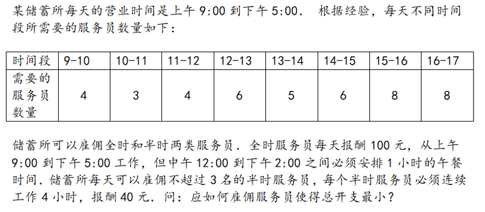

# 整数线性规划
PB20000156  
徐亦昶
## 问题描述

## 模型建立
不妨设所有半时服务员都在9至13时的整点开始工作（否则工作时间做平移，开支不会增）。设有$x_1$个半时服务员9点开始工作，$x_2$个半时服务员10点开始工作，……，$x_5$个半时服务员13点开始工作，并有$x_6$个全时服务员，其中$x_7$人在12到13点午餐，$x_8$人在13到14点午餐。则问题可归结为一个整数线性规划：
$$
\left\{
\begin{aligned}
x_1+x_6&\ge4 \\
x_1+x_2+x_6&\ge3 \\
x_1+x_2+x_3+x_6&\ge4 \\
x_1+x_2+x_3+x_4+x_8&\ge6 \\
x_2+x_3+x_4+x_5+x_7&\ge5 \\
x_3+x_4+x_5+x_6&\ge6 \\
x_4+x_5+x_6&\ge8 \\
x_5+x_6&\ge8 \\
x_1+x_2+x_3+x_4+x_5&\le3 \\
x_6-x_7-x_8&=0 \\
x_1,...,x_6&\in\mathbb{N}
\end{aligned}
\right.
$$
$$
\min z=40x_1+40x_2+40x_3+40x_4+40x_5+100x_6
$$
## 程序求解
```matlab
clear;
A=[-1,0,0,0,0,-1,0,0;-1,-1,0,0,0,-1,0,0;-1,-1,-1,0,0,-1,0,0;-1,-1,-1,-1,0,0,0,-1;0,-1,-1,-1,-1,0,-1,0;0,0,-1,-1,-1,-1,0,0;0,0,0,-1,-1,-1,0,0;0,0,0,0,-1,-1,0,0;1,1,1,1,1,0,0,0];
b=[-4,-3,-4,-6,-5,-4,-8,-8,3];
intcon=[1;2;3;4;5;6;7;8];
c=[40,40,40,40,40,100,0,0];
Aeq=[0,0,0,0,0,1,-1,-1];
beq=[0];
[x,optvalue]=intlinprog(c,intcon,A,b,Aeq,beq,[0;0;0;0;0;0;0;0],[]);
disp(x);
disp(optvalue);
```
## 运行结果
结果如下：
```
     0
     0
     2
     0
     1
     7
     3
     4

   820
```
因此雇佣2名半时服务员在11-15点工作，1名半时服务员在13-17时工作，7名全时服务员，其中3人在12-13点午餐，4人在13-14点午餐可以使得总开销最小，最小值是820元/日。