# 第一章
* 1. [三棱镜最小偏向角](#1)
* 2. [给定方向的平面波函数](#2)
* 3. [重叠区域的复振幅](#3)
* 4. [干涉条件](#4)
* 5. [已知干涉条纹移动距离求介质厚度](#5)
* 6. [干涉相消求相位关系](#6)
* 7. [相干宽度](#7)
* 8. [极小到中心距离](#8)
* 9. [光栅长度、极大位置](#9)
* 10. [色分辨本领](#10)
* 11. [偏振片光强](#11)
* 12. [布儒斯特角](#12)
* 13. [四分之一波片](#13)
###  1. 三棱镜最小偏向角
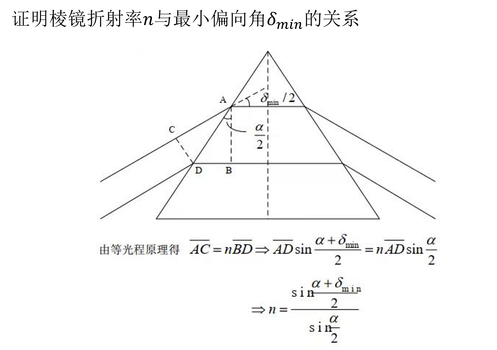
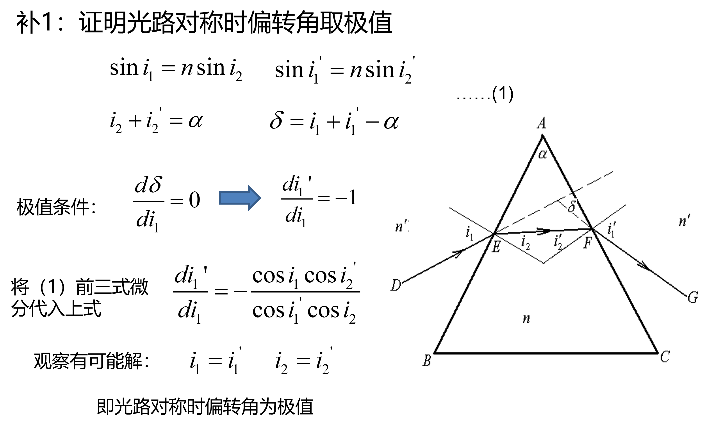
###  2. 给定方向的平面波函数
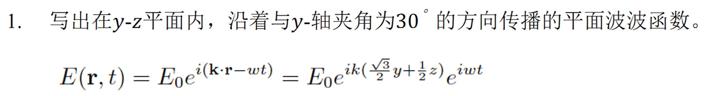
###  3. 重叠区域的复振幅
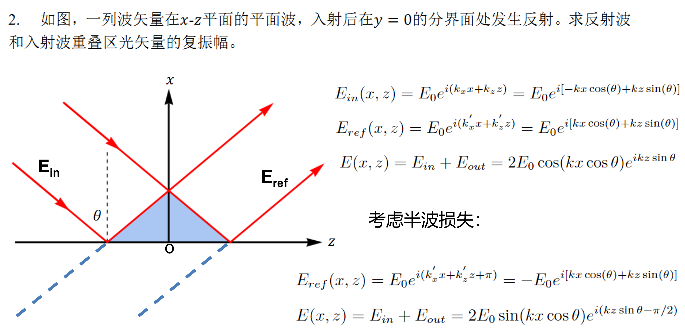
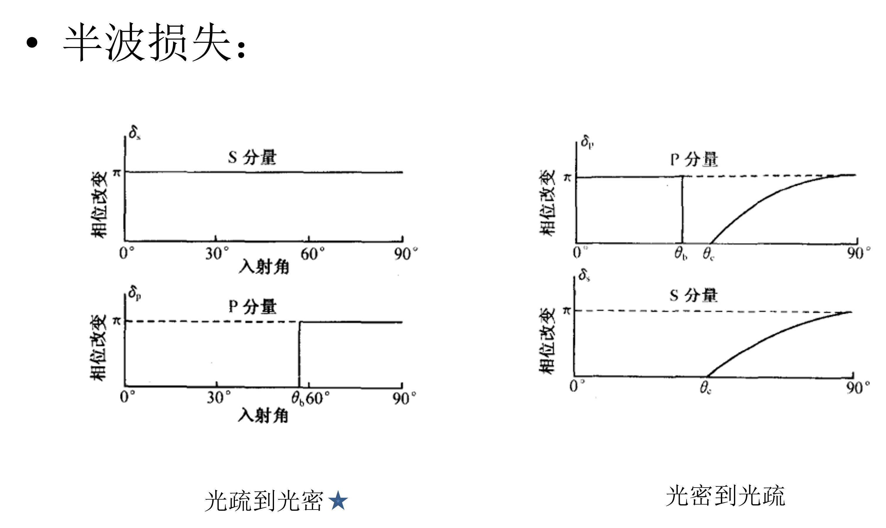
###  4. 干涉条件
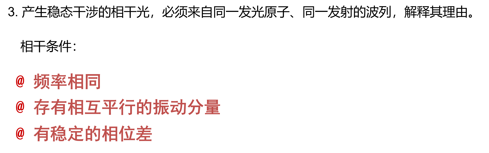
###  5. 已知干涉条纹移动距离求介质厚度
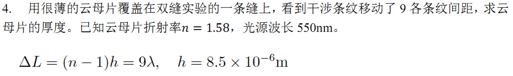
###  6. 干涉相消求相位关系
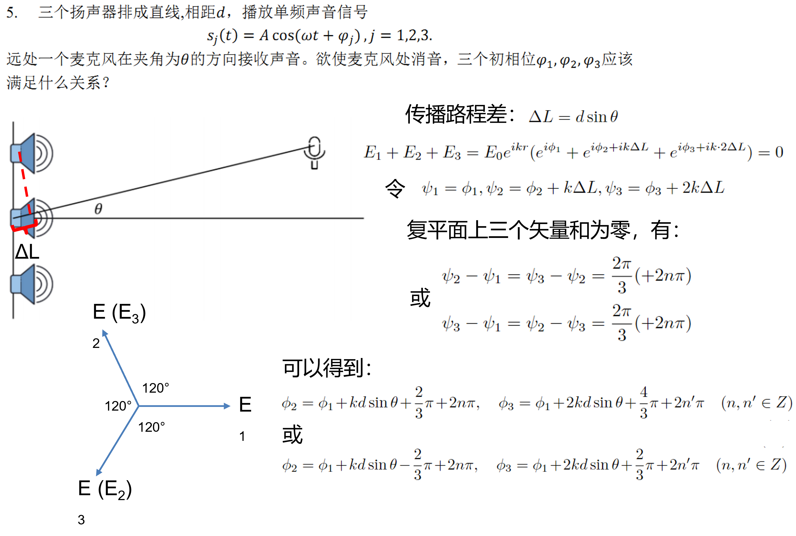
###  7. 相干宽度
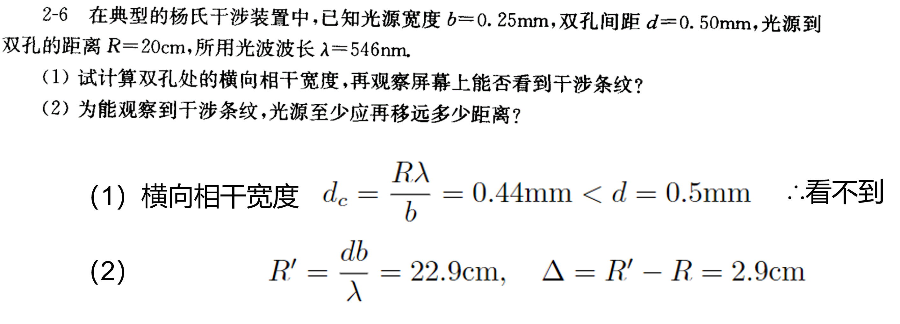
###  8. 极小到中心距离
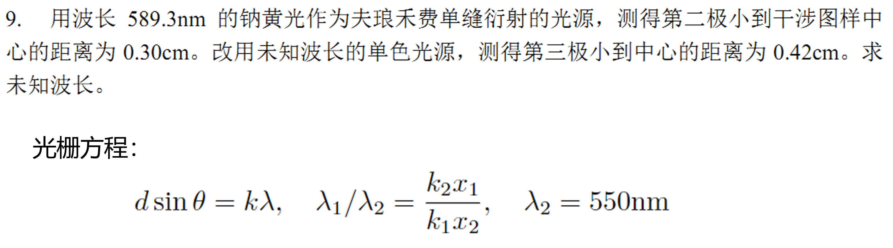
###  9. 光栅长度、极大位置
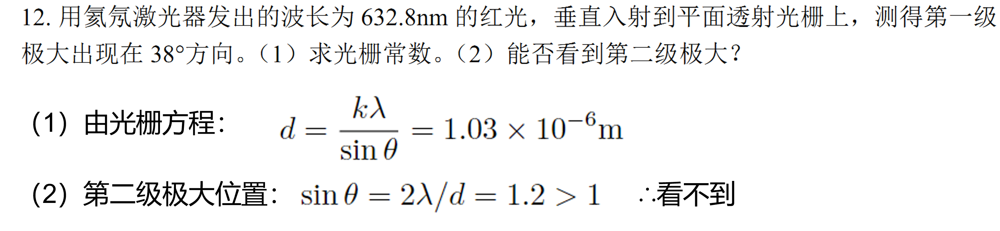
###  10. 色分辨本领
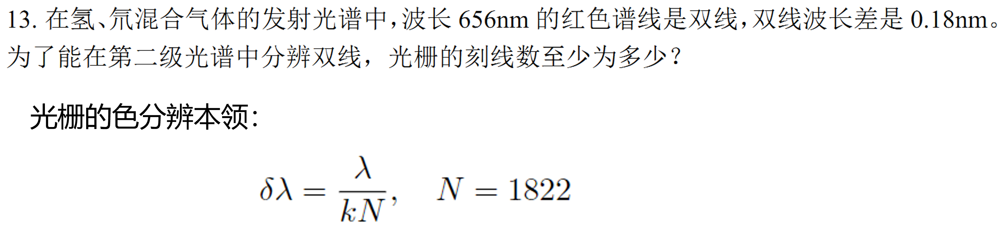
###  11. 偏振片光强
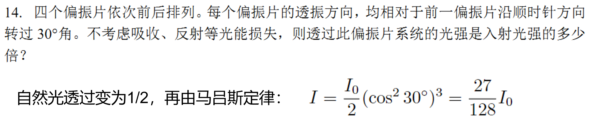
###  12. 布儒斯特角
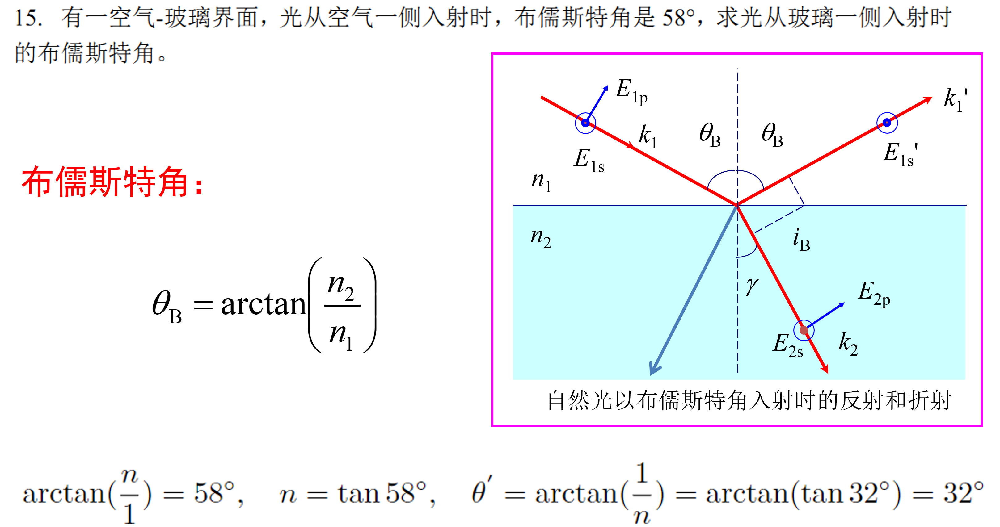
###  13. 四分之一波片
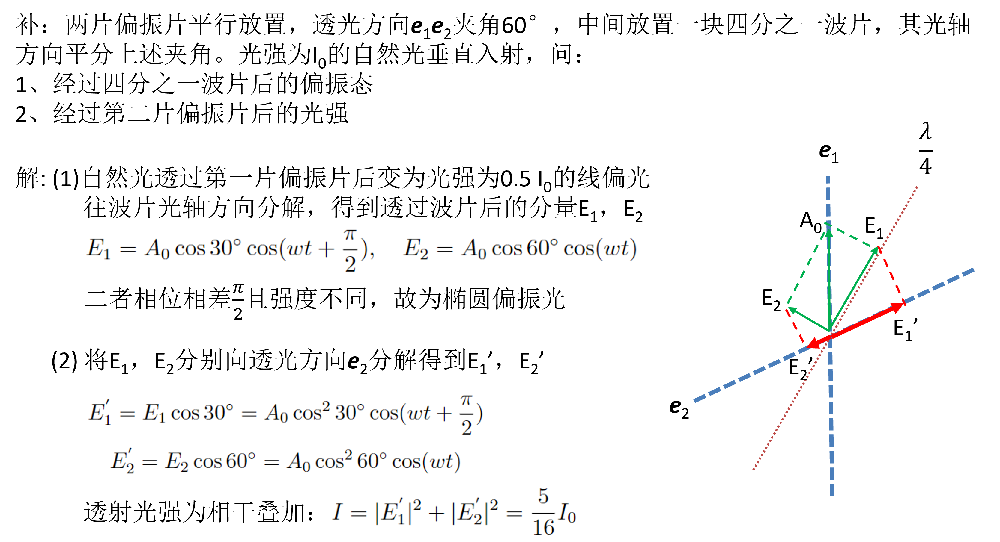
