# 第三章
* 1. [已知德布罗意波长，求动能](#1)
* 2. [已知波函数，求几率密度](#2)
* 3. [已知波函数，归一化并求动量表象波函数（一维）](#3)
* 4. [已知初始状态，求时间演化、算符平均值、能量平均值、测量结果和相应几率](#4)
* 5. [一维无限深势阱的基态波函数、时间演化、x和p平均值](#5)
* 6. [势阱宽度突然增加](#6)
* 7. [证明谐振子哈密顿算符本征函数](#7)
* 8. [一维无限深势垒公式推导](#8)
* 9. [证明在1D情况下不存在简并的束缚态](#9)
###  1. 已知德布罗意波长，求动能

###  2. 已知波函数，求几率密度
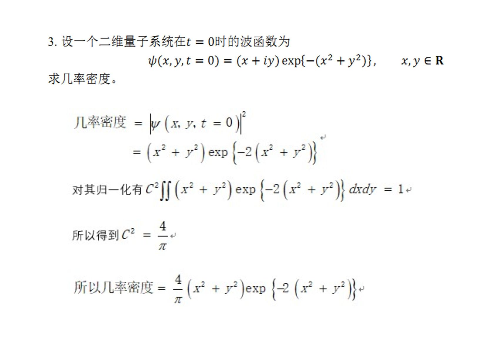
###  3. 已知波函数，归一化并求动量表象波函数（一维）
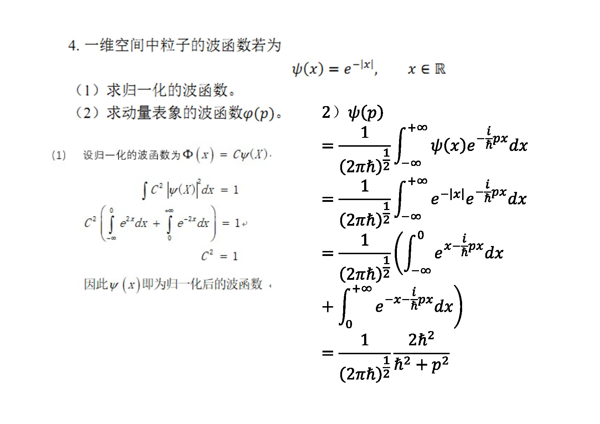
###  4. 已知初始状态，求时间演化、算符平均值、能量平均值、测量结果和相应几率
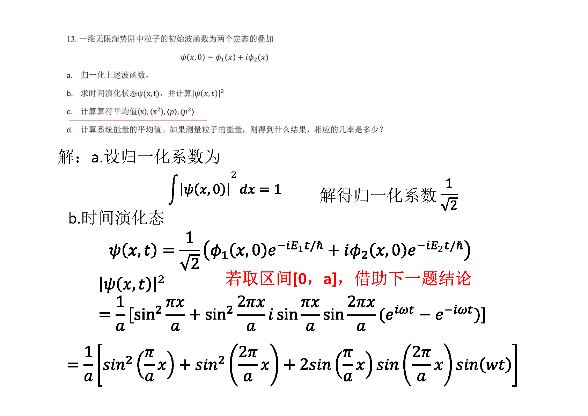
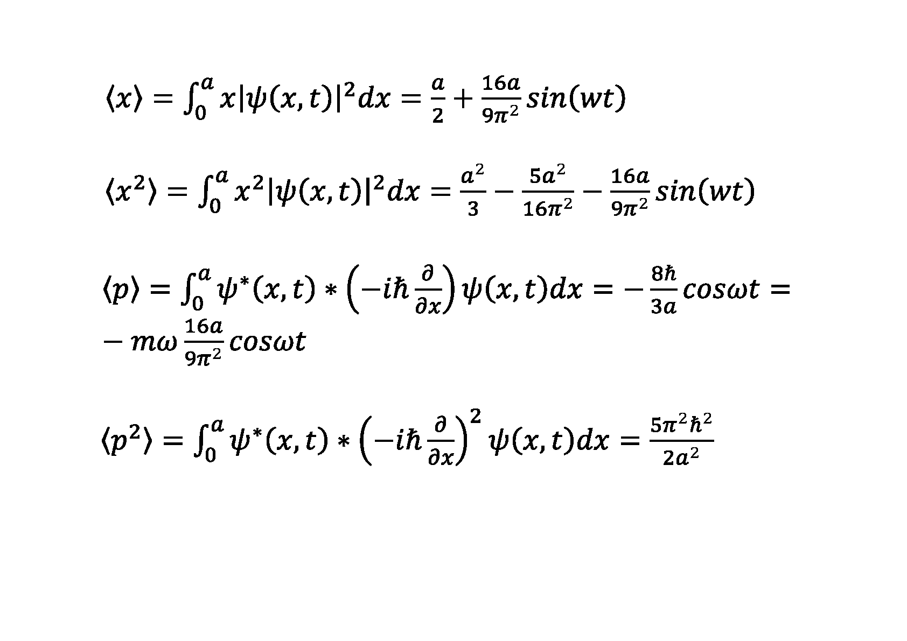
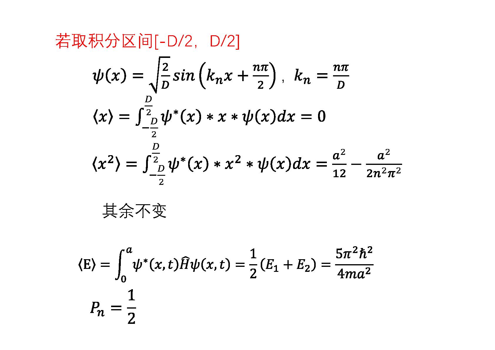
###  5. 一维无限深势阱的基态波函数、时间演化、x和p平均值
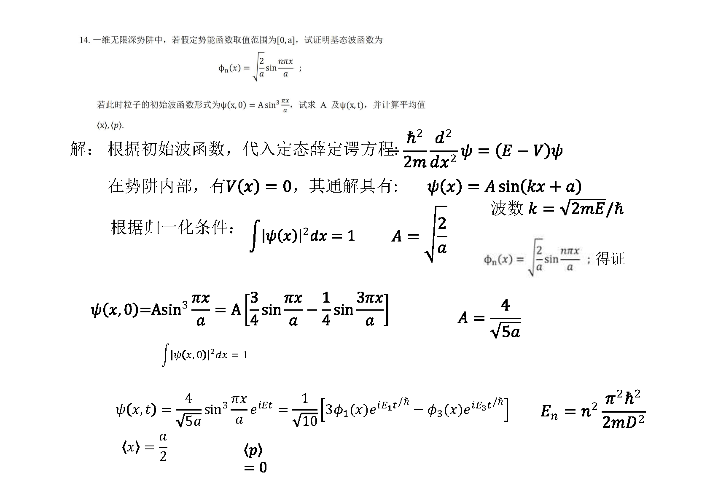
###  6. 势阱宽度突然增加
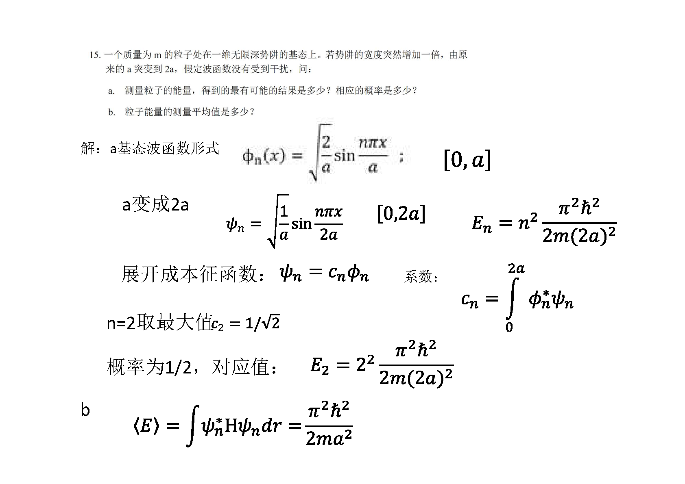
###  7. 证明谐振子哈密顿算符本征函数
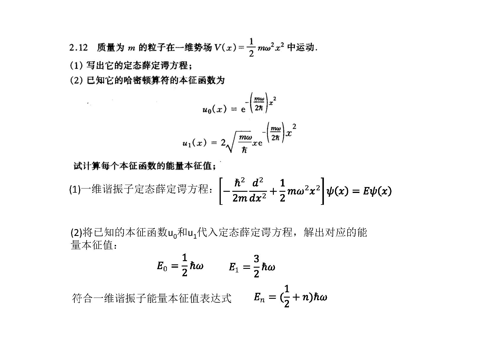
###  8. 一维无限深势垒公式推导
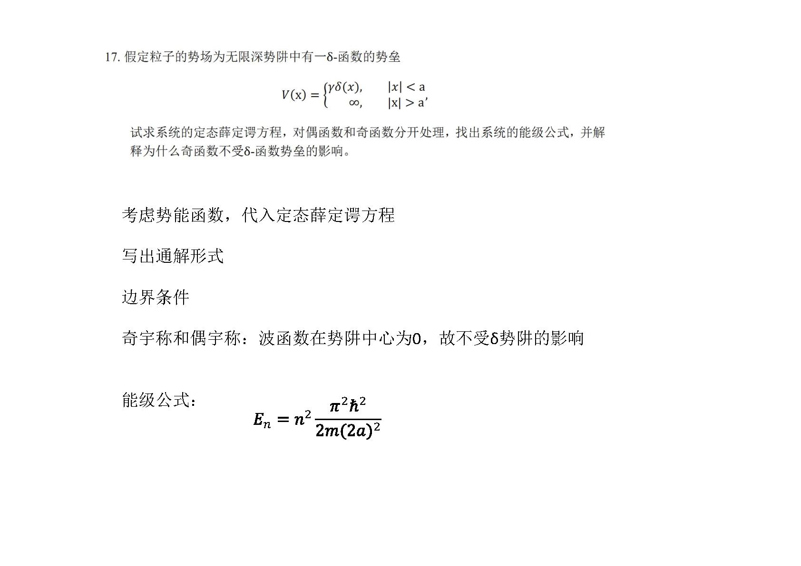
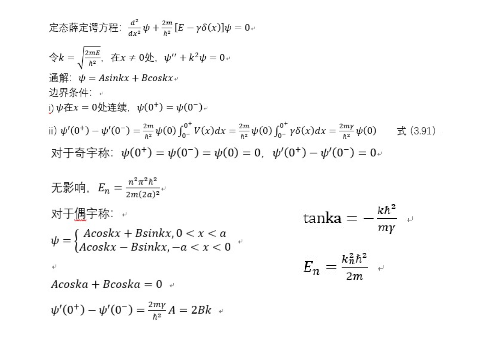
###  9. 证明在1D情况下不存在简并的束缚态
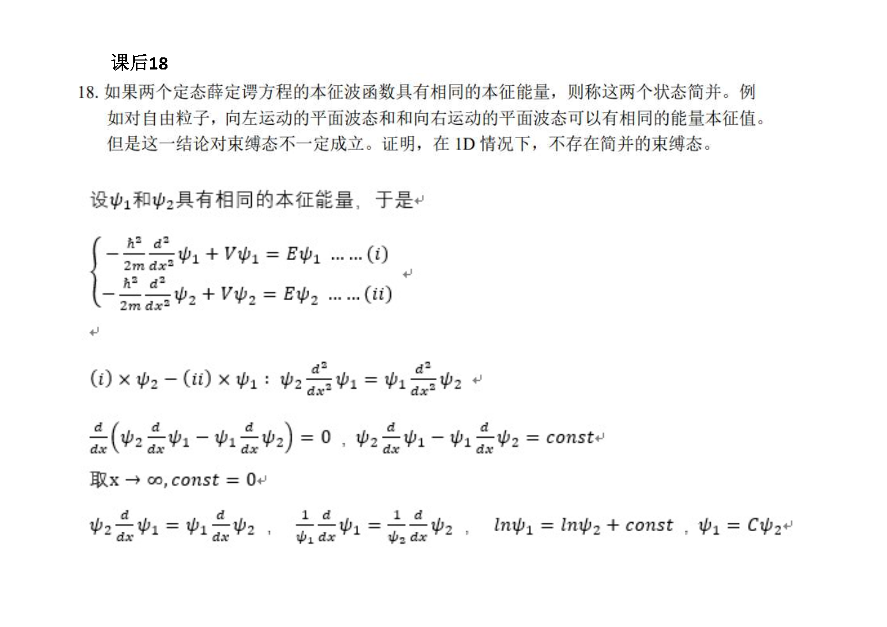
