# 第三章
### 已知德布罗意波长，求动能
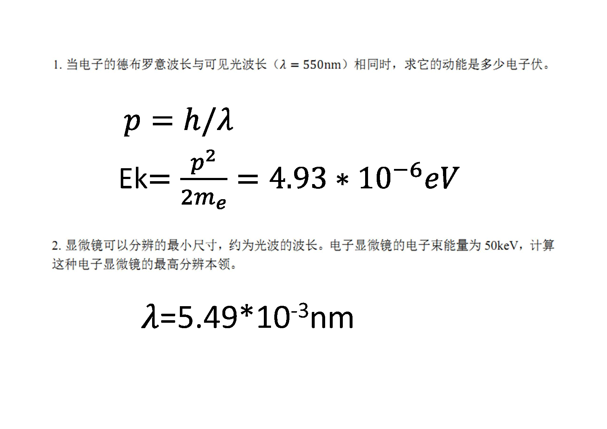
### 已知波函数，求几率密度
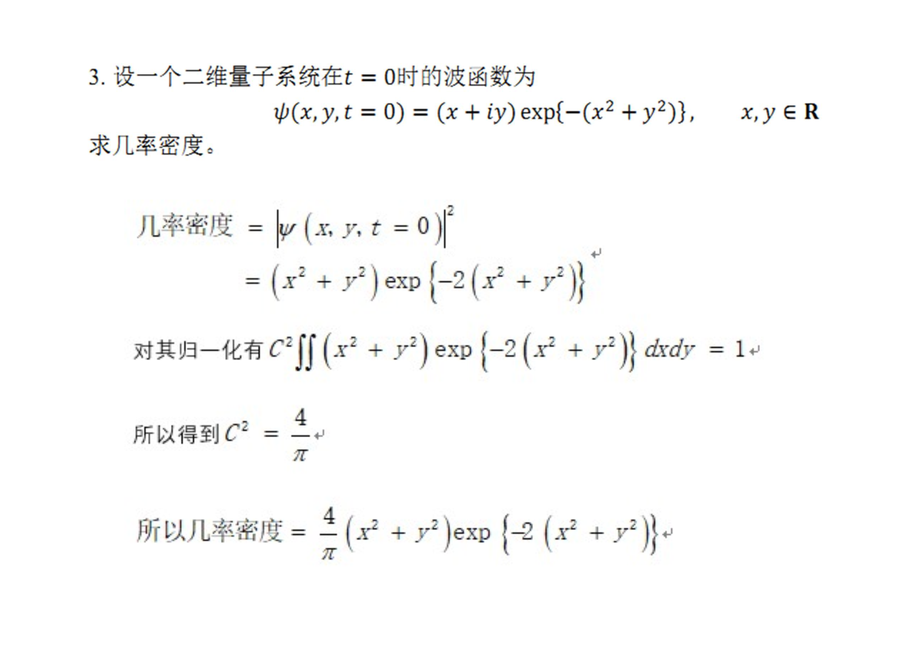
### 已知波函数，归一化并求动量表象波函数（一维）
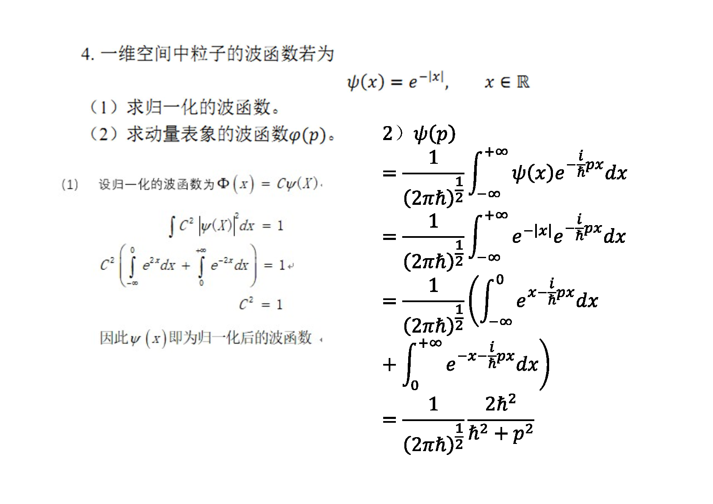
### 已知初始状态，求时间演化、算符平均值、能量平均值、测量结果和相应几率
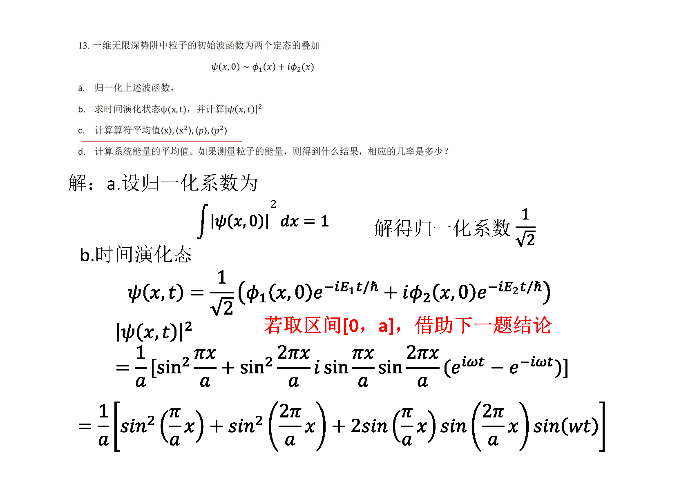
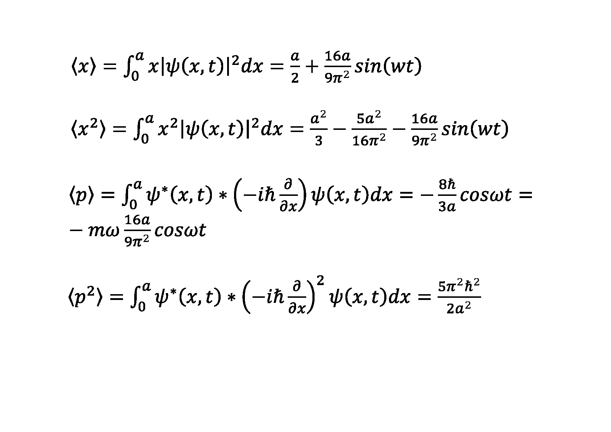
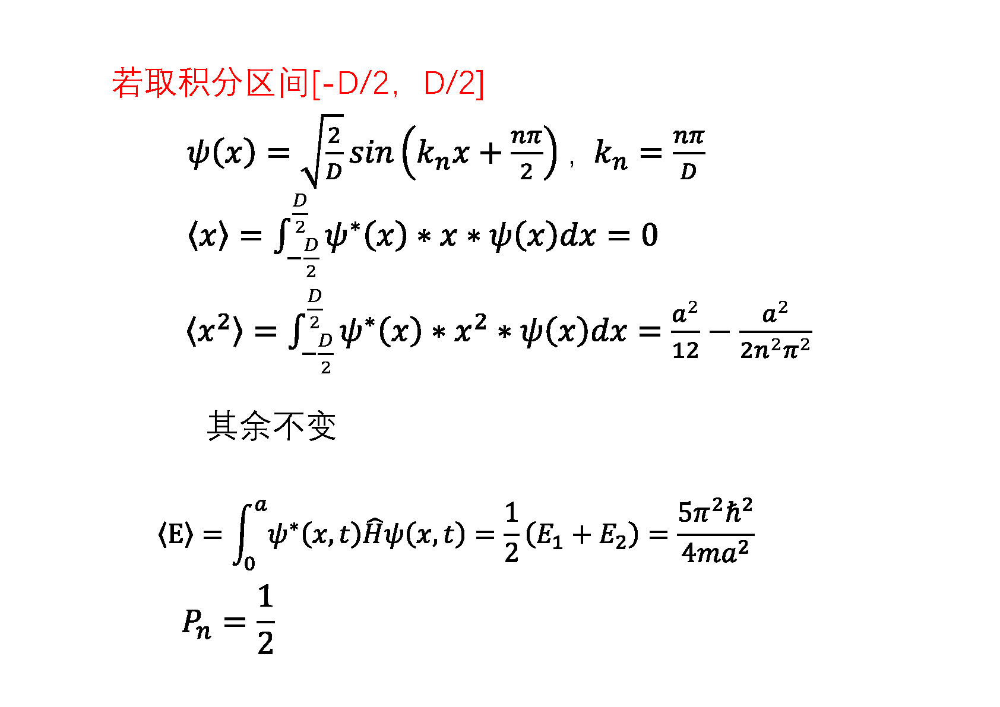
### 一维无限深势阱的基态波函数、时间演化、x和p平均值
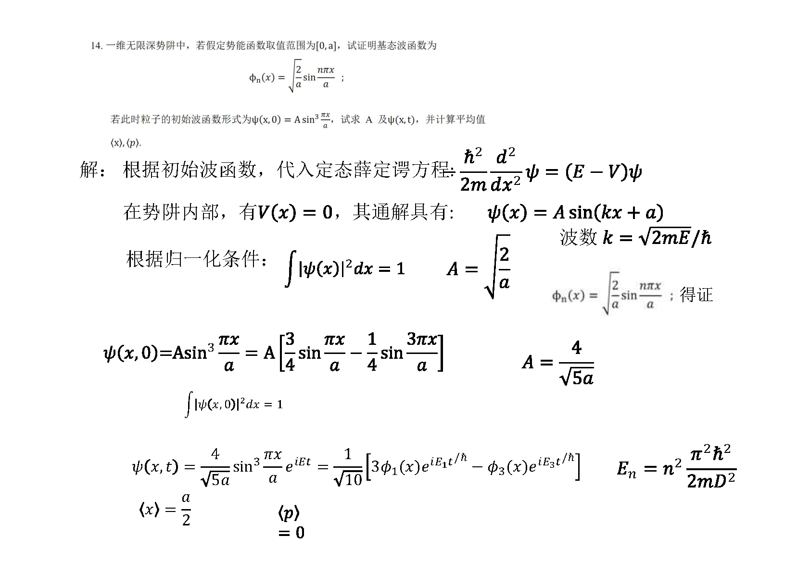
### 势阱宽度突然增加
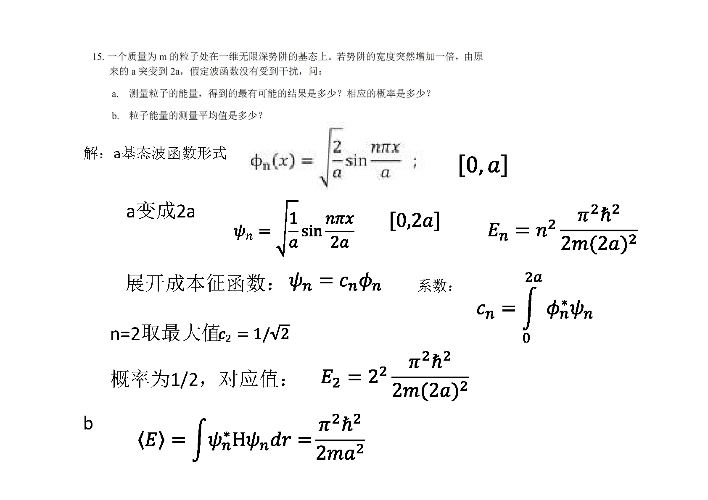
### 证明谐振子哈密顿算符本征函数
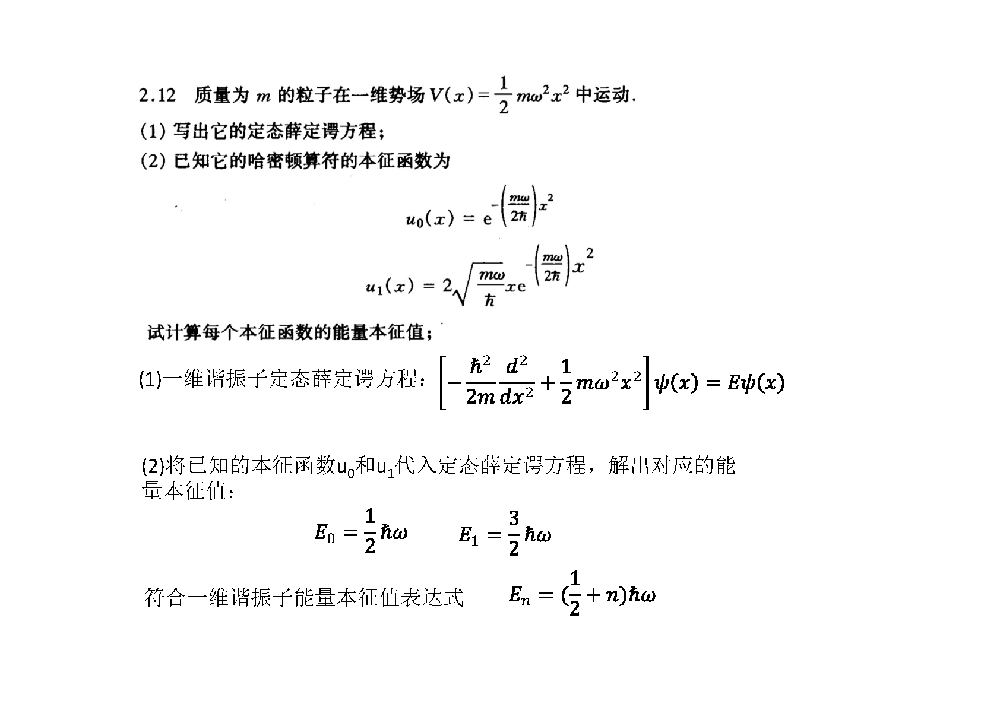
### 一维无限深势垒公式推导
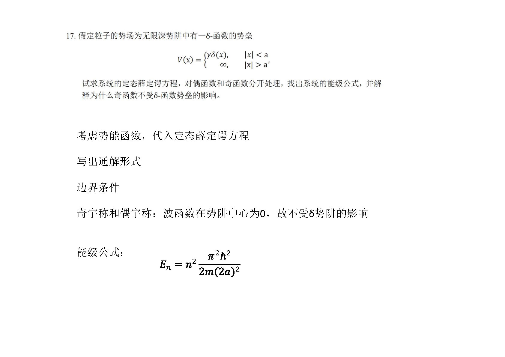
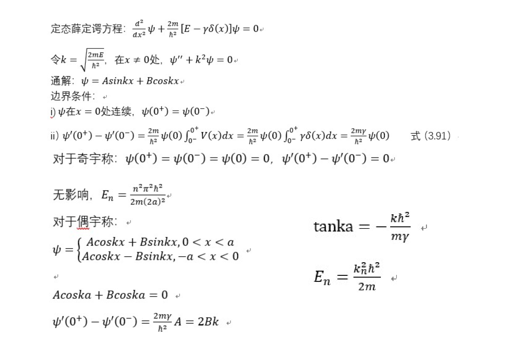
### 证明在1D情况下不存在简并的束缚态
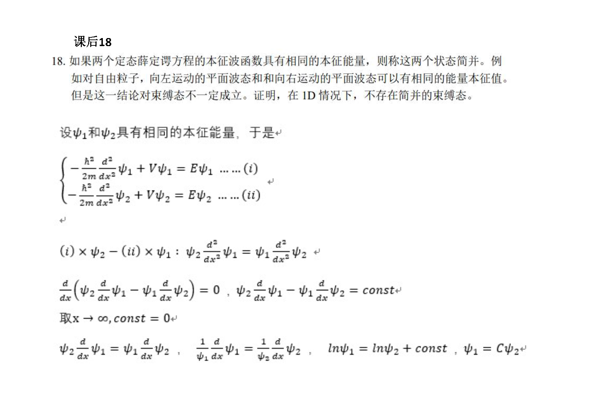
