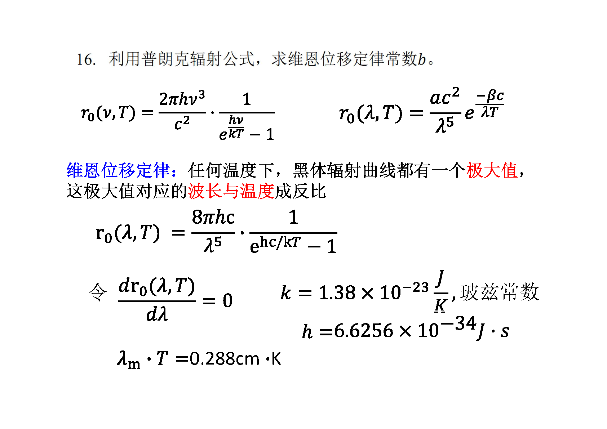
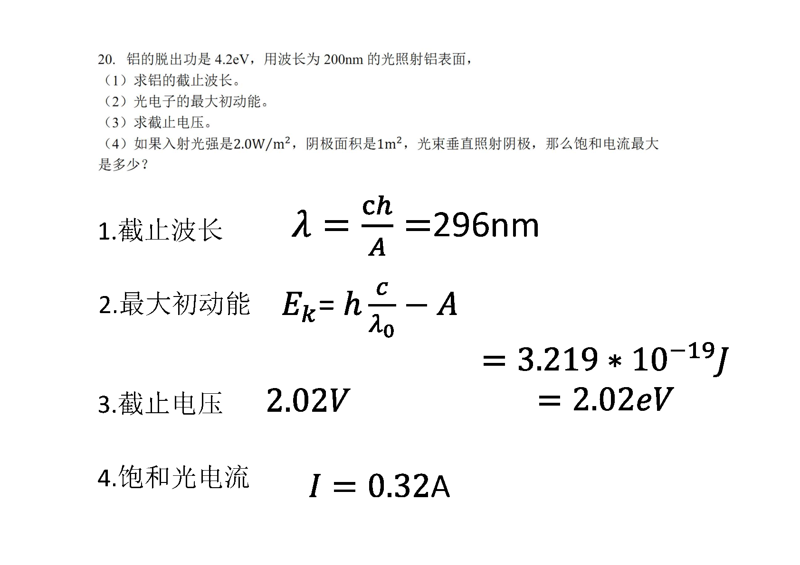
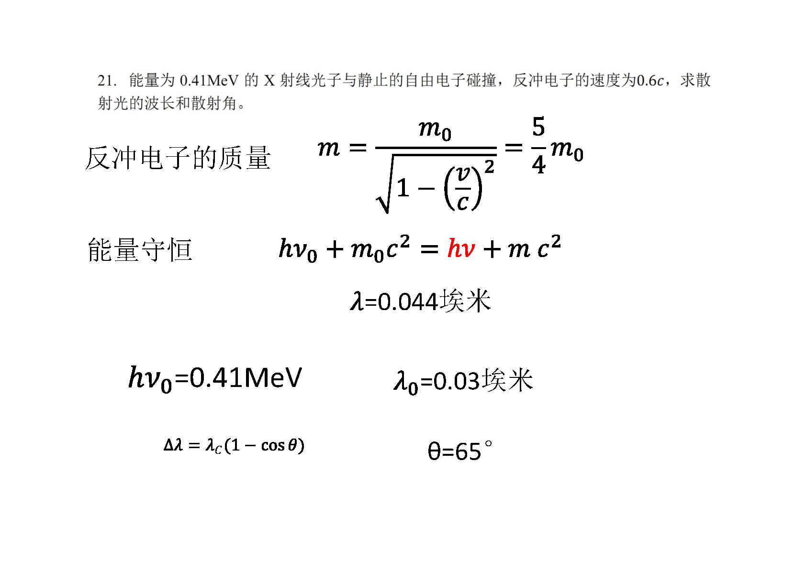
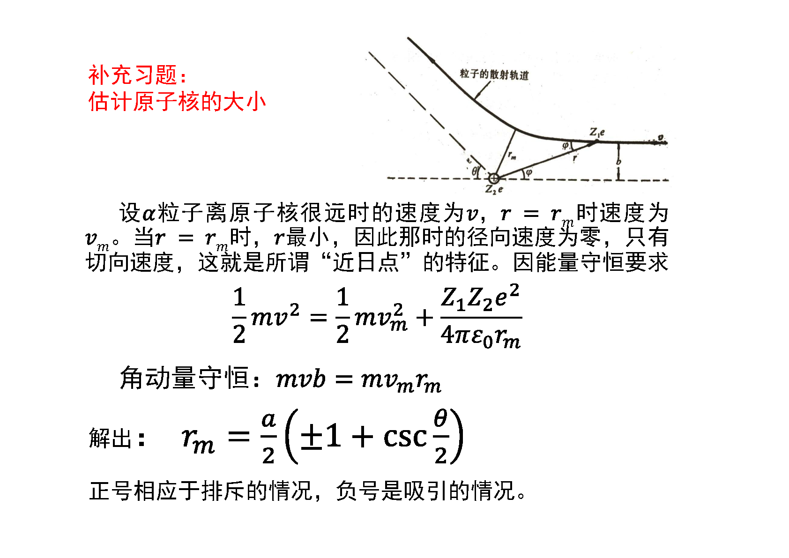
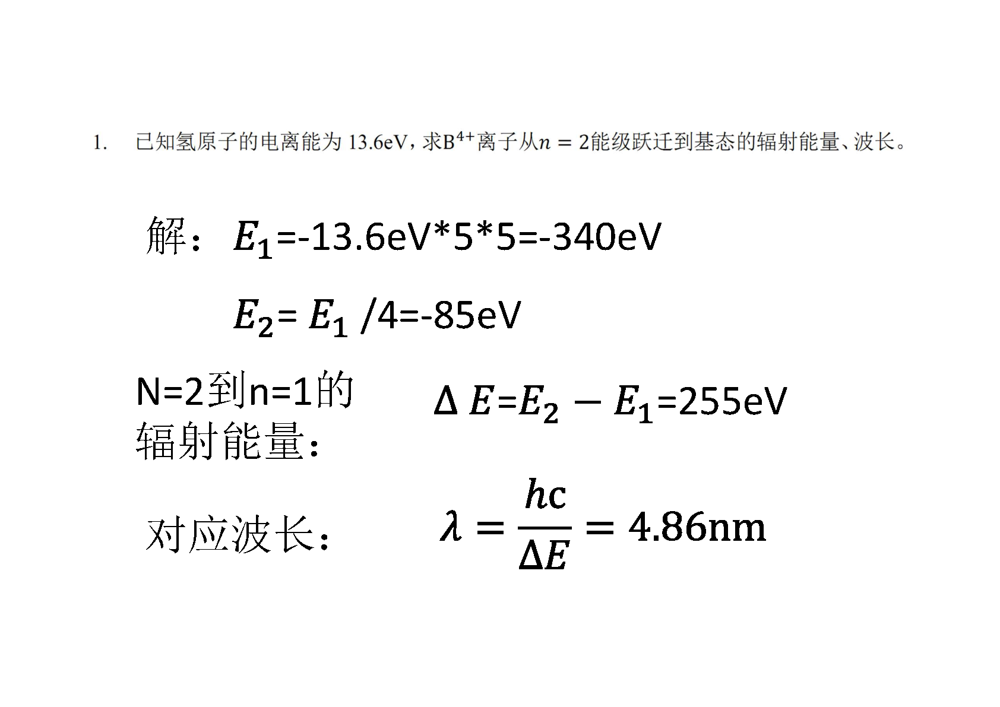
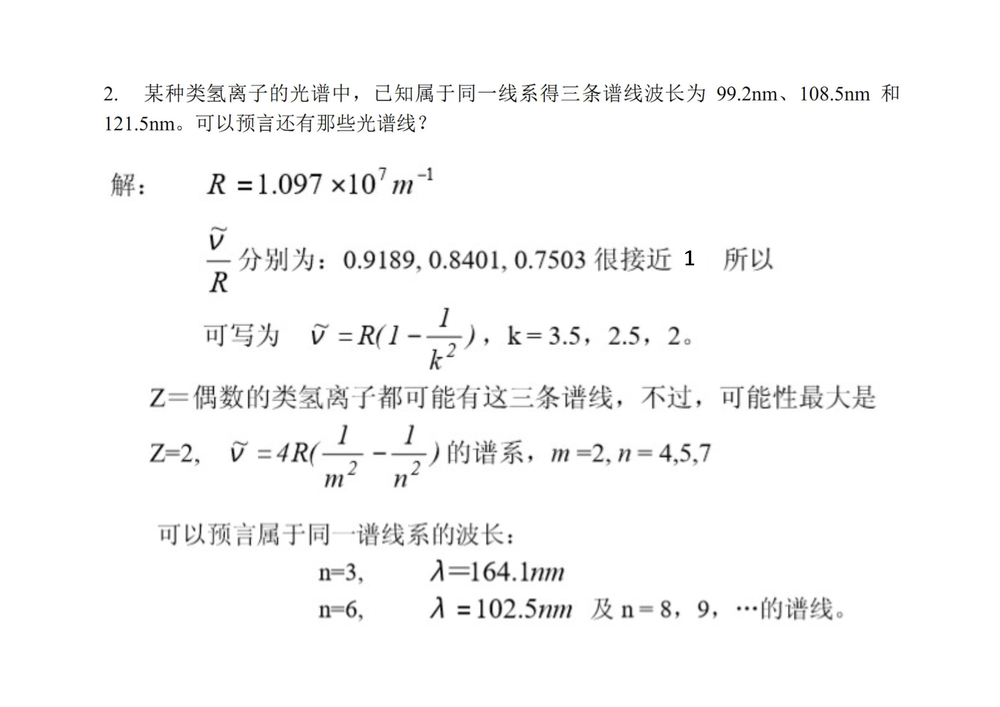
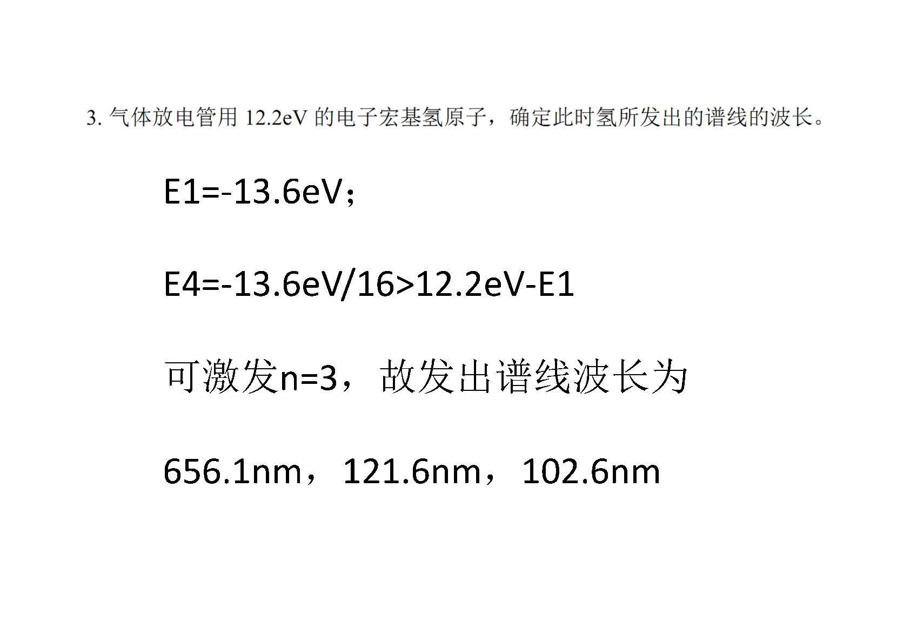
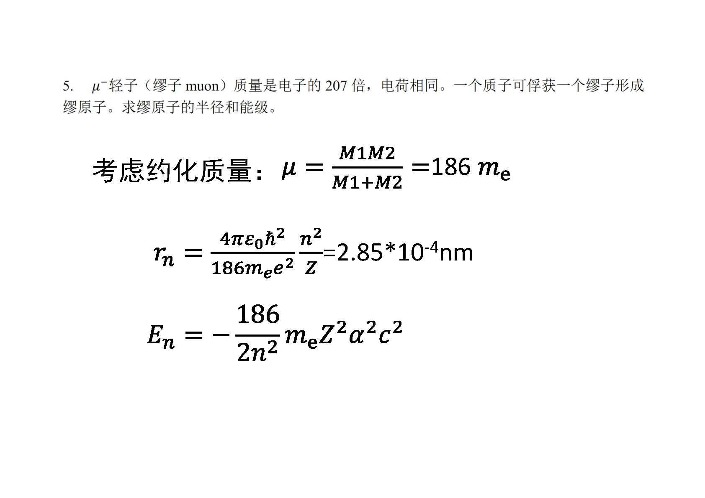

# 第二章
* 1. [利用普朗克辐射公式，求维恩位移定律常熟b。](#1)
* 2. [已知脱出功和波长求截止波长、最大初动能、截止电压、已知光强和阴极面积后的最大饱和电流](#2)
* 3. [已知初始能量和反冲电子速度，求散射光的波长和散射角](#3)
* 4. [利用粒子散射求原子轨道](#4)
* 5. [已知氢原子电离能，求B4+离子跃迁的辐射能量和波长](#5)
* 6. [已知同一线系下三条谱线的波长，预测其他谱线](#6)
* 7. [已知电子能量，求被轰击氢原子发出谱线的波长](#7)
* 8. [缪原子的半径和能级](#8)
###  1. 利用普朗克辐射公式，求维恩位移定律常熟b。
  
###  2. 已知脱出功和波长求截止波长、最大初动能、截止电压、已知光强和阴极面积后的最大饱和电流
  
###  3. 已知初始能量和反冲电子速度，求散射光的波长和散射角
  
###  4. 利用粒子散射求原子轨道
  
###  5. 已知氢原子电离能，求B4+离子跃迁的辐射能量和波长
  
###  6. 已知同一线系下三条谱线的波长，预测其他谱线
  
###  7. 已知电子能量，求被轰击氢原子发出谱线的波长

###  8. 缪原子的半径和能级
  
