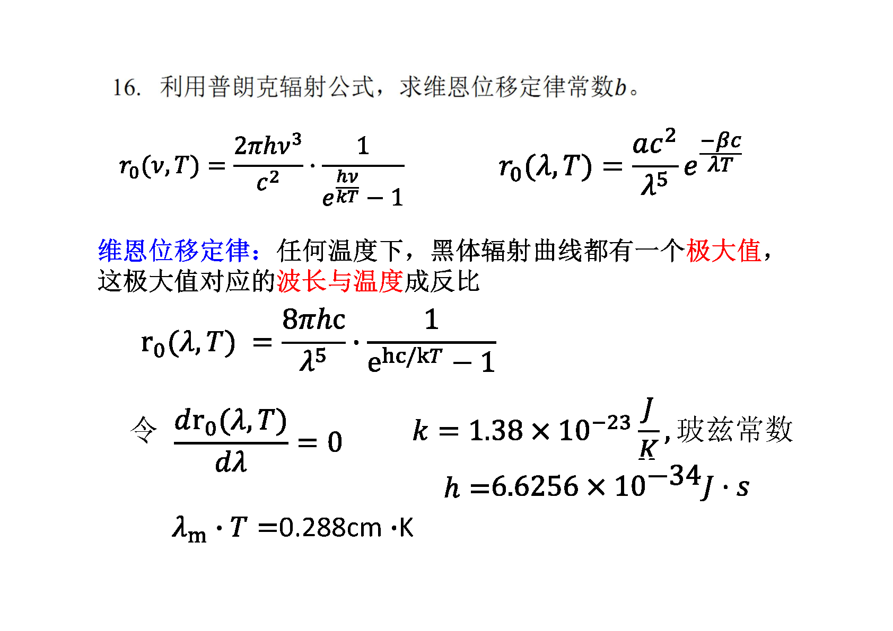
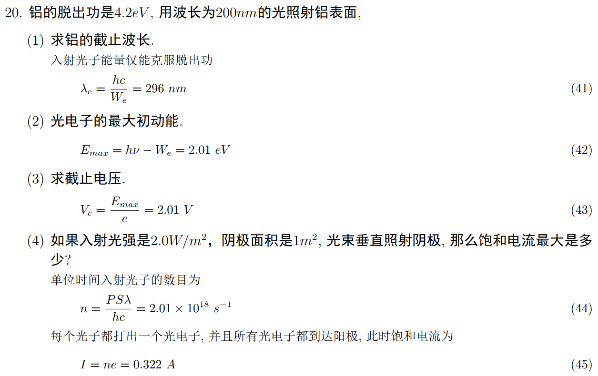
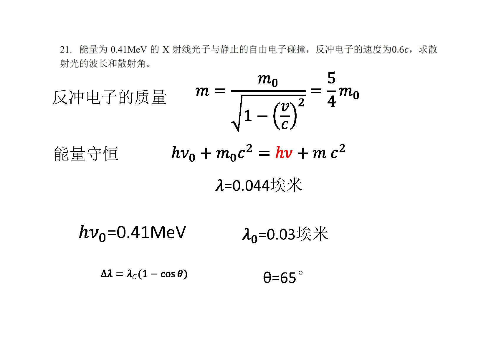
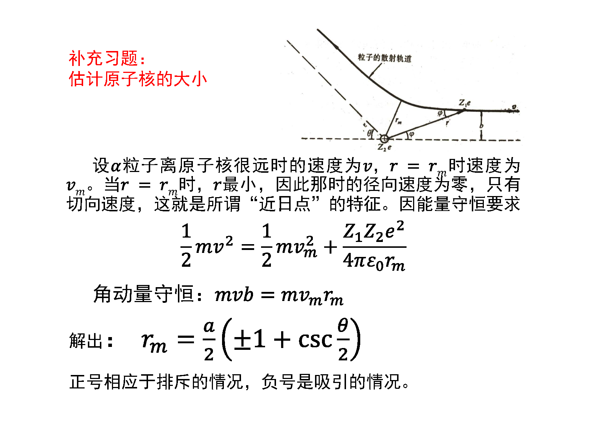
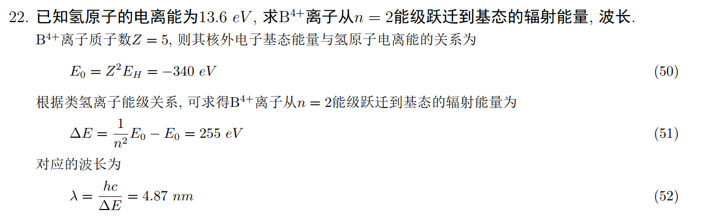
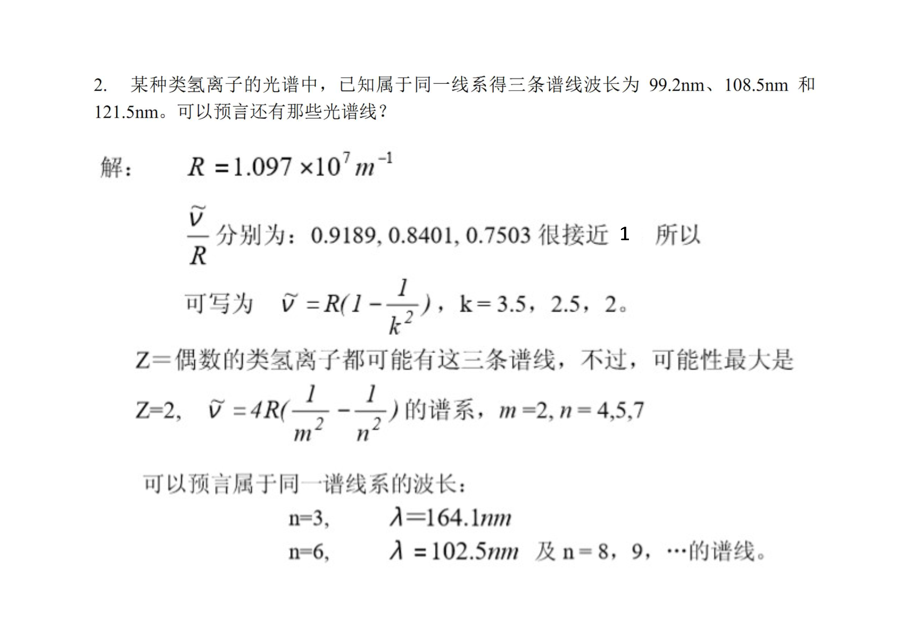
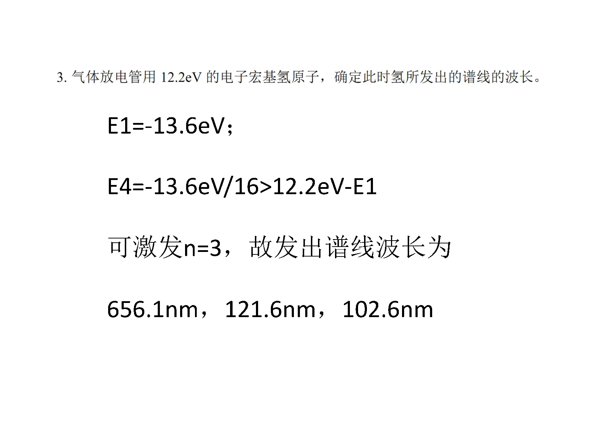
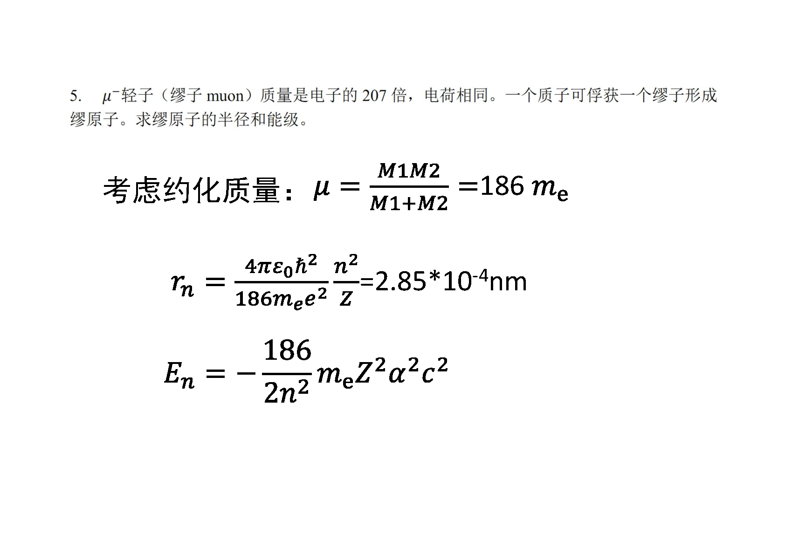

# 第二章
### 利用普朗克辐射公式，求维恩位移定律常熟b。
  
### 已知脱出功和波长求截止波长、最大初动能、截止电压、已知光强和阴极面积后的最大饱和电流
  
### 已知初始能量和反冲电子速度，求散射光的波长和散射角
  
### 利用粒子散射求原子轨道
  
### 已知氢原子电离能，求B4+离子跃迁的辐射能量和波长
  
### 已知同一线系下三条谱线的波长，预测其他谱线
  
### 已知电子能量，求被轰击氢原子发出谱线的波长

### 缪原子的半径和能级
  
