# 第四章
* 1. [类氢原子定态波函数和能量、电子平均半径、涨落及验证和角量子数无关](#1)
* 2. [已知氢原子初态，求半径期望值和时间演化](#2)
* 3. [已知波函数，证明处在角动量的本征态吗，求出本征值](#3)
* 4. [证明在L_z的本征态下，角动量沿与z方向成θ角方向上分量的平均值为mhcosθ](#4)
* 5. [证明Lz的本征态下, \<Lx\> = \<Ly\> = 0](#5)
* 6. [角动量算符与动能算符的对易子](#6)
* 7. [[L²,Lz]](#7)
###  1. 类氢原子定态波函数和能量、电子平均半径、涨落及验证和角量子数无关
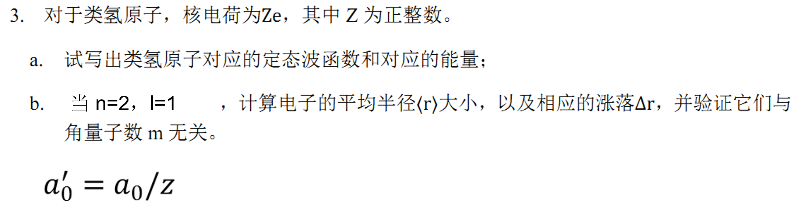
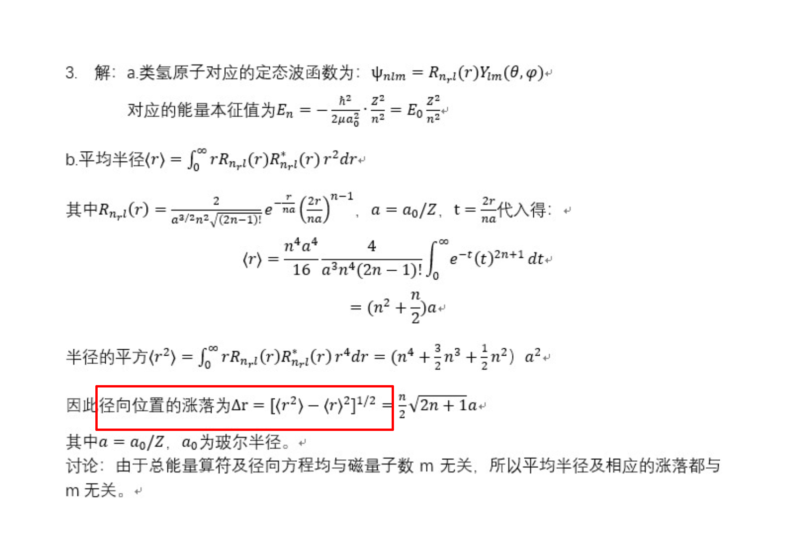
###  2. 已知氢原子初态，求半径期望值和时间演化
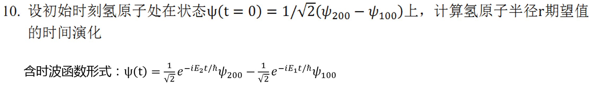
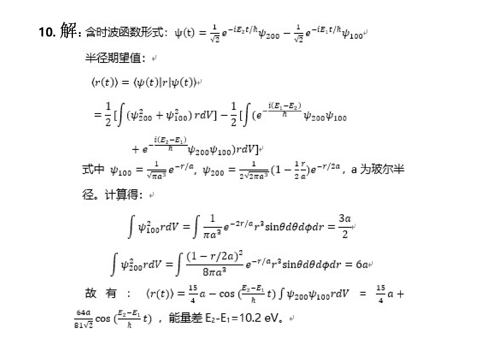
###  3. 已知波函数，证明处在角动量的本征态吗，求出本征值
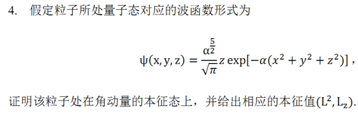
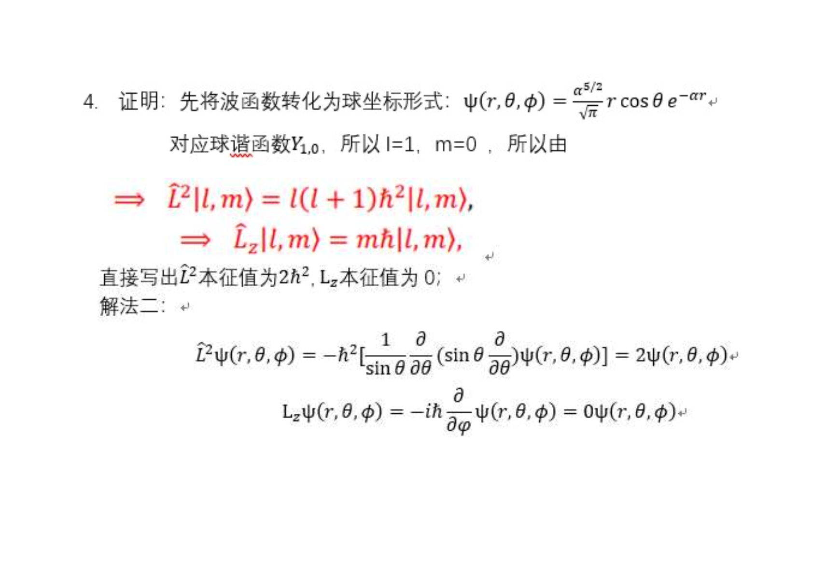
###  4. 证明在L_z的本征态下，角动量沿与z方向成θ角方向上分量的平均值为mhcosθ
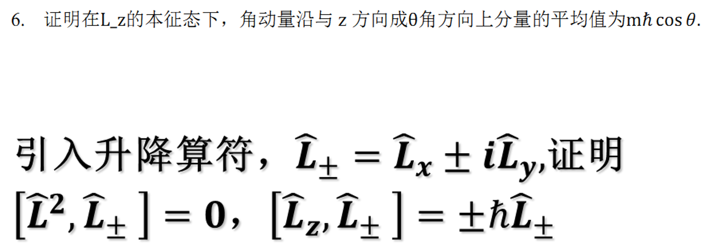
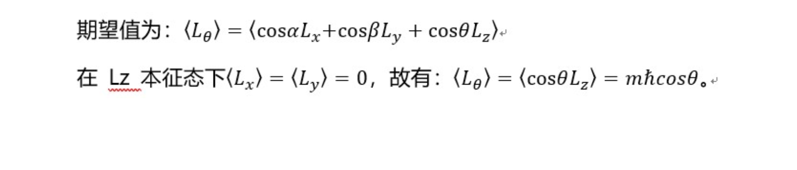
###  5. 证明Lz的本征态下, \<Lx\> = \<Ly\> = 0
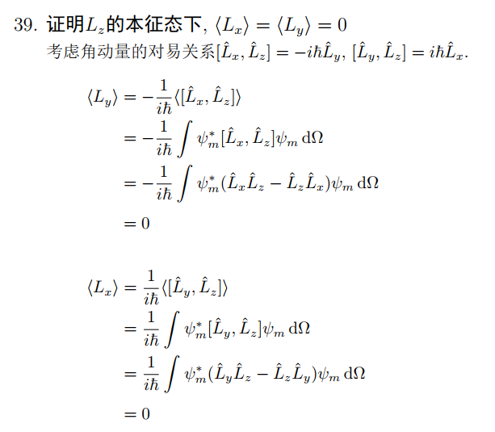
###  6. 角动量算符与动能算符的对易子
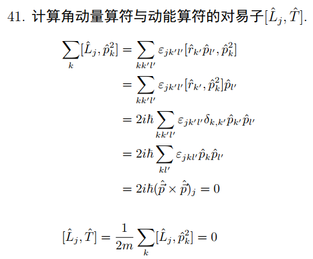
###  7. [L²,Lz]
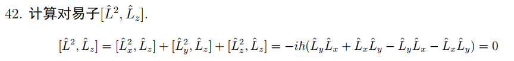
