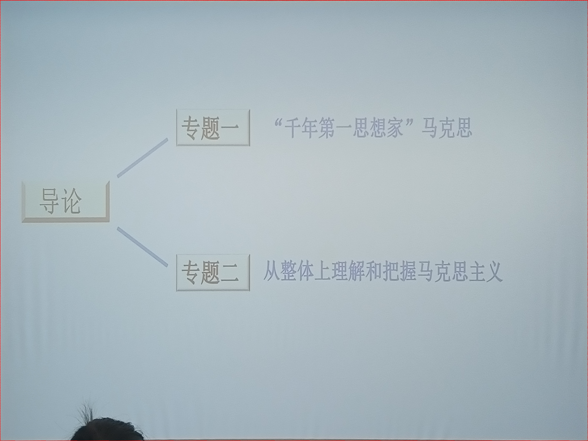

# 马克思主义基本原理（张旭）
包含2021秋马原课的ppt，全程跟拍+图像处理。    
ppt一般，懒得上传了，实在想要联系我。    
process.py为图像处理程序，可以自动识别屏幕区域，通过透视变换将视角调整到正中间并使屏幕充满整个图片。  
样图：

如果process.py不能处理，可使用manually_process.py人工处理。使用前将所有待处理图片置于和,py文件同目录下的remaining文件夹中，运行.py文件，在弹出的窗口中依次点击幻灯片的四个角，关掉窗口即完成依次变换。  
rename.py用于给图片编号。  
process.py和rename.py开头都加了exit语句，防止误点击时造成不可逆的文件修改。使用时要反复确认代码中的目录地址是否有误，备份好原图片后在exit前添加注释符（脚本的处理不一定准确，出问题的需要把原图复制到remaining文件夹进行人工处理（manually_process.py）  
由于剪辑失误，2021年10月9日的ppt已遗失，2021年10月19日部分图片扭曲或不完整。
